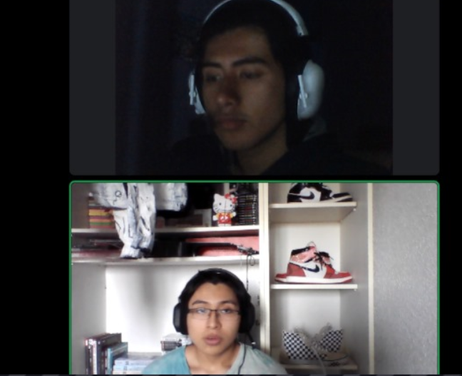

## **2.2. Entrevistas.**
### **2.2.1. Diseño de entrevistas.**

* Segmento objetivo 1 "Propietarios de vehículos"  
  Estas son las personas que poseen automóviles y están dispuestas a compartirlos con otros a cambio de un alquiler. 
    * Preguntas generales:   
      * **¿Cuál es su nombre completo?**  
      * **¿Cuántos años tienes?**  
      * **¿Cuál es su estado civil?**  
      * **¿A qué te dedicas?**  
      * **¿Trabajas?**  
      * **¿Estudias?**  
      * **¿En qué ciudad resides?** 

   * Preguntas sobre el Negocio de Alquiler de Vehículos: 
     * **¿Actualmente posee uno o varios vehículos adicionales que no utiliza constantemente?**  
     * **¿Estaría interesado en la posibilidad de ganar dinero alquilando su vehículo cuando no lo está utilizando?**  
     * **¿Qué le motiva a considerar la idea de compartir su vehículo en una plataforma de alquiler?**  
     * **¿Qué tipo de vehículo(s) posee y estaría dispuesto a compartir en la plataforma?**  
     * **¿Ha tenido experiencia previa alquilando su vehículo o considerando esta opción?**  
   * Preguntas luego de contarle sobre la Plataforma Automovile-Unit:  
     * **¿Cómo ve la idea de utilizar una plataforma en línea para mostrar su vehículo y permitir que otros lo alquilen?**  
     * **¿Cuáles serían sus preocupaciones principales al alquilar su vehículo a desconocidos?**  
     * **¿Qué medidas de seguridad y verificación consideraría necesarias para sentirse cómodo alquilando su vehículo?**  
     * **¿Estaría dispuesto a ofrecer incentivos especiales, como descuentos, para aumentar la visibilidad de su vehículo en la plataforma?**  
     * **¿Qué características o herramientas le gustaría ver en la plataforma para facilitar el proceso de alquiler y comunicación con los usuarios?**  
   * Preguntas sobre la Experiencia del Usuario:  
     * **¿Qué información considera importante incluir en la descripción de su vehículo para los posibles arrendatarios?**  
     * **¿Cómo preferiría coordinar la entrega y devolución de su vehículo con los usuarios que lo alquilen?**  
     * **¿Considera importante recibir calificaciones y reseñas de los usuarios que alquilen su vehículo?**  
     * **¿Qué aspectos considera importantes al interactuar con los usuarios interesados en alquilar su vehículo?**  

* Segmento objetivo 2 "Arrendatarios"  
  Estas son las personas que desean alquilar un automóvil por un período específico.  
    * Preguntas generales: 
      
      * **¿Cuál es su nombre completo?**  
      * **¿Cuántos años tienes?**   
      * **¿Cuál es su estado civil?**   
      * **¿A qué te dedicas?, ¿Trabajas?, ¿Estudias?**   
      * **¿En qué ciudad resides?**  

    * Preguntas sobre el Alquiler de Vehículos:  
      * **¿Ha alquilado un vehículo en el pasado?**   
      * **¿Por qué decidido alquilar el vehículo?**   
      * **Coménteme su experiencia alquilando dicho vehículo, ¿Qué aspectos disfrutó y qué aspectos considera que podrían mejorarse?**   
      * **¿Qué tipo de vehículo(s) preferiría alquilar y para qué ocasiones?**   
      * **¿Qué factores considera importantes al momento de seleccionar un vehículo de alquiler?**   
    * Preguntas luego de contarle sobre la Plataforma Automovile-Unit: 
      * **¿Cómo se siente acerca de la idea de alquilar vehículos directamente de propietarios a través de una plataforma en línea?**   
      * **¿Qué características o herramientas le gustaría ver en una plataforma de alquiler de vehículos para que la experiencia sea más atractiva y conveniente?**   
      * **¿Cuáles son sus principales inquietudes en relación con la seguridad y confiabilidad al alquilar un vehículo de un propietario privado?**   
      * **¿Valora la posibilidad de acceder a vehículos únicos o específicos en términos de marca, modelo o características?**   
      * **¿Estaría dispuesto a proporcionar calificaciones y reseñas sobre los vehículos y propietarios con los que tuvo experiencia?**   
    * Preguntas sobre las Necesidades y Motivaciones:  
      * **¿Cuáles son las principales razones por las que alquilaría un vehículo en lugar de utilizar su propio automóvil o el transporte público?**   
      * **¿Ha tenido situaciones en las que hubiera sido más conveniente tener acceso a un vehículo de alquiler por un período corto?**   
      * **¿Cuál sería su principal expectativa en términos de proceso de reserva y entrega del vehículo alquilado?**   
      * **¿Consideraría la opción de alquilar vehículos en diferentes ocasiones, como para eventos especiales o viajes de trabajo?**   
      * **¿Qué tipo de incentivos o características adicionales en la plataforma le motivarían a elegir alquilar un vehículo a través de Automovile-Unit?**   

### **2.2.2. Registro de entrevistas.**
### **2.2.3. Análisis de entrevistas.**
**PROPIETARIOS**
*Entrevista 1*

URL del video: [Click](https://upcedupe-my.sharepoint.com/:v:/g/personal/u202120467_upc_edu_pe/ETu3x-TX6OdGqsrgg5PhM8ABsqNUpxAFG9a8g5CZlQWLZQ?e=zkvOCS)

En esta entrevista, se habla con Renzo Miguel, un joven de 20 años que reside en Lima y está interesado en la idea de utilizar una plataforma en línea para alquilar su vehículo cuando no lo está utilizando. Renzo expresa su interés en ganar dinero de esta manera, pero también tiene preocupaciones sobre la seguridad de su vehículo y la confiabilidad de los arrendatarios desconocidos.

Renzo considera que las medidas de seguridad necesarias incluyen la verificación de la licencia de conducir vigente de los arrendatarios y tiene preocupaciones sobre el posible daño, pérdida o robo de su vehículo al alquilarlo.

En cuanto a la plataforma, Renzo cree que es importante tener anuncios claros que incluyan información sobre el precio, calidad y estado del vehículo, así como un chat directo para facilitar la comunicación con los usuarios interesados.

También menciona la importancia de recibir calificaciones y reseñas de los usuarios que alquilen su vehículo, pero señala que la excesiva exigencia por parte de los propietarios podría ser un problema.

En resumen, Renzo muestra interés en la idea de alquilar su vehículo a través de una plataforma en línea, pero destaca la importancia de medidas de seguridad y una comunicación eficaz con los arrendatarios. También sugiere que las calificaciones y reseñas sean útiles y equilibradas para garantizar una buena experiencia para todos los usuarios.

**ARRENDATARIOS**

*Entrevista 1*

URL del video: [Click](https://upcedupe-my.sharepoint.com/:v:/g/personal/u202118946_upc_edu_pe/EQaj8DDYNzxKrqg9ZkrB8HsBcJqeuoUFdd60AwLwhVFxiw?e=ZbUdmR&nav=eyJyZWZlcnJhbEluZm8iOnsicmVmZXJyYWxBcHAiOiJTdHJlYW1XZWJBcHAiLCJyZWZlcnJhbFZpZXciOiJTaGFyZURpYWxvZyIsInJlZmVycmFsQXBwUGxhdGZvcm0iOiJXZWIiLCJyZWZlcnJhbE1vZGUiOiJ2aWV3In19)

Timing: 6:05; 5:47 min

*Descricpión*

Piero Ruiz es un estudiante universitario de 21 años. Reside en San Martín de Porres, Lima. Piero sí ha manejado autos anteriormente, pero no ha alquilado uno antes, aunque menciona que le gustaría hacerlo. Lo que él priorizaría al alquilar un auto sería que el vehículo tenga buenas características y esté en buen estado, además considera importante que el vehículo pueda recorrer largas distancias y que no gaste mucho combustible. Asimismo, piensa que un servicio de alquiler de autos debe tener un proceso sencillo y seguro, junto con un sistema de comunicación efectivo con el propietario del vehículo. Piero piensa que se debería cobrar por día de uso del auto, ya que de otra forma sería muy tedioso y costoso. También, cree que se debería cobrar alrededor de 100 soles por día de uso del auto y que se debería poder pagar tanto en efectivo como por internet y sí estaría interesado en alquilar un auto por medio de una aplicación web. Finalmente, el entrevistado manifestó que no conoce ningún servicio para alquilar autos por internet.

*Entrevista 2*

    

URL del video: <a href="https://drive.google.com/file/d/1mv1vUYsfesz3ZcTm1ud5SbKRvIifvfuo/view?usp=drive_link"> Click </a>   

Arturo Pizarro tiene 22 años de edad y reside en el distrito de Chorrillos, destaca como un profesional en la salud. Arturo, valora en gran medida la flexibilidad que ofrece este servicio, ya que lo aprovecha para sus viajes de trabajo como para. Su elección de vehículos se inclina hacia aquellos que son altamente eficientes en cuanto al consumo de combustible y que se encuentran en óptimas condiciones.   
Arturo hace énfasis en la usabilidad y la seguridad de la plataforma de alquiler de autos. Busca una comunicación fluida y eficiente con los propietarios de los vehículos, y considera muy importante que la plataforma ofrezca estos aspectos para garantizar una experiencia satisfactoria.  
En términos de tarifas, Arturo prefiere el modelo de pago por día de uso, y está dispuesto a invertir alrededor de 120 soles diarios por un vehículo de calidad. Además, muestra un fuerte interés en contar con opciones de pago tanto en efectivo como en línea, y se siente atraído por la idea de utilizar una aplicación web para el alquiler de autos.
Arturo también se muestra colaborativo al expresar su disposición para proporcionar calificaciones y reseñas en la plataforma, contribuyendo así a ayudar a otros usuarios a tomar decisiones informadas. Aunque Arturo tiene conocimiento de algunos servicios de alquiler de autos en línea, se siente especialmente entusiasmado con la propuesta de alquilar vehículos directamente de propietarios a través de una plataforma como Automovile-Unit.

