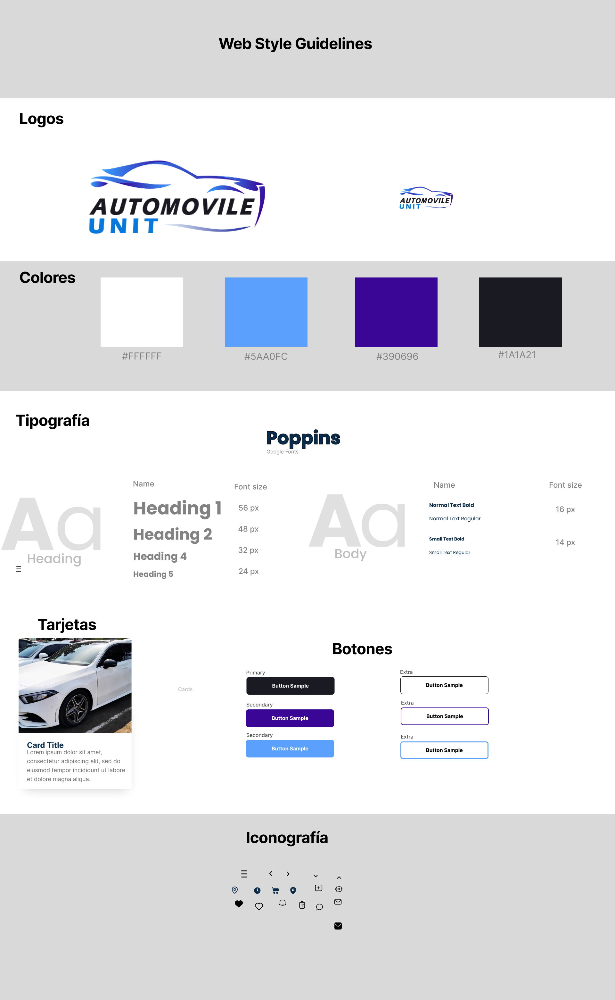

## CAPITULO IV: PRODUCT DESIGN

### 4.1. Style Guidelines.
En esta sección, establecemos las pautas de estilo que definirán los principios para crear nuestro producto desde cero. Estas directrices establecerán un estándar para la selección de tipografías, tamaños y paleta de colores necesarios para agilizar la creación del diseño de **Automovile-Unit** desde el inicio del proceso de prototipado. Estas pautas serán un recurso valioso para los miembros del equipo, ya que les brindarán una comprensión clara de cómo implementar los diferentes elementos del diseño en todas las áreas y secciones de la plataforma. Esto resultará en un ahorro significativo de tiempo y una mayor coherencia en la apariencia visual de **Automovile-Unit**.

#### 4.1.1. General Style Guidelines.
En esta sección, se revelará la selección completa de colores que hemos definido, junto con los íconos, el logo y la tipografía elegida. Estos componentes desempeñan un papel esencial en la creación de los estilos visuales que caracterizarán la apariencia de nuestra plataforma web. Cada matiz y diseño ha sido cuidadosamente seleccionado para transmitir una identidad coherente y única a lo largo de la aplicación, asegurando una experiencia visual atractiva para nuestros usuarios.

  

[click para verlo en figma](https://www.figma.com/file/Vzt3vQoRPZOXbziRvtRZXi/Landing-page?type=design&node-id=116%3A117&mode=design&t=meAF7ldyoprCkNWY-1)

#### 4.1.2. Web Style Guidelines.
En general, para los Lineamientos de Estilo Web, utilizaremos la fuente seleccionada en las Lineamientos de Estilo Generales: la fuente Poppins. Esta fuente se destaca por su legibilidad y estilo moderno, lo que la hace ideal para proyectos web. Además, se presenta la selección de colores para nuestra landing page y aplicación web, junto con el logotipo característico de nuestro producto, el cual no tendrá muchas variantes. También se muestran los diferentes formatos de botones que utilizaremos, así como la selección del estilo de tarjeta que aplicaremos en algunas secciones de nuestra landing page. Por último, se presenta la selección de íconos que servirán para la navegación.

  

[click para verlo en figma](https://www.figma.com/file/Vzt3vQoRPZOXbziRvtRZXi/Landing-page?type=design&node-id=117%3A593&mode=design&t=meAF7ldyoprCkNWY-1)