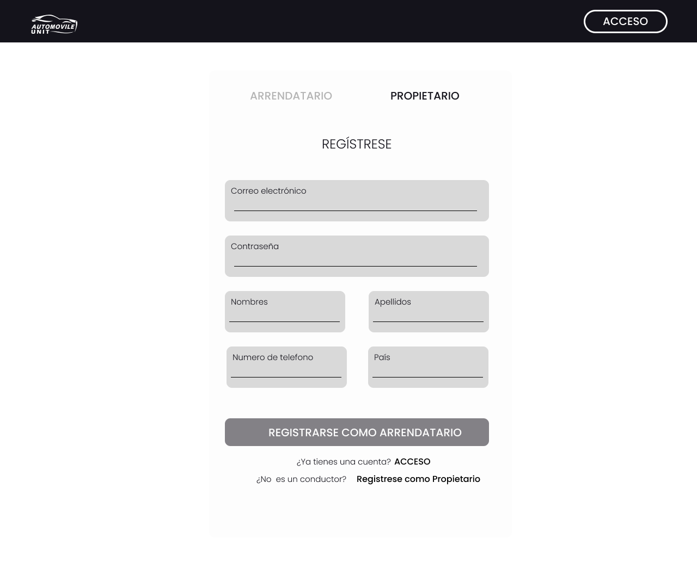

## CAPITULO IV: PRODUCT DESIGN

### 4.4. Web Applications UX/UI Design.

#### 4.4.1. Web Applications Wireframes.
**NOTA:El usuario puede decidir el tipo de registro, ya sea Arrendatario o Propietario:**

**Arrendatario(Persona que va a alquilar un auto):**

**PERFIL DE USUARIO:** Aqui el usuario podra ver sus datos como Nombre , Apellido, Celular, Correo y Cantidad de vehículos Alquilados . El usuario también podrá cambiar su foto de perfil presionando el botón **Cambiar foto de perfil** ,también podra alctualizar sus datos presionando el botón **Actualizar Datos** y también podra cerrar sesión en la cuenta presionando el botón **Cerrar Sesión**.

El botón mas importante en esta sección es el botón de **Subir documentos de Antecendente Penales**. Al presionar este botón podra subir desde su ordenador los documentos necesarios para validar sus datos. Luego se subirlo el boton cambiará a **Actualizar documentos de Antecendente Penales**.

**LOGIN:** Aqui el usuario debera iniciar sesión presionando el boton **Acceder** , si no esta registrado, debera presionar el botón **Inscríbete**.

  

**REGISTRO:** Aqui el usuario  que no se haya registrado debe ingresar sus datos para poder registrarse y presionar el botón  **Registrarse como arrendatario**.

**INICIO:** Aqui el usuario  encontrara toda las opciones posibles de la plataforma , además encontrara posibles herramientas adicionales que le puedan servir. Dentro de esta ventana estará la opcion de **Buscar coche** que llevara a otra ventana destinada a la busqueda  de autos para alquilar. Las opciones disponibles son **Buscar Auto** , **Mantenimiento** , **Alquilar**.

**BUSCAR AUTOS:** Aqui el usuario podra filtrar segun sus deseos que tipo de auto desea alquilar.Los datos a ingresar son ubicacion, precio , tiempo de alquiler,marca, modelo, clase y transmisión. El usuario debera presionar el botón **Buscar** para iniciar con la búsqueda, inmediatamente aparecerá el resultado de la búsqueda  como datos del vehiculo  , datos del propietario del vehículo y el estatus del anuncio (Disponible o No Disponible). Dentro de la busqueda estará el botón de **Ver contrato de alquiler**.

EL usuario debe verificar el contrato de Alquiler  que el propietario del vehículo ha publicado.Luego de verificarlo , si desea proceder con el alquiler deberá generar una firma digital presionando el botón **Generar firma digital** y luego presionar el botón **Solicitar Alquiler** para que se envie una solicitud al propietario del vehículo con propósito de alquiler.

  
**MANTENIMIENTO:** Aqui el usuario podra enviar un mensaje directamente al correo electrónico del propietario delvehículo para informarle sobre cualquier problema o sugerencia. Para esto primero tendra que buscar al titular y presiona el botón de **Buscar** , tambien se puede agregar fotos presionando el botón **Agregar fotos** luego se debe ingresar los datos requeridos y presionar el botón **Enviar**.  

**SOLICITUDES:** Aqui el usuario podra ver si la solicitud de alquiler esta en espero o si han sido aceptadas o rechazadas por el propietario del vehículo.Si la solicitud ha sido aceptada puedes presionar el botón de **Pagar**.

**ALQUILER:** Aqui el usuario podra ver  toda la información de los procesos de alquiler que se hayan realizado. Dentro se podra ver cada vehículo que se haya solicitado y si fue aceptada podrá presionar el botón de **Pagar**.También se puede agregar otro vehículo presionando el botón **Agregar otro vehículo**.

 Luego de presionar el botón **Pagar** se abrira otra ventana para relaizar el pago dentro de esta ventana, se encontrara 2 opciones de pago : EFECTIVO y ONLINE.Dentro de esta ventana también estara dicponible los datos de precio de alquiler , tiempo de alquiler , fecha de inicio de contrato del alquiler , fecha de fin del contrato de alquiler y lugar de recojo del vehículo.
 
 
 
 
  Al presionar el botón **Pago Efectivo** se abrira otra ventana en la cual se debera especificar la hora de recojo del vehículo y luego presionar el botón **Confirmar hora de alquiler**.Luego aparecera una ventana de Confirmación de Pago.

  

  
  
  Al presionar el botón **Pago Online** se abrira otra ventana en la cual se debera llenar el formulario con los datos reueridos y tambien se deberá ingresar la hora específica del recojo del vehículo.Luego aparecera una ventana de Confirmación de Pago.

  

  

[click para verlo en figma](https://www.figma.com/file/kSndMyfmimDhE2htNZCMfb/Web-Style-Guidelines-Grupo-6?type=design&node-id=0%3A1&mode=design&t=ZMXwDtlX9cq0rHL2-1)

#### 4.4.2. Web Applications Wireflow Diagrams.
#### 4.4.3. Web Applications Mock-ups.
#### 4.4.4. Web Applications User Flow Diagrams.
[contenido](../contenido.md)

[siguiente](./4.5-web-application-prototyping.md)