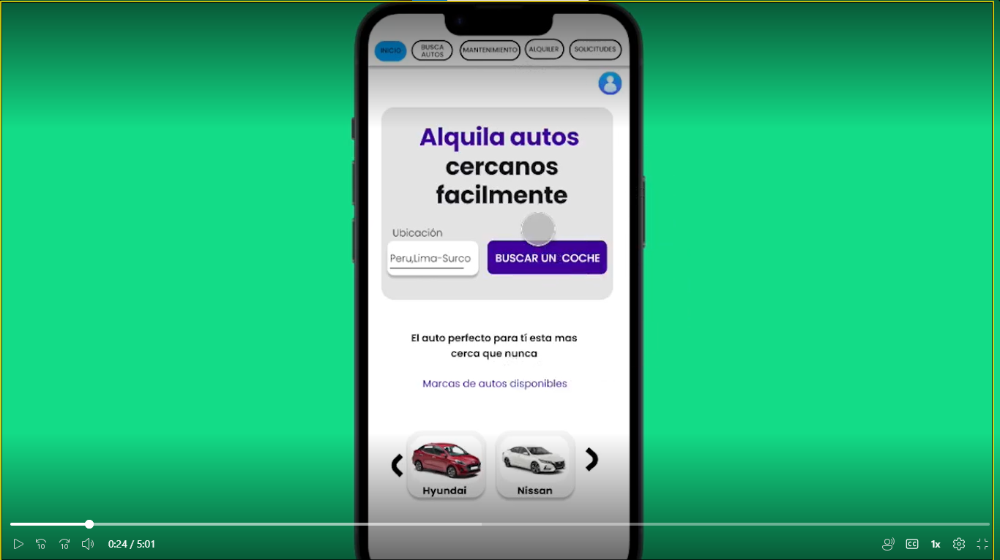
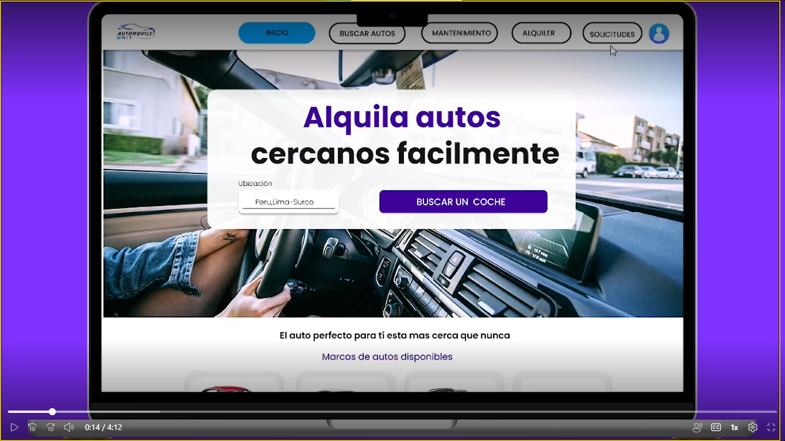

## CAPITULO IV: PRODUCT DESIGN

### 4.5. Web Applications Prototyping.

#### 4.5.1 Mobile Web Browser Prototyping.

Se desarrollo el prototipo para aplicaciones móviles, analizando el Wireflow
Diagrams y el User Flow Diagrams.
El prototipo
recrea de manera fiel el sistema de navegación que se planteó en la arquitectura de información
añadiendo las mejoras necesarias.

**Screenshot**

Enlace presentación: 
[clic al link](https://upcedupe-my.sharepoint.com/:v:/g/personal/u202118946_upc_edu_pe/EaMval6iqItKgLklpfsOtj4B8Ren21rBxw7iBl3yQhbALA?e=cVCkxY&nav=eyJyZWZlcnJhbEluZm8iOnsicmVmZXJyYWxBcHAiOiJTdHJlYW1XZWJBcHAiLCJyZWZlcnJhbFZpZXciOiJTaGFyZURpYWxvZyIsInJlZmVycmFsQXBwUGxhdGZvcm0iOiJXZWIiLCJyZWZlcnJhbE1vZGUiOiJ2aWV3In19)

Enlace explicación: [clic al link](https://upcedupe-my.sharepoint.com/:v:/g/personal/u202118946_upc_edu_pe/EUoUQURFA_xJnqRqzHD9Y88BVkaI4DzmnzfUsZ2h9dUp1g?e=1p8ptK)

Figma: [clic al link](https://www.figma.com/file/zgynlkWf61EGL7k3WX03tu/web-application-2mobile?type=design&node-id=0%3A1&mode=design&t=ghvPJN4UoU3aot9b-1)

#### 4.5.1 Desktop Prototyping.
**Screenshot**

Enlace presentación: 
[clic al link](https://upcedupe-my.sharepoint.com/:v:/g/personal/u202118946_upc_edu_pe/ETs1Z1wOZstDkcZFkE06xZsBG0Jz9cCRJlyL5t4Khe2hwg?e=pnFfrs&nav=eyJyZWZlcnJhbEluZm8iOnsicmVmZXJyYWxBcHAiOiJTdHJlYW1XZWJBcHAiLCJyZWZlcnJhbFZpZXciOiJTaGFyZURpYWxvZyIsInJlZmVycmFsQXBwUGxhdGZvcm0iOiJXZWIiLCJyZWZlcnJhbE1vZGUiOiJ2aWV3In19)

Enlace explicación: [clic al link](https://upcedupe-my.sharepoint.com/:v:/g/personal/u202118946_upc_edu_pe/EaXTOhDRALRCsQau7ileDNUBKyEfn8oDrId1HFzu4XSk5w?e=sB1ARg&nav=eyJyZWZlcnJhbEluZm8iOnsicmVmZXJyYWxBcHAiOiJTdHJlYW1XZWJBcHAiLCJyZWZlcnJhbFZpZXciOiJTaGFyZURpYWxvZyIsInJlZmVycmFsQXBwUGxhdGZvcm0iOiJXZWIiLCJyZWZlcnJhbE1vZGUiOiJ2aWV3In19)

Figma: [clic al link](https://www.figma.com/file/SLivQnDeKYJalrqtf80doC/web-application?type=design&node-id=0%3A1&mode=design&t=eFp3OdVf6Xs5nlfK-1)

[contenido](../contenido.md)

[siguiente](./4.6-domain-driven-software-arquitecture.md)