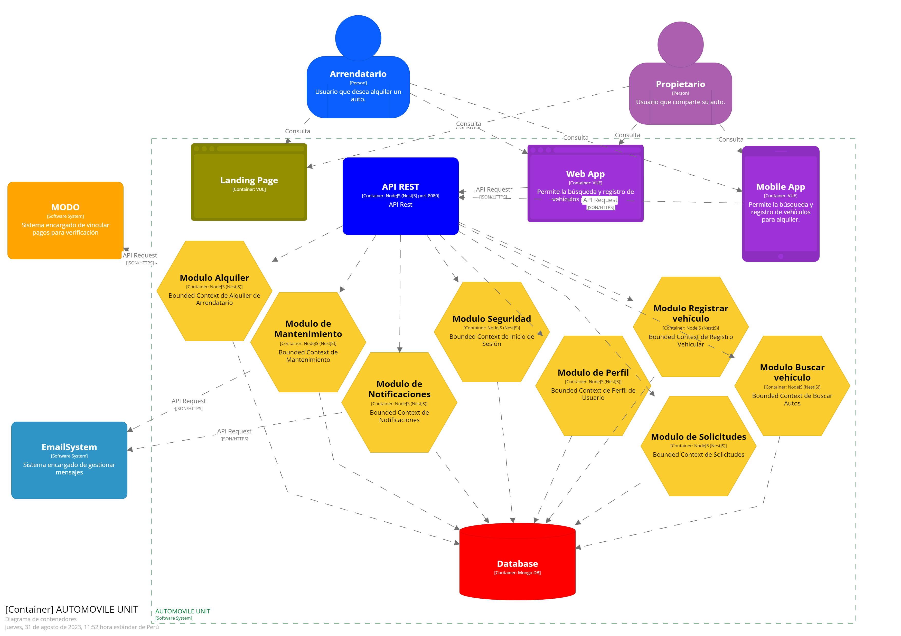

## CAPITULO IV: PRODUCT DESIGN

### 4.6. Domain-Driven Software Architecture.
#### 4.6.1. Software Architecture Context Diagram.

#### 4.6.2. Software Architecture Container Diagrams.

#### 4.6.3. Software Architecture Components Diagrams.

**Diagrama de Componentes de Seguridad**

**Diagrama de Componentes de Registro Vehicular**

**Diagrama de Componentes de Búsqueda Vehicular**

**Diagrama de Componente Solicitud**

**Diagrama de Componente Perfil**

**Diagrama de Componente Notificaciones**

**Diagrama de Componente Mantenimiento**

**Diagrama de Componente Alquiler**

[contenido](../contenido.md)

[siguiente](./4.7-software-object-oriented-design.md)