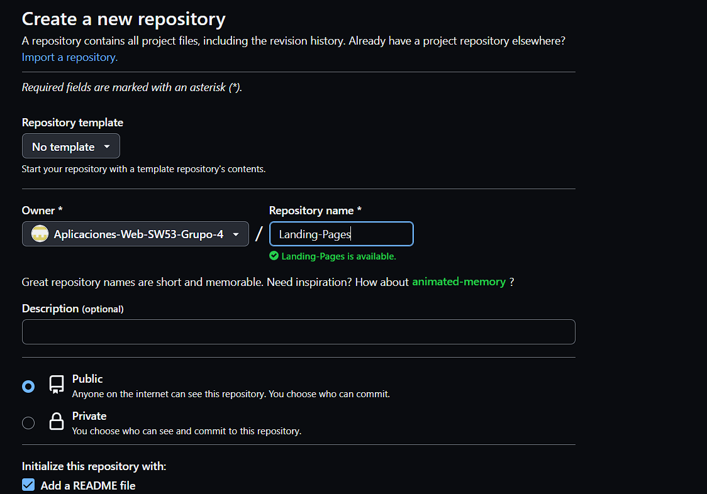
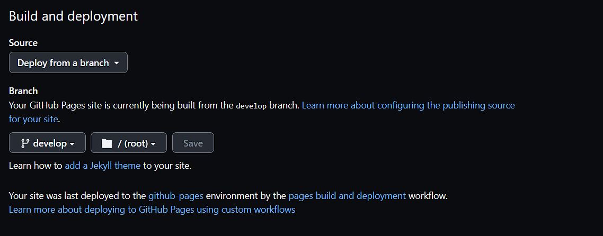
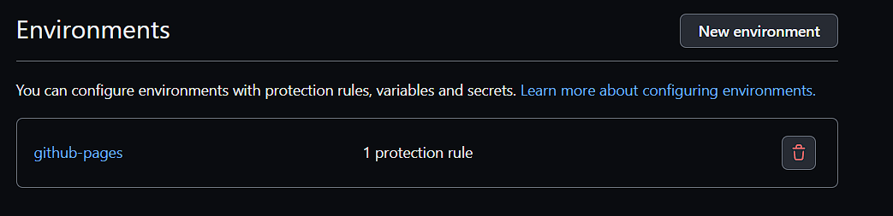

# **CAPÍTULO V: PRODUCT IMPLEMENTATION, VALIDATION & DEPLOYMENT**

## **5.1. Software Configuration Management.**
Para este proyecto nos hemos especificado en diferentes programas que nos ayudaran a la organización en el apartado visual, gráfico y con el sistema de codificación de todo el equipo y la forma en la cual lo implementaremos.
### **5.1.1. Software Development Environment Configuration.**
Para la realización de este proyecto nos hemos enfocado en tener una realización mutua del trabajo a través de diferentes programas y a su vez la utilizacion de herramientas que aportan al avance de las pautas del proyecto.
##### Proyect Managemnent:
Para Organizar todas las actividades que necesitamos realizar y prototipos de ideas e implementaciones nuevas a nuestro proyecto hemos decidido utilizar Google drive y hasta visual studio code que nos ayudará de guia para continuar con la documentación del informe.
##### Requirement Management:
Luego de que todos los integrantes han realizado la parte correspondiente a su cargo, se da la respectiva revisión general de cada parte del informe para identificar posibles errores o pautas faltante.
##### Product UX/UI design:
En el caso del prototipo de nuestra Landing Page hemos utilizado la herramienta de diseño "Figma", dicha herramienta nos facilita con el diseño e implementación de la Landing Page y sus derivados.
Link: https://www.figma.com
##### Software Development:
Para el apartado visual y tipeado de nuestro informe, se ha utilizado visualStudioCode junto con Markdown, la cual es un lenguaje de documentación al estilo de Microsoft Word. Tambien se utilizó VS Code para para la codificación de la landing Page.
Link: https://code.visualstudio.com
##### Software Documentation:
El proyecto, documentación e informe este alojado en el famoso "GitHub" herramienta que nos facilita a trabajar en conjunto y con una productividad amena para así facilitar el hecho de cuanto trabajo o cuanto porcentaje de eficacia estamos teniendo con el avance del proyecto.
Link: https://github.com
### **5.1.2. Source Code Management.**
URL del Repositorio de GitHub para la Landing Page.
Landing Page:
##### GitFlow
La metodologia GitFlow es un modo de trabajo de metodo en flijo la cual es aplicado en un repositorio de git, esto nos permite ver quien esta actualizando y realizando acciones dentro del repositorio, junto a esto con las opciones de reparar y realizar mantenimiento al repositorio de forma continua.
##### Main Branch
Es dicha rama que se genera por defecto en nuestro repositorio.
##### Master Branch
Es la rama que contiene a las versiones mas estables de nuestro proyecto.
##### Develop Branch
Es la rama la cual contiene nuestro codigo en version de plan y a la cual le incluimos las caracteristicas en estilo a la Landing Page.
##### Feature Branch
Es las branchs que manejan cada integrante de nuestro grupo "rama-(nombre del integrante)" esto para facilitar las divisiones y tener una avance continuo del proyecto.
### **5.1.3. Source Code Style Guide & Conventions.**
##### GitHub
Cada integrante del grupo tiene creado su propia rama en la cual establece la funcion de avance y establecer un trabajo continuo facil de monitorear.
##### HTML
Utilizamos el lenguaje de HTML para la implementacion base de nuestra Landing Page en la cual nos enfocaremos en las primeras funcionalidades de presentacion de nuestro proyecto y asi tambien lograr una mejor configuracion al usar los otros lenguajes de diseño.
### **5.1.4. Software Deployment Configuration.**
Se crea un repositorio remoto de trabajo en GitHub.

  

Asi haciendo esto procedemos a entrar al visual donde podemos editar con los comandos "git" las diferentes funcionalidades como el "git init" para inicializar el repositorio local.
Ya teniendo esto podemos subir los archivos al GitHub para una mayor facilidad de controlar el avance mutuo entre nosotros. en nuestro caso usamos la terminal del VisualStudioCode, junto con la posibilidad de usar git dentro de esta.
Luego nos dirigimos al repositorio remoto de GitHub.
Para activar nuestra pagina vamos al apartado de Settings y buscamos en donde esta la configuracion en donde desplegar la pagina de la landing Page, en nuestro caso vamos a desplegarlo en el main pero esta vez hemos probado desplegandolo en nuestro Branch "develop".

  

Luego en la misma seccion de Settings ya tendriamos nuestro link creado en el apartado de "Environments".

  

Link de la Landing Page: 

https://aplicaciones-web-sw53-grupo-4.github.io/Landing-page
