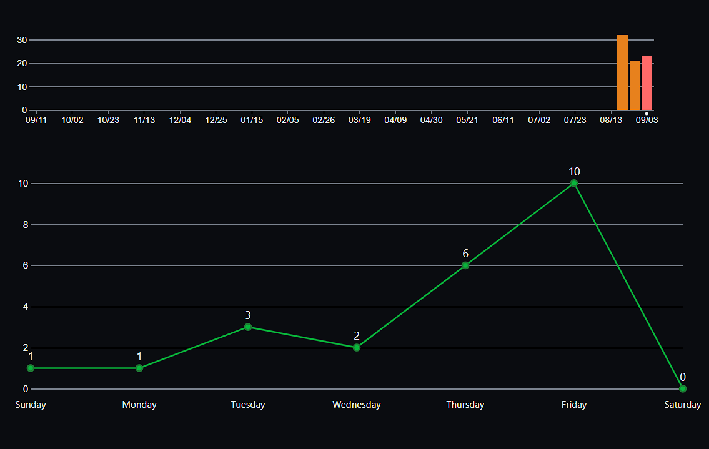

## **CAPÍTULO V: PRODUCT IMPLEMENTATION, VALIDATION & DEPLOYMENT**

### **5.2. Landing Page, Services & Applications Implementation.**
#### **5.2.1. Sprint 1**
##### **5.2.1.1. Sprint Planning 1.**

  

Link de Trello del informe: 

 https://trello.com/b/bwGqN1z7/tb1-semana-4 

  

Link de Trello de Landing Page:

https://trello.com/b/2Stqn5Ye/landing-page

##### **5.2.1.2. Sprint Backlog 1.**

| Funcionalidad | ID | Título de la Funcionalidad | Estimación (en horas) | Asignado a | Estado |
| --- | --- | --- | --- | --- | --- |
| Ver Perfil de Usuario | 1 | Ver perfil | 3 horas | Baldeon Fabian, Aldo Alberto | Hecho |
| Subir Documentos de Antecedentes Penales | 2 | Subir documentos de Antecedentes Penales | 1 horas | Herrera Del Pino, Josehp Piero | Hecho |
| Buscar Vehículo | 3 | Buscar vehículo | 2 horas | Rengifo Mirabal, Randy Becker | Hecho |
| Ver Contrato de Alquiler | 4 | Ver contrato de alquiler | 3 horas | Ruiz Torres, Erick Hernan | Hecho |
| Generar Firma Digital | 5 | Generar firma digital | 2 horas | Salas Pujay, Mauricio Alberto | Hecho |

##### **5.2.1.3. Development Evidence for Sprint Review.**
| Repository         | Branch | Commit ID                           | Commit Message                         | Commit Message Body | Committed on Date   |
|--------------------|--------|------------------------------------|----------------------------------------|---------------------|--------------------|
| AutoMovile-Unit    | main   | 5ea4cd4057c962580ca2a82a361d6d78642db1b1 | Implementación de la sección de Inicio. | -                   | 1 de septiembre de 2023 |
| AutoMovile-Unit    | main   | 6f45b878ecbafe6d25c4cf5fb63efbf7ef63d452 | Agregado de la sección Acerca de.       | -                   | 2 de septiembre de 2023 |
| AutoMovile-Unit    | main   | 3b07df3e6952b58541081096b30b1a9dfe0f9c64 | Diseño de la sección de Nosotros.       | -                   | 4 de septiembre de 2023 |
| AutoMovile-Unit    | main   | 2a0b137ea8703e5efb77a5b8a1c41bc51ab3c774 | Integración de la sección Acerca de.     | -                   | 5 de septiembre de 2023 |
| AutoMovile-Unit    | main   | 98f5e72856d775b78f4936e470c7c34f74fbf4a8 | Desarrollo de la funcionalidad de generación de firma digital. | - | 6 de septiembre de 2023 |

##### **5.2.1.4. Testing Suite Evidence for Sprint Review.**
En esta parte sabemos que hemos desarrollado solo el apartado de la Landing Page de la Aplicación Web, la cual esta parte por ahora será obviada por esta vez. De esta manera podemos hacer test para que en una siguiente entrega podamos dar una mejor experiencia.
##### **5.2.1.5. Execution Evidence for Sprint Review.**
En esta entrega nos enfocamos en el desarrollo total de la Landing Page y poder desplegarlo para que a partir de ahi poder crear e implementar las diferentes funcionalidades que tenemos pensadas. La landing page creada habla sobre como nuestra Aplicación Web tendrá el impacto en el mundo automovilístico para generar una repercusión en la compra, venta y alquiler de vehículos

  

  

  

  

##### **5.2.1.6. Services Documentation Evidence for Sprint Review.**
Nuestro proyecto, denominado AutoMovile-Unit, es una plataforma en línea que permite el alquiler de vehículos entre propietarios y arrendatarios. Para la creación de esta plataforma, hemos utilizado una serie de tecnologías y herramientas clave.
**HTML (HyperText Markup Language)**
Hemos utilizado HTML para estructurar el contenido de nuestra página web. HTML nos ha permitido crear una estructura sólida y semántica para nuestra plataforma.
**CSS (Cascading Style Sheets)**
CSS se ha utilizado para dar estilo y diseño a nuestra plataforma. Hemos creado hojas de estilo CSS para mejorar la presentación visual y la experiencia del usuario.
**JavaScript**
JavaScript se ha implementado para agregar interactividad a la plataforma. Para esta ocasión la utilizamos como método de conectar todo el apartado visual de la Landing Page.
**Git**
Git es nuestro sistema de control de versiones principal. Lo hemos utilizado para rastrear y gestionar cambios en nuestro código a lo largo del desarrollo del proyecto.
**GitHub**
Hemos alojado nuestro repositorio en GitHub para colaborar y realizar un seguimiento más efectivo de los cambios en el código. GitHub también nos ha brindado una plataforma para revisar y discutir problemas y solicitudes de incorporación de cambios.
**GitHub Pages**
GitHub Pages se ha utilizado para alojar y publicar nuestra página web de manera gratuita. Esto nos permite mostrar y compartir nuestra plataforma en línea con el público.
##### **5.2.1.7. Software Deployment Evidence for Sprint Review.**
Para esta entrega logramos cumplir la implementación de la landing Page donde se encuentra la información detallada de nuestra StartUp.
Presentamos:
URL (Link desplegado de Landing Page(AutoMovil-Unit)): 

https://aplicaciones-web-sw53-grupo-4.github.io/Landing-page/

##### **5.2.1.8. Team Collaboration Insights during Sprint.**

  

  

  

### CONCLUSIONES
- Potencial de Mercado Prometedor: La startup tiene un potencial de mercado significativo en Perú, aprovechando la subutilización de vehículos particulares y la necesidad de soluciones de alquiler de vehículos más convenientes y accesibles.
- Contribución a la Movilidad Sostenible: Automovile-Unit tiene el potencial de contribuir a la reducción de la congestión vial y fomentar prácticas de movilidad más sostenibles al optimizar el uso de vehículos existentes.
- Generación de Ingresos Adicionales: La plataforma ofrece a los propietarios de vehículos la oportunidad de generar ingresos adicionales alquilando sus vehículos cuando no los utilizan, lo que puede ser un incentivo atractivo.
- Desafíos de Seguridad y Confianza: Un desafío importante es establecer medidas de seguridad y confianza sólidas para garantizar que tanto los propietarios como los arrendatarios se sientan cómodos participando en la plataforma.
- Diferenciación Competitiva: Automovile-Unit debe enfocarse en la diferenciación competitiva, ofreciendo características y servicios únicos que la distingan de otras plataformas de alquiler de vehículos.
- Fomentar la Comunicación y la Evaluación Continua: La comunicación clara entre propietarios y arrendatarios, así como la evaluación continua de la calidad del servicio y las políticas, serán clave para el éxito a largo plazo de la startup.

### ANEXOS

- **Links del Figma:** 
- https://www.figma.com/file/Vzt3vQoRPZOXbziRvtRZXi/Landing-page?type=design&node-id=116%3A117&mode=design&t=meAF7ldyoprCkNWY-1
- https://www.figma.com/file/Vzt3vQoRPZOXbziRvtRZXi/Landing-page?type=design&node-id=117%3A593&mode=design&t=meAF7ldyoprCkNWY-1

- **Link del Trello:**  https://trello.com/b/bwGqN1z7/tb1-semana-4 
https://trello.com/b/2Stqn5Ye/landing-page
- **Link del GitHub:** https://github.com/Aplicaciones-Web-SW53-Grupo-4
- **Link del Informe en GitHub:** https://github.com/Aplicaciones-Web-SW53-Grupo-4/Informes-de-Trabajos
- **Link del GitHub de la Landing Page:** https://github.com/Aplicaciones-Web-SW53-Grupo-4/Landing-page
- **Link de la Landing Page:** https://aplicaciones-web-sw53-grupo-4.github.io/Landing-page/

## Bibliografía
- HTML: HyperText Markup Language | MDN. (2023, July 17). Mozilla.org. https://developer.mozilla.org/en-US/docs/Web/HTML
- JavaScript | MDN. (2023, July 8). Mozilla.org. https://developer.mozilla.org/en-US/docs/Web/JavaScript
- CSS: Cascading Style Sheets | MDN. (2023, July 22). Mozilla.org. https://developer.mozilla.org/en-US/docs/Web/CSS

‌
‌

‌
