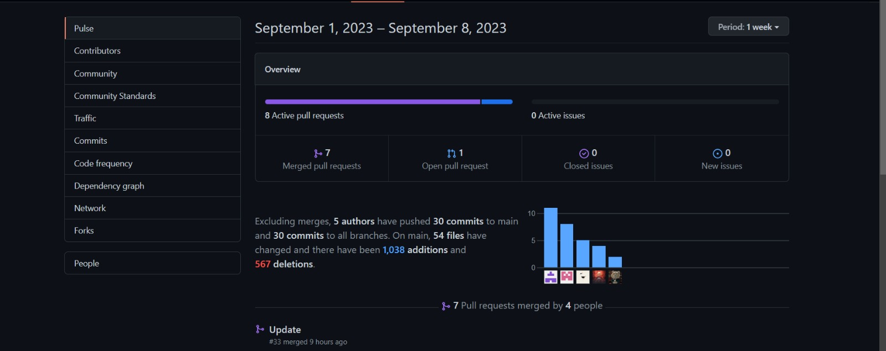
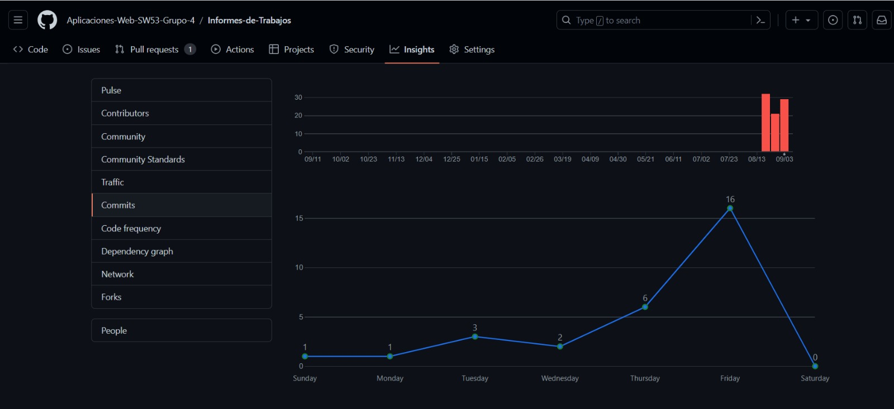

## Universidad Peruana de Ciencias Aplicadas 
## Ingenieria de software 
## Ciclo II

## Aplicaciones Web
**Sección:** [SW53]

**Profesor:** [Naldo Reupo-Musayon Gastulo]

## **Informe de Trabajo Final**

**Startup:** [Speed-Driving]

**Producto:** [Automovile-Unit]

## Relación de Integrantes:
- [Baldeon Fabian, Aldo Alberto - u202122633]
- [Herrera Del Pino, Josehp Piero - u20211e098]
- [Rengifo Mirabal, Randy Becker - u20211d683]
- [Ruiz Torres, Erick Hernan - u202118946]
- [Salas Pujay, Mauricio Alberto - u202120467]

**Mes y Año:** [Agosto - 2023]

***

## Registro de Versiones del Informe

| Versión | Fecha       | Autor            | Descripción de modificación       |
| ------- | ----------- | ---------------- | --------------------------------- |
| 1    | [23-08-2023]     | [Todos los integrantes]  | [Asignación de partes a trabajar por cada integrante del equipo] |
| 2    | [28-08-2023]     | [Todos los integrantes]  | [Implementacion del capitulo I,II y III] |
| 3    | [03-09-2023]     | [Todos los integrantes]  | [Implementacion del capitulo IV] |
| 4    | [05-09-2023]     | [Todos los integrantes]  | [Implementacion del capitulo V] |
| 5    | [08-09-2023]     | [Todos los integrantes]  | [Ultimas revisiones del documento] |

## Project Report Collaboration Insights

 

## **Contenido**
### CAPÍTULO I: INTRODUCCIÓN
- [1.1 Startup Profile]
  - [1.1.1. Descripción de la Startup]
  - [1.1.2. Perfiles de integrantes del equipo]
- [1.2 Solution Profile]
  - [1.2.1 Antecedentes y problemática]
  - [1.2.2 Lean UX Process.]
    - [1.2.2.1. Lean UX Problem Statements.]
    - [1.2.2.2. Lean UX Assumptions.]
    - [1.2.2.3. Lean UX Hypothesis Statements.]
    - [1.2.2.4. Lean UX Canvas]
  - [1.3. Segmentos objetivo.]

### CAPÍTULO II: REQUIREMENTS ELICITATION & ANALYSIS
- [2.1. Competidores.]
  - [2.1.1. Análisis competitivo.]
  - [2.1.2. Estrategias y tácticas frente a competidores.]
- [2.2. Entrevistas.]
  - [2.2.1. Diseño de entrevistas.]
  - [2.2.2. Registro de entrevistas.]
  - [2.2.3. Análisis de entrevistas.]
- [2.3. Needfinding.]
  - [2.3.1. User Personas.]
  - [2.3.2. User Task Matrix.]
  - [2.3.3. User Journey Mapping.]
  - [2.3.4. Empathy Mapping.]
  - [2.3.5. As-is Scenario Mapping.]

### CAPÍTULO III: REQUIREMENTS SPECIFICATION
- [3.1. To-Be Scenario Mapping.]
- [3.2. User Stories.]
- [3.3. Impact Mapping.]
- [3.4. Product Backlog.]

### CAPÍTULO IV: PRODUCT DESIGN
- [4.1. Style Guidelines.]
  - [4.1.1. General Style Guidelines.]
  - [4.1.2. Web Style Guidelines.]
- [4.2. Information Architecture.]
  - [4.2.1. Organization Systems.]
  - [4.2.2. Labeling Systems.]
  - [4.2.3. SEO Tags and Meta Tags]
  - [4.2.4. Searching Systems.]
  - [4.2.5. Navigation Systems.]
- [4.3. Landing Page UI Design.]
  - [4.3.1. Landing Page Wireframe.]
  - [4.3.2. Landing Page Mock-up.]
- [4.4. Web Applications UX/UI Design.]
  - [4.4.1. Web Applications Wireframes.]
  - [4.4.2. Web Applications Wireflow Diagrams.]
  - [4.4.3. Web Applications Mock-ups.]
  - [4.4.4. Web Applications User Flow Diagrams.]
- [4.5. Web Applications Prototyping.]
- [4.6. Domain-Driven Software Architecture.]
  - [4.6.1. Software Architecture Context Diagram.]
  - [4.6.2. Software Architecture Container Diagrams.]
  - [4.6.3. Software Architecture Components Diagrams.]
- [4.7. Software Object-Oriented Design.]
  - [4.7.1. Class Diagrams.]
  - [4.7.2. Class Dictionary.]
- [4.8. Database Design.]
  - [4.8.1. Database Diagram.]

### CAPÍTULO V: PRODUCT IMPLEMENTATION, VALIDATION & DEPLOYMENT
- [5.1. Software Configuration Management.]
  - [5.1.1. Software Development Environment Configuration.]
  - [5.1.2. Source Code Management.]
  - [5.1.3. Source Code Style Guide & Conventions.]
  - [5.1.4. Software Deployment Configuration.]
- [5.2. Landing Page, Services & Applications Implementation.]
  - [5.2.1. Sprint 1]
    - [5.2.1.1. Sprint Planning 1.]
    - [5.2.1.2. Sprint Backlog 1.]
    - [5.2.1.3. Development Evidence for Sprint Review.]
    - [5.2.1.4. Testing Suite Evidence for Sprint Review.]
    - [5.2.1.5. Execution Evidence for Sprint Review.]
    - [5.2.1.6. Services Documentation Evidence for Sprint Review.]
    - [5.2.1.7. Software Deployment Evidence for Sprint Review.]
    - [5.2.1.8. Team Collaboration Insights during Sprint.]

## Student Outcome
| Criterio Específico | Acciones Realizadas | Conclusiones                                      |
| ------------------- | ------------------- | ------------------------------------------------- |
| La capacidad de funcionar efectivamente en un equipo cuyos miembros juntos proporcionan liderazgo, crean un entorno de colaboración e inclusivo, establecen objetivos, planifican tareas y cumplen objetivos. | **TB1: Rengifo Mirabal, Randy Becker:** Capitulo I y III - **TB1: Baldeon Fabian, Aldo Alberto:** Capitulo II - **TB1: Herrera Del Pino, Josehp Piero** Capitulo IV - **TB1: Ruiz Torres, Erick Hernan** Capitulo IV - **TB1: Salas Pujay, Mauricio Alberto** Capitulo V | [- Hemos reconocido la importancia fundamental del trabajo en equipo en el logro de objetivos y metas compartidas. Comprendemos que no se trata solo de las habilidades individuales, sino de la capacidad de colaborar de manera efectiva. - Valoramos la necesidad de establecer objetivos claros y planificar nuestras acciones para lograrlos. Esto implica definir metas concretas, asignar responsabilidades y elaborar un plan estratégico. - Como equipo, estamos comprometidos con el cumplimiento de nuestros objetivos. Entendemos que el éxito radica en nuestra capacidad para trabajar de manera eficiente y coordinada para alcanzar resultados deseables.]|

# CAPÍTULO I: INTRODUCCIÓN 

## 1.1 Startup Profile
### 1.1.1. Descripción de la Startup

Somos Speed-Drivingun startup integrado por estudiantes del quinto ciclo de la carrera de Ingeniería de Software de la Universidad Peruana de Ciencias Aplicadas, que se encuentran elaborando el producto nombrado Automovile-Unit la cual consiste en el alquiler de vehículos que actúa como intermediario entre los propietarios de automóviles y las personas que desean alquilarlos.

Automovile-Unit surgio apartir de la idea de aprovechar los vehículos que no están en uso y permitir a los propietarios ganar dinero alquilándolos a otros usuarios, al mismo tiempo que brindamos a los usuarios la conveniencia de acceder a una amplia variedad de vehículos según sus necesidades.

**Misión:** En Speed-Drivingun, nuestra misión es revolucionar la movilidad en el Perú al proporcionar una plataforma segura y eficiente que permita a las personas compartir vehículos de manera confiable y conveniente. Estamos comprometidos en optimizar la utilización de los vehículos existentes, contribuyendo así a la reducción de la congestión vial y alentando prácticas más sostenibles en el transporte.

**Visión:** Nuestra visión es ser líderes en la transformación de la movilidad compartida en el Perú. Nos esforzamos por ser la plataforma preferida tanto para propietarios de vehículos que buscan una fuente de ingresos adicional como para usuarios que desean una alternativa de alquiler de vehículos flexible y asequible. A medida que avanzamos, aspiramos a crear un cambio positivo en la forma en que las personas se desplazan dentro del país, promoviendo la economía local y mejorando la calidad de vida de los peruanos.

### 1.1.2. Perfiles de integrantes del equipo

**Baldeon Fabian, Aldo Alberto:**

**Herrera Del Pino, Josehp Piero:**

  

En la actualidad, me encuentro en el quinto ciclo de mi formación en Ingeniería de Software en la Universidad Peruana de Ciencias Aplicadas. Mi personalidad proactiva me impulsa a buscar constantemente nuevas oportunidades de aprendizaje, mientras que mi perseverancia innata me lleva a enfrentar cada desafío con determinación. Mi sentido de responsabilidad guía mis acciones, asegurando que me comprometo plenamente con mis tareas y metas. En mis momentos de ocio, encuentro satisfacción en los videojuegos, la música, el fútbol y las series, actividades que fomentan mi creatividad. Mi habilidad técnica abarca diversos lenguajes y herramientas, como C++, Java, Python, HTML, CSS, Git y Javascript, y busco constantemente fusionar creatividad y lógica para abordar desafíos con innovación y eficiencia.

**Rengifo Mirabal, Randy Becker:**

  

Actualemente me encuentro cursando el quinto ciclo de la carrera de Ingenieria de Software en la Universidad Peruana de Ciencias Aplicadas. Me considero una persona proactiva, perseverante, responsable y sobre todo divertido. Mis pasatiempos favoritos son los videojuegos, escuchar música, jugar al futbol. Cuentos con conocimientos en C++, Java, Kotlin, HTML, CSS, etc.

**Ruiz Torres, Erick Hernan**

  

Actualmente me encuentro cursando el quinto ciclo de la carrera de Ingenieria de Software en la Universidad Peruana de Ciencias Aplicadas. Me considero una persona responsable, puntual y dedicada. Mis pasatiempos favorito es la ilustración digital, escuchar música, jugar al futbol. Cuento con conocimientos en C++, Java, HTML, CSS, etc.

**Salas Pujay, Mauricio Alberto:**

  

Actualmente me encuentro cursando el quinto ciclo de la carrera de Ingeniería de Software en la Universidad Peruana de Ciencias Aplicadas. Me considero una persona dedicada, responsable, proactivo, y eficiente. Mis pasatiempos favoritos son escuchar música, ver series y en ciertas ocasiones jugar videojuegos y al básquet. En cuanto al conocimiento de la programación tengo una experiencia en uso de C++, Java Script, Html, Css.

## **1.2 Solution Profile**
### **1.2.1 Antecedentes y problemática**
En el contexto peruano, existe una problemática relacionada con la subutilización de vehículos particulares y las dificultades en el proceso de alquiler de automóviles. Según datos del Ministerio de Transportes y Comunicaciones de Perú, se estima que aproximadamente el 50% de los vehículos particulares en Lima, la capital, pasan la mayor parte del tiempo estacionados y sin uso. Esto representa una oportunidad significativa para aprovechar esos vehículos y reducir la congestión del tráfico urbano.

#### The 5’W’s & 2’H’s

**What (Qué)** 
- **¿Cuál es el problema?**
  - El problema es la subutilización de vehículos particulares en Perú y las complicaciones en el proceso tradicional de alquiler de automóviles.

- **¿Cuál es la relación con la persona en cuestión?**
  - La relación se establece entre los propietarios de vehículos que no utilizan sus automóviles eficientemente y los usuarios que buscan alquilar vehículos de manera conveniente.

**When (Cuando)** 
- **¿Cuándo sucede el problema?**
  - El problema de la subutilización de vehículos ocurre de manera continua en el día a día en Perú. Las complicaciones en el proceso de alquiler de automóviles también ocurren cuando los usuarios necesitan vehículos de manera temporal.

- **¿Cuándo utiliza el cliente el producto?**
  - Los usuarios utilizarán la plataforma de alquiler de vehículos cuando necesiten un automóvil por un período corto.

**Where (Dónde)** 
- **¿Dónde está el cliente cuando usa el producto?**
  - Los usuarios estarán en diferentes ubicaciones en Perú cuando utilicen la plataforma para buscar y alquilar vehículos.

- **¿A dónde se dirige?**
  - La plataforma se dirige a usuarios en todo el territorio de Perú, inicialmente enfocándose en áreas urbanas como Lima y otras ciudades importantes.

- **¿Dónde surge el problema?**
  - El problema de la subutilización de vehículos surge en hogares y estacionamientos en todo el país, mientras que las complicaciones en el alquiler surgen en las agencias tradicionales.

**Who (Quién)** 
- **¿Quiénes están involucrados?**
  - Propietarios de vehículos particulares, usuarios en búsqueda de alquiler de vehículos.

- **¿A quiénes le sucede el problema?**
  Tanto a los propietarios que desean generar ingresos con sus vehículos como a los usuarios que buscan una forma más accesible de alquilar autos.

- **¿Quién lo utilizará?**
  - Tanto propietarios de vehículos como usuarios interesados en alquilar.

**Why (Por qué)** 
- **¿Cuál es la causa del problema?**
  - El problema surge debido a la falta de una plataforma eficiente que permita la colaboración entre propietarios y usuarios de vehículos.

**How (Cómo)** 
- **¿En qué condiciones los clientes usan nuestro producto?**
  - Los clientes utilizarán la plataforma cuando necesiten alquilar un vehículo por un período corto.

- **¿Cómo nos conocieron los compradores?**
  - Los compradores nos conocerán a través de campañas de marketing digital, recomendaciones de usuarios existentes y asociaciones con empresas relacionadas.

- **¿Cómo prefieren los usuarios acceder a nuestro servicio?**
  - Los usuarios prefieren acceder a nuestro servicio a través de una aplicación móvil o un sitio web fácil de usar.

- **¿Qué llevó a la persona a llegar a esta situación?**
  - La necesidad de generar ingresos extra o la búsqueda de una solución más conveniente y económica para el alquiler de vehículos.

**How much (Cuánto)** 
- En Perú, según datos del Ministerio de Transportes y Comunicaciones, se estima que alrededor del 50% de los vehículos particulares en Lima, la capital, pasan la mayor parte del tiempo estacionados y sin uso1. Esto representa un gran número de vehículos subutilizados que podrían ser aprovechados de manera más eficiente a través de un servicio de alquiler. Además, según datos del Registro de Propiedad Vehicular de la Superintendencia Nacional de los Registros Públicos (SUNARP) y la Asociación Automotriz del Perú (AAP), se estima que había alrededor de 3.5 millones de vehículos registrados en Perú hasta 2021. Este número incluye automóviles particulares, vehículos comerciales y otros tipos de vehículos12.

### **1.2.2 Lean UX Process.**
### **1.2.2.1. Lean UX Problem Statements.**
**Problem statement 1: Falta de Confianza en el Proceso de Alquiler**
- Los propietarios pueden sentir inseguridad al entregar sus vehículos a extraños, mientras que los arrendatarios pueden preocuparse por el estado del vehículo y el cumplimiento del contrato. Esto puede llevar a una baja adopción de la plataforma. Es esencial establecer mecanismos de verificación de identidad y confiabilidad, así como implementar políticas claras de seguro y reembolso en caso de daños.

**Problem statement 2: Selección de Vehículos Apropiados**
- Los usuarios pueden encontrarse con una amplia variedad de vehículos en la plataforma, lo que dificulta encontrar el más adecuado para sus necesidades. Esto puede resultar en una experiencia frustrante y llevar a usuarios a abandonar la búsqueda. Una solución sería permitir la aplicación de filtros específicos, como tipo de vehículo, capacidad, características y ubicación, para ayudar a los usuarios a encontrar rápidamente lo que necesitan.

**Problem statement 3: Proceso de Pago y Tarifas Claras**
- Los usuarios pueden abandonar el proceso de alquiler si no comprenden completamente cómo se calculan las tarifas o si sienten que están ocultas. Una solución es simplificar el proceso de pago y presentar las tarifas de manera transparente, divulgando cualquier cargo adicional de manera clara antes de que los usuarios confirmen su alquiler.

**Problem statement 4: Verificación de Identidad y Antecedentes**
- Aunque es necesario llevar a cabo verificaciones de antecedentes para construir confianza entre las partes, este proceso puede llevar mucho tiempo y desanimar a los usuarios. Para abordar este problema, se podría explorar la posibilidad de integrar tecnologías de verificación más rápidas y confiables, como la verificación biométrica y el uso de bases de datos públicas para antecedentes penales.

**Problem statement 5: Interfaz Intuitiva y Fácil de Usar**
- Una interfaz complicada y abarrotada puede abrumar a los usuarios, especialmente aquellos que no están familiarizados con plataformas de alquiler en línea. La solución implica adoptar un diseño centrado en el usuario que guíe a los usuarios de manera clara y lógica a través de cada paso del proceso de alquiler, limitando la cantidad de información presentada en cada etapa.

**Problem statement 6: Gestión de Reseñas y Calificaciones**
- Las reseñas y calificaciones son fundamentales para construir confianza, pero existe el riesgo de reseñas falsas o injustas. Para abordar este desafío, podríamos implementar sistemas de verificación de reseñas y fomentar la retroalimentación constructiva. Además, se podrían tomar medidas contra el abuso de reseñas falsas, como verificar la autenticidad de las transacciones antes de permitir reseñas.

### **1.2.2.2. Lean UX Assumptions.**
- Los propietarios de automóviles están dispuestos a alquilar sus vehículos a desconocidos.
- Los usuarios están dispuestos a alquilar vehículos de propietarios individuales en lugar de utilizar servicios tradicionales de alquiler de automóviles.
- El proceso de reserva y alquiler de vehículos será lo suficientemente intuitivo y fácil de usar para los usuarios.
- Los precios establecidos por los propietarios serán atractivos para los usuarios.
- Habrá suficientes propietarios y usuarios interesados en el servicio para mantener un flujo constante de alquileres.
- Los propietarios estarán dispuestos a proporcionar información precisa y detallada sobre sus vehículos.
-  La plataforma será capaz de gestionar de manera efectiva los aspectos logísticos, como la disponibilidad de vehículos y los horarios de recogida y entrega.

**1. ¿Quién es el usuario?**
- El usuario principal es cualquier persona que necesite alquilar un automóvil, ya sea para viajes personales, negocios o vacaciones. También incluye a aquellos que buscan opciones de alquiler más flexibles y económicas que las ofrecidas por las empresas tradicionales de alquiler de automóviles.

**2. ¿Dónde encaja nuestro producto en su trabajo o vida?**
- Nuestro producto se integra en la vida de los usuarios brindándoles acceso a una variedad de vehículos para alquilar directamente de propietarios privados. Encaja cuando los usuarios necesitan un automóvil temporal para cumplir con sus necesidades de transporte, ya sea para desplazarse por la ciudad, realizar viajes de corta duración o experimentar diferentes tipos de vehículos.

**3. ¿Qué problemas tiene nuestro producto y cómo se pueden resolver?**
- Los usuarios pueden preocuparse por la seguridad y el estado de los vehículos alquilados de propietarios privados.Para ello se va a implementar un proceso de verificación y evaluación riguroso para los propietarios y sus vehículos, incluyendo inspecciones de seguridad y mantenimiento antes de ser listados en la plataforma.

**4. ¿Cuándo y cómo es usado nuestro producto?**
- Nuestro producto es utilizado cuando los usuarios necesitan un vehículo temporal. Esto podría ser para viajes cortos, como recados o salidas de fin de semana, o para viajes más largos. El producto es utilizado a través de una plataforma en línea o una aplicación móvil donde los usuarios pueden buscar vehículos disponibles, hacer reservas y coordinar los detalles con los propietarios.

**5. ¿Qué características son importantes?**
- Búsqueda y Filtros: Permitir a los usuarios buscar vehículos por ubicación, tipo, características y disponibilidad.
Perfiles de Propietarios: Mostrar información detallada sobre los propietarios y sus vehículos, incluyendo evaluaciones y comentarios de otros usuarios.
Calendario de Disponibilidad: Mostrar fechas y horarios disponibles para la reserva de vehículos.
Sistema de Reservas: Facilitar la reserva segura y conveniente de los vehículos seleccionados.
Mensajería: Proporcionar una forma de comunicación entre propietarios y usuarios para coordinar detalles.
Seguro y Verificación: Garantizar la seguridad y confianza mediante verificaciones de identidad y seguros adecuados.

**6. ¿Cómo debe verse nuestro producto y cómo debe comportarse?**
- El diseño debe ser limpio, intuitivo y fácil de usar, con una interfaz de usuario centrada en la búsqueda y reserva de vehículos.
La plataforma debe comportarse de manera ágil, proporcionando respuestas rápidas a las interacciones del usuario y asegurando una experiencia fluida desde la búsqueda hasta la confirmación de la reserva.
La plataforma debe transmitir confianza a través de un diseño profesional y contenido informativo sobre el proceso de alquiler, seguridad y apoyo al cliente.

### **1.2.2.3. Lean UX Hypothesis Statements.**

- **Creemos que** al implementar un sistema de calificaciones y reseñas para los usuarios que alquilen vehículos a través de Automovile-Unit
- **Sabremos que** hemos tenido éxito 
- **Cuando** veamos un aumento del 15% en la confianza de los usuarios al alquilar automóviles de propietarios desconocidos, demostrado por un incremento en las transacciones completadas.
***
- **Creemos que** al incluir una función de chat en tiempo real entre los propietarios de vehículos y los arrendatarios en la plataforma Automovile-Unit
- **Sabremos que** hemos tenido éxito
- **Cuando** haya un aumento del 30% en la resolución exitosa de consultas y problemas relacionados con las reservas, lo que indicará una mejor comunicación y experiencia del usuario.
***
- **Creemos que** al proporcionar incentivos para que los propietarios de vehículos ofrezcan descuentos especiales durante los períodos de demanda baja a través de Automovile-Unit
- **Sabremos que** hemos tenido éxito 
- **Cuando** observemos un aumento del 20% en las reservas durante esos períodos, lo que indicará que los usuarios son sensibles a los precios y están dispuestos a aprovechar ofertas.
***
- **Creemos que** al lanzar una función de "vehículo destacado" donde se muestren automóviles populares y altamente calificados en la página de inicio de Automovile-Unit
- **Sabremos que** hemos tenido éxito 
- **Cuando** veamos un aumento del 15% en las conversiones de navegación a reservas, demostrando que los usuarios se sienten atraídos por opciones de alta calidad y confiabilidad.

### **1.2.2.4. Lean UX Canvas**

## **1.3 Segmentos Objetivo**

El segmento objetivo de la startup se divide en dos categorías principales: los arrendatarios y los propietarios de vehículos. La aplicación que están desarrollando tiene como objetivo ser un intermediario eficiente y seguro entre estos dos grupos para facilitar el proceso de alquiler de automóviles.

### Arrendatarios:

Estas son las personas que desean alquilar un automóvil por un período específico. Pueden tener diversas motivaciones para alquilar un vehículo, como:

- Viajes de placer.
- Viajes de negocios.
- Necesidades temporales de transporte.
- La curiosidad de probar diferentes tipos de automóviles.

El segmento de arrendatarios puede incluir:

- Viajeros ocasionales que necesitan movilidad durante sus viajes.
- Personas que desean probar un tipo específico de vehículo antes de comprarlo.
- Individuos que necesitan un vehículo por un tiempo limitado debido a una emergencia o una situación inesperada.
- Profesionales en viajes de trabajo que requieren un automóvil en su destino.
- Estudiantes que necesitan un vehículo para eventos especiales o mudanzas temporales.

### Propietarios de vehículos:

Estas son las personas que poseen automóviles y están dispuestas a compartirlos con otros a cambio de un alquiler. El segmento de propietarios de vehículos podría incluir:

- Individuos que poseen automóviles adicionales que no utilizan constantemente.
- Personas que desean aprovechar una fuente adicional de ingresos alquilando su automóvil cuando no lo están utilizando.
- Propietarios de flotas pequeñas que quieren optimizar la utilización de sus vehículos.
- Personas que están dispuestas a rentar su automóvil mientras están de vacaciones o fuera de la ciudad.
- Dueños de automóviles de lujo que desean compartir la experiencia de conducir esos vehículos.

