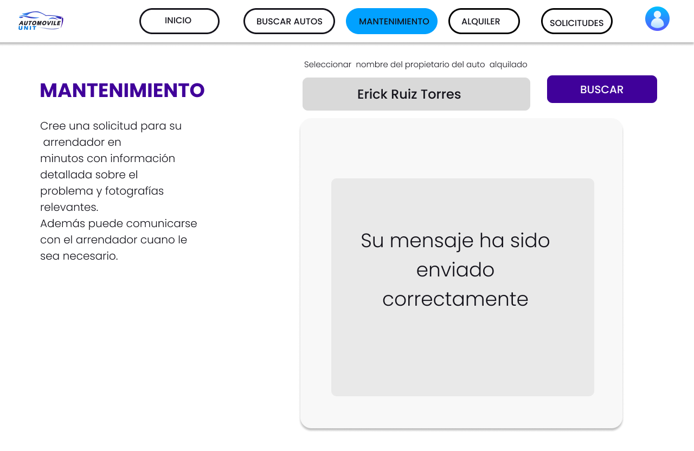

# Universidad Peruana de Ciencias Aplicadas 

## Ingenieria de software 
## Ciclo II

## Aplicaciones Web
**Sección:** [SW53]

**Profesor:** [Naldo Reupo-Musayon Gastulo]

## **Informe de Trabajo Final**

**Startup:** [Speed-Driving]

**Producto:** [Automovile-Unit]

## Relación de Integrantes:
- [Baldeon Fabian, Aldo Alberto - u202122633]
- [Herrera Del Pino, Josehp Piero - u20211e098]
- [Rengifo Mirabal, Randy Becker - u20211d683]
- [Ruiz Torres, Erick Hernan - u202118946]
- [Salas Pujay, Mauricio Alberto - u202120467]

**Mes y Año:** [Agosto - 2023]

***

## Registro de Versiones del Informe

| Versión | Fecha       | Autor            | Descripción de modificación       |
| ------- | ----------- | ---------------- | --------------------------------- |
| 1    | [23-08-2023]     | [Todos los integrantes]  | [Asignación de partes a trabajar por cada integrante del equipo] |
| 2    | [28-08-2023]     | [Todos los integrantes]  | [Implementacion del capitulo I,II y III] |
| 3    | [03-09-2023]     | [Todos los integrantes]  | [Implementacion del capitulo IV] |
| 4    | [05-09-2023]     | [Todos los integrantes]  | [Implementacion del capitulo V] |
| 5    | [08-09-2023]     | [Todos los integrantes]  | [Ultimas revisiones del documento] |
| 6    | [23-09-2023]     | [Todos los integrantes]  | [Implementación de vistas del Frontend] |
| 7    | [23-09-2023]     | [Todos los integrantes]  | [Avence del Sprint 2] |
| 8    | [27-09-2023]     | [Erick Ruiz Torres]  | [Despliegue del Frontend] |
| 9    | [27-09-2023]     | [Todos los integrantes]  | [Ultimas revisiones del informe] |

## Project Report Collaboration Insights

 

## **Contenido**
### CAPÍTULO I: INTRODUCCIÓN

- [1.1 Startup Profile] 
  - [1.1.1. Descripción de la Startup]
  - [1.1.2. Perfiles de integrantes del equipo]
- [1.2 Solution Profile]
  - [1.2.1 Antecedentes y problemática]
  - [1.2.2 Lean UX Process.]
    - [1.2.2.1. Lean UX Problem Statements.]
    - [1.2.2.2. Lean UX Assumptions.]
    - [1.2.2.3. Lean UX Hypothesis Statements.]
    - [1.2.2.4. Lean UX Canvas]
  - [1.3. Segmentos objetivo.]

### CAPÍTULO II: REQUIREMENTS ELICITATION & ANALYSIS
- [2.1. Competidores.]
  - [2.1.1. Análisis competitivo.]
  - [2.1.2. Estrategias y tácticas frente a competidores.]
- [2.2. Entrevistas.]
  - [2.2.1. Diseño de entrevistas.]
  - [2.2.2. Registro de entrevistas.]
  - [2.2.3. Análisis de entrevistas.]
- [2.3. Needfinding.]
  - [2.3.1. User Personas.]
  - [2.3.2. User Task Matrix.]
  - [2.3.3. User Journey Mapping.]
  - [2.3.4. Empathy Mapping.]
  - [2.3.5. As-is Scenario Mapping.]

### CAPÍTULO III: REQUIREMENTS SPECIFICATION
- [3.1. To-Be Scenario Mapping.]
- [3.2. User Stories.]
- [3.3. Impact Mapping.]
- [3.4. Product Backlog.]

### CAPÍTULO IV: PRODUCT DESIGN
- [4.1. Style Guidelines.]
  - [4.1.1. General Style Guidelines.]
  - [4.1.2. Web Style Guidelines.]
- [4.2. Information Architecture.]
  - [4.2.1. Organization Systems.]
  - [4.2.2. Labeling Systems.]
  - [4.2.3. SEO Tags and Meta Tags]
  - [4.2.4. Searching Systems.]
  - [4.2.5. Navigation Systems.]
- [4.3. Landing Page UI Design.]
  - [4.3.1. Landing Page Wireframe.]
  - [4.3.2. Landing Page Mock-up.]
- [4.4. Web Applications UX/UI Design.]
  - [4.4.1. Web Applications Wireframes.]
  - [4.4.2. Web Applications Wireflow Diagrams.]
  - [4.4.3. Web Applications Mock-ups.]
  - [4.4.4. Web Applications User Flow Diagrams.]
- [4.5. Web Applications Prototyping.]
- [4.6. Domain-Driven Software Architecture.]
  - [4.6.1. Software Architecture Context Diagram.]
  - [4.6.2. Software Architecture Container Diagrams.]
  - [4.6.3. Software Architecture Components Diagrams.]
- [4.7. Software Object-Oriented Design.]
  - [4.7.1. Class Diagrams.]
  - [4.7.2. Class Dictionary.]
- [4.8. Database Design.]
  - [4.8.1. Database Diagram.]

### CAPÍTULO V: PRODUCT IMPLEMENTATION, VALIDATION & DEPLOYMENT
- [5.1. Software Configuration Management.]
  - [5.1.1. Software Development Environment Configuration.]
  - [5.1.2. Source Code Management.]
  - [5.1.3. Source Code Style Guide & Conventions.]
  - [5.1.4. Software Deployment Configuration.]
- [5.2. Landing Page, Services & Applications Implementation.]
  - [5.2.1. Sprint 1]
    - [5.2.1.1. Sprint Planning 1.]
    - [5.2.1.2. Sprint Backlog 1.]
    - [5.2.1.3. Development Evidence for Sprint Review.]
    - [5.2.1.4. Testing Suite Evidence for Sprint Review.]
    - [5.2.1.5. Execution Evidence for Sprint Review.]
    - [5.2.1.6. Services Documentation Evidence for Sprint Review.]
    - [5.2.1.7. Software Deployment Evidence for Sprint Review.]
    - [5.2.1.8. Team Collaboration Insights during Sprint.]

  - [5.2.2. Sprint 2]
    - [5.2.1.1. Sprint Planning 2.]
    - [5.2.1.2. Sprint Backlog 2.]
    - [5.2.1.3. Development Evidence for Sprint Review.]
    - [5.2.1.4. Testing Suite Evidence for Sprint Review.]
    - [5.2.1.5. Execution Evidence for Sprint Review.]
    - [5.2.1.6. Services Documentation Evidence for Sprint Review.]
    - [5.2.1.7. Software Deployment Evidence for Sprint Review.]
    - [5.2.1.8. Team Collaboration Insights during Sprint.]  

## Student Outcome
| Criterio Específico | Acciones Realizadas | Conclusiones                                      |
| ------------------- | ------------------- | ------------------------------------------------- |
| La capacidad de funcionar efectivamente en un equipo cuyos miembros juntos proporcionan liderazgo, crean un entorno de colaboración e inclusivo, establecen objetivos, planifican tareas y cumplen objetivos. |**TB1: Rengifo Mirabal, Randy Becker:** Capitulo I y III - **TB1: Baldeon Fabian, Aldo Alberto:** Capitulo II - **TB1: Herrera Del Pino, Josehp Piero** Capitulo IV - **TB1: Ruiz Torres, Erick Hernan** Capitulo IV - **TB1: Salas Pujay, Mauricio Alberto** Capitulo V | [- Hemos reconocido la importancia fundamental del trabajo en equipo en el logro de objetivos y metas compartidas. Comprendemos que no se trata solo de las habilidades individuales, sino de la capacidad de colaborar de manera efectiva. - Valoramos la necesidad de establecer objetivos claros y planificar nuestras acciones para lograrlos. Esto implica definir metas concretas, asignar responsabilidades y elaborar un plan estratégico. - Como equipo, estamos comprometidos con el cumplimiento de nuestros objetivos. Entendemos que el éxito radica en nuestra capacidad para trabajar de manera eficiente y coordinada para alcanzar resultados deseables.]|
| Comunica oralmente sus ideasy/o resultados con objetividad a público de diferentes especialidades y niveles jerarquicos, en el marco del desarrollo de un proyecto en ingeniería. |**TP1: Todos los Integrantes** - Implementación del Frontend| [- Cada uno de los integrantes hemos dado ideas para la implementacion de Frontend, trabajando en equipo hemos logrado el objetivo y la meta esperada. -Valoramos la necesidad de establecer objetivos claros y planificar nuestras acciones para lograrlos. - Como equipo, estamos comprometidos con el cumplimiento de nuestros objetivos.]|
| Comunica oralmente sus ideasy/o resultados con objetividad a público de diferentes especialidades y niveles jerarquicos, en el marco del desarrollo de un proyecto en ingeniería. |**TB2: Todos los Integrantes** - Implementación del Backend| [- Cada uno de los integrantes hemos dado ideas para la implementacion de Backend, trabajando en equipo hemos logrado el objetivo y la meta esperada. -Valoramos la necesidad de establecer objetivos claros y planificar nuestras acciones para lograrlos. - Como equipo, estamos comprometidos con el cumplimiento de nuestros objetivos.]|

# CAPÍTULO I: INTRODUCCIÓN 

## 1.1 Startup Profile
### 1.1.1. Descripción de la Startup

Somos Speed-Drivingun startup integrado por estudiantes del quinto ciclo de la carrera de Ingeniería de Software de la Universidad Peruana de Ciencias Aplicadas, que se encuentran elaborando el producto nombrado Automovile-Unit la cual consiste en el alquiler de vehículos que actúa como intermediario entre los propietarios de automóviles y las personas que desean alquilarlos.

Automovile-Unit surgio apartir de la idea de aprovechar los vehículos que no están en uso y permitir a los propietarios ganar dinero alquilándolos a otros usuarios, al mismo tiempo que brindamos a los usuarios la conveniencia de acceder a una amplia variedad de vehículos según sus necesidades.

**Misión:** En Speed-Drivingun, nuestra misión es revolucionar la movilidad en el Perú al proporcionar una plataforma segura y eficiente que permita a las personas compartir vehículos de manera confiable y conveniente. Estamos comprometidos en optimizar la utilización de los vehículos existentes, contribuyendo así a la reducción de la congestión vial y alentando prácticas más sostenibles en el transporte.

**Visión:** Nuestra visión es ser líderes en la transformación de la movilidad compartida en el Perú. Nos esforzamos por ser la plataforma preferida tanto para propietarios de vehículos que buscan una fuente de ingresos adicional como para usuarios que desean una alternativa de alquiler de vehículos flexible y asequible. A medida que avanzamos, aspiramos a crear un cambio positivo en la forma en que las personas se desplazan dentro del país, promoviendo la economía local y mejorando la calidad de vida de los peruanos.

### 1.1.2. Perfiles de integrantes del equipo

**Baldeon Fabian, Aldo Alberto:**

  

Me encuntro cursando el quinto ciclo de la carrera de Ingeniería de Software en la UPC. Escogí esta carrera es porque me intereso el desarrollo de aplicaciones y el desarrollo web. Me gusta ser responsable y trabajar en equipo. Tengo conocimientos básicos en C#, java, JavaScript, HTML y CSS. También poseo conocimientos intermedios en C + +, SQL y MongoDB, además de cuento con experiencia en Git y GitHub.  

**Herrera Del Pino, Josehp Piero:**

  

En la actualidad, me encuentro en el quinto ciclo de mi formación en Ingeniería de Software en la Universidad Peruana de Ciencias Aplicadas. Mi personalidad proactiva me impulsa a buscar constantemente nuevas oportunidades de aprendizaje, mientras que mi perseverancia innata me lleva a enfrentar cada desafío con determinación. Mi sentido de responsabilidad guía mis acciones, asegurando que me comprometo plenamente con mis tareas y metas. En mis momentos de ocio, encuentro satisfacción en los videojuegos, la música, el fútbol y las series, actividades que fomentan mi creatividad. Mi habilidad técnica abarca diversos lenguajes y herramientas, como C++, Java, Python, HTML, CSS, Git y Javascript, y busco constantemente fusionar creatividad y lógica para abordar desafíos con innovación y eficiencia.

**Rengifo Mirabal, Randy Becker:**

  

Actualemente me encuentro cursando el quinto ciclo de la carrera de Ingenieria de Software en la Universidad Peruana de Ciencias Aplicadas. Me considero una persona proactiva, perseverante, responsable y sobre todo divertido. Mis pasatiempos favoritos son los videojuegos, escuchar música, jugar al futbol. Cuentos con conocimientos en C++, Java, Kotlin, HTML, CSS, etc.

**Ruiz Torres, Erick Hernan**

  

Actualmente me encuentro cursando el quinto ciclo de la carrera de Ingenieria de Software en la Universidad Peruana de Ciencias Aplicadas. Me considero una persona responsable, puntual y dedicada. Mis pasatiempos favorito es la ilustración digital, escuchar música, jugar al futbol. Cuento con conocimientos en C++, Java, HTML, CSS, etc.

**Salas Pujay, Mauricio Alberto:**

  

Actualmente me encuentro cursando el quinto ciclo de la carrera de Ingeniería de Software en la Universidad Peruana de Ciencias Aplicadas. Me considero una persona dedicada, responsable, proactivo, y eficiente. Mis pasatiempos favoritos son escuchar música, ver series y en ciertas ocasiones jugar videojuegos y al básquet. En cuanto al conocimiento de la programación tengo una experiencia en uso de C++, Java Script, Html, Css.

## **1.2 Solution Profile**
### **1.2.1 Antecedentes y problemática**
En el contexto peruano, existe una problemática relacionada con la subutilización de vehículos particulares y las dificultades en el proceso de alquiler de automóviles. Según datos del Ministerio de Transportes y Comunicaciones de Perú, se estima que aproximadamente el 50% de los vehículos particulares en Lima, la capital, pasan la mayor parte del tiempo estacionados y sin uso. Esto representa una oportunidad significativa para aprovechar esos vehículos y reducir la congestión del tráfico urbano.

#### The 5’W’s & 2’H’s

**What (Qué)** 
- **¿Cuál es el problema?**
  - El problema es la subutilización de vehículos particulares en Perú y las complicaciones en el proceso tradicional de alquiler de automóviles.

- **¿Cuál es la relación con la persona en cuestión?**
  - La relación se establece entre los propietarios de vehículos que no utilizan sus automóviles eficientemente y los usuarios que buscan alquilar vehículos de manera conveniente.

**When (Cuando)** 
- **¿Cuándo sucede el problema?**
  - El problema de la subutilización de vehículos ocurre de manera continua en el día a día en Perú. Las complicaciones en el proceso de alquiler de automóviles también ocurren cuando los usuarios necesitan vehículos de manera temporal.

- **¿Cuándo utiliza el cliente el producto?**
  - Los usuarios utilizarán la plataforma de alquiler de vehículos cuando necesiten un automóvil por un período corto.

**Where (Dónde)** 
- **¿Dónde está el cliente cuando usa el producto?**
  - Los usuarios estarán en diferentes ubicaciones en Perú cuando utilicen la plataforma para buscar y alquilar vehículos.

- **¿A dónde se dirige?**
  - La plataforma se dirige a usuarios en todo el territorio de Perú, inicialmente enfocándose en áreas urbanas como Lima y otras ciudades importantes.

- **¿Dónde surge el problema?**
  - El problema de la subutilización de vehículos surge en hogares y estacionamientos en todo el país, mientras que las complicaciones en el alquiler surgen en las agencias tradicionales.

**Who (Quién)** 
- **¿Quiénes están involucrados?**
  - Propietarios de vehículos particulares, usuarios en búsqueda de alquiler de vehículos.

- **¿A quiénes le sucede el problema?**
  Tanto a los propietarios que desean generar ingresos con sus vehículos como a los usuarios que buscan una forma más accesible de alquilar autos.

- **¿Quién lo utilizará?**
  - Tanto propietarios de vehículos como usuarios interesados en alquilar.

**Why (Por qué)** 
- **¿Cuál es la causa del problema?**
  - El problema surge debido a la falta de una plataforma eficiente que permita la colaboración entre propietarios y usuarios de vehículos.

**How (Cómo)** 
- **¿En qué condiciones los clientes usan nuestro producto?**
  - Los clientes utilizarán la plataforma cuando necesiten alquilar un vehículo por un período corto.

- **¿Cómo nos conocieron los compradores?**
  - Los compradores nos conocerán a través de campañas de marketing digital, recomendaciones de usuarios existentes y asociaciones con empresas relacionadas.

- **¿Cómo prefieren los usuarios acceder a nuestro servicio?**
  - Los usuarios prefieren acceder a nuestro servicio a través de una aplicación móvil o un sitio web fácil de usar.

- **¿Qué llevó a la persona a llegar a esta situación?**
  - La necesidad de generar ingresos extra o la búsqueda de una solución más conveniente y económica para el alquiler de vehículos.

**How much (Cuánto)** 
- En Perú, según datos del Ministerio de Transportes y Comunicaciones, se estima que alrededor del 50% de los vehículos particulares en Lima, la capital, pasan la mayor parte del tiempo estacionados y sin uso1. Esto representa un gran número de vehículos subutilizados que podrían ser aprovechados de manera más eficiente a través de un servicio de alquiler. Además, según datos del Registro de Propiedad Vehicular de la Superintendencia Nacional de los Registros Públicos (SUNARP) y la Asociación Automotriz del Perú (AAP), se estima que había alrededor de 3.5 millones de vehículos registrados en Perú hasta 2021. Este número incluye automóviles particulares, vehículos comerciales y otros tipos de vehículos12.

### **1.2.2 Lean UX Process.**
### **1.2.2.1. Lean UX Problem Statements.**
**Problem statement 1: Falta de Confianza en el Proceso de Alquiler**
- Los propietarios pueden sentir inseguridad al entregar sus vehículos a extraños, mientras que los arrendatarios pueden preocuparse por el estado del vehículo y el cumplimiento del contrato. Esto puede llevar a una baja adopción de la plataforma. Es esencial establecer mecanismos de verificación de identidad y confiabilidad, así como implementar políticas claras de seguro y reembolso en caso de daños.

**Problem statement 2: Selección de Vehículos Apropiados**
- Los usuarios pueden encontrarse con una amplia variedad de vehículos en la plataforma, lo que dificulta encontrar el más adecuado para sus necesidades. Esto puede resultar en una experiencia frustrante y llevar a usuarios a abandonar la búsqueda. Una solución sería permitir la aplicación de filtros específicos, como tipo de vehículo, capacidad, características y ubicación, para ayudar a los usuarios a encontrar rápidamente lo que necesitan.

**Problem statement 3: Proceso de Pago y Tarifas Claras**
- Los usuarios pueden abandonar el proceso de alquiler si no comprenden completamente cómo se calculan las tarifas o si sienten que están ocultas. Una solución es simplificar el proceso de pago y presentar las tarifas de manera transparente, divulgando cualquier cargo adicional de manera clara antes de que los usuarios confirmen su alquiler.

**Problem statement 4: Verificación de Identidad y Antecedentes**
- Aunque es necesario llevar a cabo verificaciones de antecedentes para construir confianza entre las partes, este proceso puede llevar mucho tiempo y desanimar a los usuarios. Para abordar este problema, se podría explorar la posibilidad de integrar tecnologías de verificación más rápidas y confiables, como la verificación biométrica y el uso de bases de datos públicas para antecedentes penales.

**Problem statement 5: Interfaz Intuitiva y Fácil de Usar**
- Una interfaz complicada y abarrotada puede abrumar a los usuarios, especialmente aquellos que no están familiarizados con plataformas de alquiler en línea. La solución implica adoptar un diseño centrado en el usuario que guíe a los usuarios de manera clara y lógica a través de cada paso del proceso de alquiler, limitando la cantidad de información presentada en cada etapa.

**Problem statement 6: Gestión de Reseñas y Calificaciones**
- Las reseñas y calificaciones son fundamentales para construir confianza, pero existe el riesgo de reseñas falsas o injustas. Para abordar este desafío, podríamos implementar sistemas de verificación de reseñas y fomentar la retroalimentación constructiva. Además, se podrían tomar medidas contra el abuso de reseñas falsas, como verificar la autenticidad de las transacciones antes de permitir reseñas.

### **1.2.2.2. Lean UX Assumptions.**
- Los propietarios de automóviles están dispuestos a alquilar sus vehículos a desconocidos.
- Los usuarios están dispuestos a alquilar vehículos de propietarios individuales en lugar de utilizar servicios tradicionales de alquiler de automóviles.
- El proceso de reserva y alquiler de vehículos será lo suficientemente intuitivo y fácil de usar para los usuarios.
- Los precios establecidos por los propietarios serán atractivos para los usuarios.
- Habrá suficientes propietarios y usuarios interesados en el servicio para mantener un flujo constante de alquileres.
- Los propietarios estarán dispuestos a proporcionar información precisa y detallada sobre sus vehículos.
-  La plataforma será capaz de gestionar de manera efectiva los aspectos logísticos, como la disponibilidad de vehículos y los horarios de recogida y entrega.

**1. ¿Quién es el usuario?**
- El usuario principal es cualquier persona que necesite alquilar un automóvil, ya sea para viajes personales, negocios o vacaciones. También incluye a aquellos que buscan opciones de alquiler más flexibles y económicas que las ofrecidas por las empresas tradicionales de alquiler de automóviles.

**2. ¿Dónde encaja nuestro producto en su trabajo o vida?**
- Nuestro producto se integra en la vida de los usuarios brindándoles acceso a una variedad de vehículos para alquilar directamente de propietarios privados. Encaja cuando los usuarios necesitan un automóvil temporal para cumplir con sus necesidades de transporte, ya sea para desplazarse por la ciudad, realizar viajes de corta duración o experimentar diferentes tipos de vehículos.

**3. ¿Qué problemas tiene nuestro producto y cómo se pueden resolver?**
- Los usuarios pueden preocuparse por la seguridad y el estado de los vehículos alquilados de propietarios privados.Para ello se va a implementar un proceso de verificación y evaluación riguroso para los propietarios y sus vehículos, incluyendo inspecciones de seguridad y mantenimiento antes de ser listados en la plataforma.

**4. ¿Cuándo y cómo es usado nuestro producto?**
- Nuestro producto es utilizado cuando los usuarios necesitan un vehículo temporal. Esto podría ser para viajes cortos, como recados o salidas de fin de semana, o para viajes más largos. El producto es utilizado a través de una plataforma en línea o una aplicación móvil donde los usuarios pueden buscar vehículos disponibles, hacer reservas y coordinar los detalles con los propietarios.

**5. ¿Qué características son importantes?**
- Búsqueda y Filtros: Permitir a los usuarios buscar vehículos por ubicación, tipo, características y disponibilidad.
Perfiles de Propietarios: Mostrar información detallada sobre los propietarios y sus vehículos, incluyendo evaluaciones y comentarios de otros usuarios.
Calendario de Disponibilidad: Mostrar fechas y horarios disponibles para la reserva de vehículos.
Sistema de Reservas: Facilitar la reserva segura y conveniente de los vehículos seleccionados.
Mensajería: Proporcionar una forma de comunicación entre propietarios y usuarios para coordinar detalles.
Seguro y Verificación: Garantizar la seguridad y confianza mediante verificaciones de identidad y seguros adecuados.

**6. ¿Cómo debe verse nuestro producto y cómo debe comportarse?**
- El diseño debe ser limpio, intuitivo y fácil de usar, con una interfaz de usuario centrada en la búsqueda y reserva de vehículos.
La plataforma debe comportarse de manera ágil, proporcionando respuestas rápidas a las interacciones del usuario y asegurando una experiencia fluida desde la búsqueda hasta la confirmación de la reserva.
La plataforma debe transmitir confianza a través de un diseño profesional y contenido informativo sobre el proceso de alquiler, seguridad y apoyo al cliente.

### **1.2.2.3. Lean UX Hypothesis Statements.**

- **Creemos que** al implementar un sistema de calificaciones y reseñas para los usuarios que alquilen vehículos a través de Automovile-Unit
- **Sabremos que** hemos tenido éxito 
- **Cuando** veamos un aumento del 15% en la confianza de los usuarios al alquilar automóviles de propietarios desconocidos, demostrado por un incremento en las transacciones completadas.
***
- **Creemos que** al incluir una función de chat en tiempo real entre los propietarios de vehículos y los arrendatarios en la plataforma Automovile-Unit
- **Sabremos que** hemos tenido éxito
- **Cuando** haya un aumento del 30% en la resolución exitosa de consultas y problemas relacionados con las reservas, lo que indicará una mejor comunicación y experiencia del usuario.
***
- **Creemos que** al proporcionar incentivos para que los propietarios de vehículos ofrezcan descuentos especiales durante los períodos de demanda baja a través de Automovile-Unit
- **Sabremos que** hemos tenido éxito 
- **Cuando** observemos un aumento del 20% en las reservas durante esos períodos, lo que indicará que los usuarios son sensibles a los precios y están dispuestos a aprovechar ofertas.
***
- **Creemos que** al lanzar una función de "vehículo destacado" donde se muestren automóviles populares y altamente calificados en la página de inicio de Automovile-Unit
- **Sabremos que** hemos tenido éxito 
- **Cuando** veamos un aumento del 15% en las conversiones de navegación a reservas, demostrando que los usuarios se sienten atraídos por opciones de alta calidad y confiabilidad.

### **1.2.2.4. Lean UX Canvas**

## **1.3 Segmentos Objetivo**

El segmento objetivo de la startup se divide en dos categorías principales: los arrendatarios y los propietarios de vehículos. La aplicación que están desarrollando tiene como objetivo ser un intermediario eficiente y seguro entre estos dos grupos para facilitar el proceso de alquiler de automóviles.

### Arrendatarios:

Estas son las personas que desean alquilar un automóvil por un período específico. Pueden tener diversas motivaciones para alquilar un vehículo, como:

- Viajes de placer.
- Viajes de negocios.
- Necesidades temporales de transporte.
- La curiosidad de probar diferentes tipos de automóviles.

El segmento de arrendatarios puede incluir:

- Viajeros ocasionales que necesitan movilidad durante sus viajes.
- Personas que desean probar un tipo específico de vehículo antes de comprarlo.
- Individuos que necesitan un vehículo por un tiempo limitado debido a una emergencia o una situación inesperada.
- Profesionales en viajes de trabajo que requieren un automóvil en su destino.
- Estudiantes que necesitan un vehículo para eventos especiales o mudanzas temporales.

### Propietarios de vehículos:

Estas son las personas que poseen automóviles y están dispuestas a compartirlos con otros a cambio de un alquiler. El segmento de propietarios de vehículos podría incluir:

- Individuos que poseen automóviles adicionales que no utilizan constantemente.
- Personas que desean aprovechar una fuente adicional de ingresos alquilando su automóvil cuando no lo están utilizando.
- Propietarios de flotas pequeñas que quieren optimizar la utilización de sus vehículos.
- Personas que están dispuestas a rentar su automóvil mientras están de vacaciones o fuera de la ciudad.
- Dueños de automóviles de lujo que desean compartir la experiencia de conducir esos vehículos.

# **CAPÍTULO II: REQUIREMENTS ELICITATION & ANALYSIS**

## **2.1. Competidores**

Luego de nuestra investigación, hemos identificado dos modelos de negocio que se dedican a proporcionar servicios y beneficios afines a los que ofrecemos. Estas empresas emergen como potenciales competidores en nuestro campo. Mediante este análisis competitivo, buscamos obtener una visión integral del panorama competitivo en el que operaremos, lo que nos permitirá tomar decisiones informadas y definir nuestra estrategia para destacarnos en este entorno desafiante y en constante evolución.

* Getaround: 
  Getaround es una destacada empresa de movilidad compartida con sede en San Francisco, fundada en 2009. Su plataforma en        línea y aplicación móvil conectan propietarios de automóviles con arrendatarios que buscan alquilar vehículos por períodos 
  específicos. Al aprovechar vehículos subutilizados, Getaround ofrece una variedad de opciones de vehículos, desde económicos 
  hasta de lujo, brindando una solución flexible y asequible para las necesidades de transporte. La empresa destaca por su 
  enfoque en tecnología e innovación, implementando medidas de seguridad, como verificaciones de antecedentes y seguros 
  integrales, para fomentar la confianza entre los usuarios. 
* Turo: 
  Turo, una empresa líder en movilidad compartida, opera globalmente, incluyendo Australia. Su plataforma conecta a 
  propietarios de vehículos con viajeros y locales que buscan alquilar vehículos directamente. Similar a Getaround, ofrece una 
  gama diversa de vehículos y se enfoca en la confianza de la comunidad, proporcionando reseñas y medidas de seguridad. Turo 
  ha redefinido el alquiler de automóviles con su enfoque colaborativo y flexible, satisfaciendo las necesidades de transporte 
  de manera asequible y personalizada en Australia y en todo el mundo.
* Amovens: 
  Amovens es una destacada empresa de movilidad compartida que se enfoca en transformar el alquiler de coches a través de su 
  plataforma en línea y aplicación móvil. Su enfoque principal es el alquiler de coches entre particulares, permitiendo a los 
  usuarios alquilar vehículos directamente de otros miembros de la comunidad. Esto proporciona una amplia gama de opciones de 
  coches y fomenta la colaboración y la sostenibilidad. La plataforma se destaca por su compromiso con la seguridad y la 
  confiabilidad, ofreciendo sistemas de verificación de usuarios, reseñas y calificaciones. En definitiva, Amovens revoluciona 
  la manera en que las personas acceden y utilizan vehículos, alineándose con la creciente demanda de soluciones de alquiler 
  de coches más flexibles y personalizadas.

### **2.1.1. Análisis competitivo**

<table>
    <tr>
      <th colspan="7" valign="top"><b>Competitive Analysis Landscape</b></th>
    </tr>
    <tr>
      <td colspan="2" rowspan="2">¿Por qué llevar a cabo este análisis?</td>
      <td colspan="5">Escriba en el recuadro la pregunta que busca responder o el objetivo de este análisis.</td>
    </tr>
    <tr>
      <td colspan="5">Este análisis se realizó con la finalidad de poder identificar a nuestros potenciales competidores e idear estrategias y tácticas para diferenciarnos de estos.</td>
    </tr>
    <tr>
      <td colspan="3">(En la cabecera colocar por cada competidor nombre y logo)</td>
      <td colspan="1" valign="top" style="font-weight: bold;">
          Automovile-Unit
           
          

                  
          

      <td colspan="1" valign="top" style="font-weight: bold;">
        Amovens
      

                  
          

      </td>
      <td colspan="1" valign="top" style="font-weight: bold;">
        Getarounds 
        

                  
              

        </td>
      <td colspan="1" valign="top" style="font-weight: bold;" >
        Turo
        

                  
              

      </td>
    </tr>
    <tr>
      <td colspan="1" rowspan="2">
Perfil
</td>
      <td colspan="2">Overview</td>
      <td colspan="1" valign="top">Aplicación que actúa como un intermediario confiable entre propietarios de automóviles y usuarios que desean alquilar.</td>
      <td colspan="1" valign="top">Aplicación que se enfoca en el alquiler de coches entre particulares, promoviendo la sostenibilidad y la colaboración comunitaria.</td>
      <td colspan="1" valign="top">Aplicación que permite a los propietarios compartir sus vehículos con su enfoque innovador y tecnológico.</td>
      <td colspan="1" valign="top">Aplicación que permite a usuarios alquilar vehículos directamente de propietarios, brindando opciones personalizadas y flexibles.</td>
    </tr>
    <tr>
      <td colspan="2">Ventaja competitiva</td>
      <td colspan="1" valign="top">Ofrecemos incentivos para que los propietarios ofrezcan descuentos especiales durante los períodos de demanda baja. Ademas, implementa un sistema de calificaciones y reseñas, así como verificaciones de identidad rigurosas, Automovile-Unit aborda la falta de confianza en el proceso de alquiler.</td>
      <td colspan="1" valign="top">Ofrece a los clientes el valor de la movilidad compartida sostenible y personalizada.   Permite a los usuarios alquilar coches directamente con opciones flexibles y económicas.  La plataforma fomenta la colaboración y la reducción de emisiones, proporcionando a los clientes una alternativa más ecológica y eficiente.</td>
      <td colspan="1" valign="top">Ofrece la optimización de la utilización de vehículos. Al permitir a los propietarios alquilar sus coches cuando no los usan, Getaround brinda a los clientes acceso a una variedad de vehículos según su preferencia y necesidades. Esto les ofrece comodidad y flexibilidad mientras aborda la congestión vial y contribuye a una economía más eficiente.</td>
      <td colspan="1" valign="top">Ofrece a los clientes poder alquilar vehículos directamente de propietarios brindando una experiencia de alquiler más auténtica y personalizada.  Además, los usuarios pueden elegir entre una amplia gama de vehículos para adaptarse a sus gustos y necesidades. La plataforma se destaca por su enfoque en la seguridad y la confianza, asegurando una experiencia de alquiler sin problemas.</td>
    </tr>
    <tr>
      <td colspan="1" rowspan="2">
Perfil de Marketing
</td>
      <td colspan="2">Mercado objetivo</td>
      <td colspan="1" valign="top">Arrendatario, personas que desean alquilar un automóvil por un período específico.     
      Propietarios de vehículos, son personas que poseen automóviles y están dispuestas a compartirlos con otros a cambio de un alquiler. </td>
      <td colspan="1" valign="top">Personas conscientes de la sostenibilidad y la colaboración que buscan alternativas más ecológicas y económicas para sus desplazamientos diarios.</td>
      <td colspan="1" valign="top">Público en general mayor a 18 años que busquen opciones de alquiler de vehículos más flexibles y diversas para satisfacer sus necesidades de transporte.</td>
      <td colspan="1" valign="top">Publico que busque experiencias de alquiler de coches únicas y personalizadas. Esto abarca desde personas que desean alquilar vehículos convencionales hasta aquellas que buscan opciones más exclusivas y lujosas.</td>
    </tr>
    <tr>
      <td colspan="2">Estrategias de marketing</td>
      <td colspan="1" valign="top">Utilizar publicidad en línea, como Google Ads o anuncios   Mantener presencia activa en las redes sociales. Compartiremos contenido, promociones especiales y responderemos preguntas de los usuarios.</td>
      <td colspan="1" valign="top">Centrarse en resaltar su enfoque en la sostenibilidad y la colaboración. Utilizan campañas de concienciación sobre la reducción de emisiones y la movilidad compartida para atraer a usuarios preocupados por el medio ambiente.</td>
      <td colspan="1" valign="top">Centrarse en la conveniencia y la variedad de opciones de alquiler. Destacan la facilidad de compartir coches y resaltan cómo su plataforma permite a los usuarios elegir entre una amplia gama de vehículos para adaptarse a sus necesidades.</td>
      <td colspan="1" valign="top">Enfocarse en la autenticidad y la personalización de la experiencia de alquiler. Resaltan la diversidad de vehículos disponibles en su plataforma, desde modelos convencionales hasta opciones de lujo y exóticas.</td>
    </tr>
    <tr>
      <td colspan="1" rowspan="3">
Perfil de Producto
</td>
      <td colspan="2">Productos & Servicios</td>
      <td colspan="1" valign="top">La aplicación brinda a los usuarios varias funciones para llevar un correcto manejo de su dinero. Asimismo, cuenta con un sistema de recordatorio de pagos y con una IA que permite prever gastos.</td>
      <td colspan="1" valign="top">Ofrece una plataforma de movilidad compartida. Su principal enfoque es el alquiler de coches entre particulares, permitiendo a los usuarios alquilar vehículos directamente de otros miembros de la comunidad.</td>
      <td colspan="1" valign="top">Ofrece una plataforma de alquiler de vehículos entre particulares, permitiendo a los propietarios compartir sus coches cuando no los utilizan.</td>
      <td colspan="1" valign="top">Ofrece una plataforma de alquiler de coches entre particulares, donde los usuarios pueden alquilar una amplia gama de vehículos directamente de los propietarios.</td>
    </tr>
    <tr>
      <td colspan="2">Precios & Costos</td>
      <td colspan="1" valign="top">La aplicación es totalmente gratuita. </td>
      <td colspan="1" valign="top">La aplicación es totalmente gratuita. </td>
      <td colspan="1" valign="top">La aplicación es totalmente gratuita. </td>
      <td colspan="1" valign="top">La aplicación es totalmente gratuita. </td>
    </tr>
    <tr>
      <td colspan="2">Canales de distribución (Web y/o Móvil)</td>
      <td colspan="1" valign="top"> El canal de distribución es Web.</td>
      <td colspan="1" valign="top"> Los canales de distribución son digitales, como La App Store y Google Play.</td>
      <td colspan="1" valign="top"> Los canales de distribución son digitales, como La App Store y Google Play.</td>
      <td colspan="1" valign="top"> Los canales de distribución son digitales, como La App Store y Google Play.</td>
    </tr>
    <tr>
      <td colspan="1" rowspan="5">
Análisis SWOT
</td>
      <td colspan="6">Realice esto para su startup y sus competidores. Sus fortalezas deberían apoyar sus oportunidades y contribuir a lo que ustedes definen como su posible ventaja competitiva.</td>
    </tr>
    <tr>
      <td colspan="2">Fortalezas</td>
      <td colspan="1" valign="top">Al operar en una plataforma en línea permitiendo un acceso rápido. El sistema de verificación de identidad y antecedentes garantiza la confianza y seguridad de los usuarios.</td>
      <td colspan="1" valign="top">Destaca por su enfoque en la movilidad compartida sostenible, lo que atrae a usuarios conscientes del medio ambiente y preocupados por reducir las emisiones de carbono.</td>
      <td colspan="1" valign="top">Optimiza el uso de vehículos subutilizados, reduciendo la congestión del tráfico y brindando una solución a los problemas de estacionamiento en áreas urbanas.</td>
      <td colspan="1" valign="top">Destaca por su amplia gama de opciones de alquiler, incluyendo vehículos convencionales, de lujo y exóticos, permitiendo a los usuarios elegir según sus preferencias.</td>
    </tr>
    <tr>
      <td colspan="2">Debilidades</td>
      <td colspan="1" valign="top">Falta de conocimiento respecto al proceso de alquiler de vehículos en línea.</td>
      <td colspan="1" valign="top">En comparación con algunas de sus competidores, la variedad de vehículos disponibles puede ser más limitada.</td>
      <td colspan="1" valign="top">Su éxito depende en gran medida de la densidad de usuarios y propietarios en una ubicación determinada.</td>
      <td colspan="1" valign="top">Los precios pueden variar según la ubicación y la disponibilidad, lo que puede llevar a fluctuaciones en los costos para los usuarios.</td>
    </tr>
    <tr>
      <td colspan="2">Oportunidades</td>
      <td colspan="1" valign="top">Implementar programas de recompensas incentiva a los usuarios a utilizar repetidamente la plataforma. Ofrecer descuentos por reservas frecuentes o recompensas por referir a otros usuarios puede impulsar el crecimiento.</td>
      <td colspan="1" valign="top">Amovens podría considerar la expansión de sus servicios, como la incorporación de más opciones de vehículos.</td>
      <td colspan="1" valign="top">Expandirse a nuevas ciudades y regiones puede aumentar su base de usuarios.</td>
      <td colspan="1" valign="top">Turo podría considerar una expansión internacional para llegar a más usuarios en todo el mundo.</td>
    </tr>
    <tr>
      <td colspan="2">Amenazas</td>
      <td colspan="1" valign="top">Cambios en las regulaciones de alquiler de vehículos pueden afectar la operación y requerir ajustes en la plataforma.</td>
      <td colspan="1" valign="top">La adopción de transporte público mejorado, sistemas de bicicletas compartidas o vehículos autónomos podría reducir la demanda de alquiler de automóviles compartidos.</td>
      <td colspan="1" valign="top">Incidentes de seguridad, como accidentes graves o problemas de delincuencia relacionados con vehículos compartidos, podrían dañar la reputación y la confianza de los usuarios.</td>
      <td colspan="1" valign="top">La aparición de nuevas tecnologías, como la conducción autónoma, podría alterar significativamente el mercado de movilidad compartida.</td>
    </tr>
  </table>
  
### **2.1.2. Estrategias y tácticas frente a competidores**

  Las estrategias y tácticas que utilizaremos para aprovechar nuestras fortalezas y oportunidades, mientras sacamos provecho   de las debilidades y amenazas de nuestros competidores, son las siguientes:

  * Automovile-Unit se esforzará por simplificar y agilizar el proceso de reserva y alquiler para brindar a los usuarios una     experiencia fluida y libre de complicaciones. La plataforma contará con una interfaz de usuario intuitiva y fácil de         navegar, guiando a los usuarios a través de cada paso del proceso.
  * El servicio al cliente será una prioridad para Automovile-Unit, con el objetivo de brindar asistencia oportuna y de alta     calidad a los usuarios. Se ofrecerá un servicio de chat en línea en tiempo real a través de la plataforma, donde los         usuarios podrán hacer preguntas y resolver problemas de manera inmediata.
  * La seguridad y la confianza serán fundamentales en la plataforma de Automovile-Unit. Para garantizar la integridad de la     comunidad. Los propietarios y usuarios deberán proporcionar documentación válida para verificar su identidad y               establecer un alto nivel de confianza en la plataforma. Tambien, se implementarán controles exhaustivos de antecedentes      penales y de seguridad para garantizar que los usuarios cumplan con los requisitos de confiabilidad.

## **2.2. Entrevistas.**
### **2.2.1. Diseño de entrevistas.**

* Segmento objetivo 1 "Propietarios de vehículos"  
  Estas son las personas que poseen automóviles y están dispuestas a compartirlos con otros a cambio de un alquiler. 
    * Preguntas generales:   
      * **¿Cuál es su nombre completo?**  
      * **¿Cuántos años tienes?**  
      * **¿Cuál es su estado civil?**  
      * **¿A qué te dedicas?**  
      * **¿Trabajas?**  
      * **¿Estudias?**  
      * **¿En qué ciudad resides?** 

   * Preguntas sobre el Negocio de Alquiler de Vehículos: 
     * **¿Actualmente posee uno o varios vehículos adicionales que no utiliza constantemente?**  
     * **¿Estaría interesado en la posibilidad de ganar dinero alquilando su vehículo cuando no lo está utilizando?**  
     * **¿Qué le motiva a considerar la idea de compartir su vehículo en una plataforma de alquiler?**  
     * **¿Qué tipo de vehículo(s) posee y estaría dispuesto a compartir en la plataforma?**  
     * **¿Ha tenido experiencia previa alquilando su vehículo o considerando esta opción?**  
   * Preguntas luego de contarle sobre la Plataforma Automovile-Unit:  
     * **¿Cómo ve la idea de utilizar una plataforma en línea para mostrar su vehículo y permitir que otros lo alquilen?**  
     * **¿Cuáles serían sus preocupaciones principales al alquilar su vehículo a desconocidos?**  
     * **¿Qué medidas de seguridad y verificación consideraría necesarias para sentirse cómodo alquilando su vehículo?**  
     * **¿Estaría dispuesto a ofrecer incentivos especiales, como descuentos, para aumentar la visibilidad de su vehículo en la plataforma?**  
     * **¿Qué características o herramientas le gustaría ver en la plataforma para facilitar el proceso de alquiler y comunicación con los usuarios?**  
   * Preguntas sobre la Experiencia del Usuario:  
     * **¿Qué información considera importante incluir en la descripción de su vehículo para los posibles arrendatarios?**  
     * **¿Cómo preferiría coordinar la entrega y devolución de su vehículo con los usuarios que lo alquilen?**  
     * **¿Considera importante recibir calificaciones y reseñas de los usuarios que alquilen su vehículo?**  
     * **¿Qué aspectos considera importantes al interactuar con los usuarios interesados en alquilar su vehículo?**  

* Segmento objetivo 2 "Arrendatarios"  
  Estas son las personas que desean alquilar un automóvil por un período específico.  
    * Preguntas generales: 
      
      * **¿Cuál es su nombre completo?**  
      * **¿Cuántos años tienes?**   
      * **¿Cuál es su estado civil?**   
      * **¿A qué te dedicas?, ¿Trabajas?, ¿Estudias?**   
      * **¿En qué ciudad resides?**  

    * Preguntas sobre el Alquiler de Vehículos:  
      * **¿Ha alquilado un vehículo en el pasado?**   
      * **¿Por qué decidido alquilar el vehículo?**   
      * **Coménteme su experiencia alquilando dicho vehículo, ¿Qué aspectos disfrutó y qué aspectos considera que podrían mejorarse?**   
      * **¿Qué tipo de vehículo(s) preferiría alquilar y para qué ocasiones?**   
      * **¿Qué factores considera importantes al momento de seleccionar un vehículo de alquiler?**   
    * Preguntas luego de contarle sobre la Plataforma Automovile-Unit: 
      * **¿Cómo se siente acerca de la idea de alquilar vehículos directamente de propietarios a través de una plataforma en línea?**   
      * **¿Qué características o herramientas le gustaría ver en una plataforma de alquiler de vehículos para que la experiencia sea más atractiva y conveniente?**   
      * **¿Cuáles son sus principales inquietudes en relación con la seguridad y confiabilidad al alquilar un vehículo de un propietario privado?**   
      * **¿Valora la posibilidad de acceder a vehículos únicos o específicos en términos de marca, modelo o características?**   
      * **¿Estaría dispuesto a proporcionar calificaciones y reseñas sobre los vehículos y propietarios con los que tuvo experiencia?**   
    * Preguntas sobre las Necesidades y Motivaciones:  
      * **¿Cuáles son las principales razones por las que alquilaría un vehículo en lugar de utilizar su propio automóvil o el transporte público?**   
      * **¿Ha tenido situaciones en las que hubiera sido más conveniente tener acceso a un vehículo de alquiler por un período corto?**   
      * **¿Cuál sería su principal expectativa en términos de proceso de reserva y entrega del vehículo alquilado?**   
      * **¿Consideraría la opción de alquilar vehículos en diferentes ocasiones, como para eventos especiales o viajes de trabajo?**   
      * **¿Qué tipo de incentivos o características adicionales en la plataforma le motivarían a elegir alquilar un vehículo a través de Automovile-Unit?**   

### **2.2.2. Registro de entrevistas.**

### **2.2.3. Análisis de entrevistas.**
**PROPIETARIOS**
*Entrevista 1*

URL del video: [Click](https://upcedupe-my.sharepoint.com/:v:/g/personal/u202120467_upc_edu_pe/ETu3x-TX6OdGqsrgg5PhM8ABsqNUpxAFG9a8g5CZlQWLZQ?e=zkvOCS)

En esta entrevista, se habla con Renzo Miguel, un joven de 20 años que reside en Lima y está interesado en la idea de utilizar una plataforma en línea para alquilar su vehículo cuando no lo está utilizando. Renzo expresa su interés en ganar dinero de esta manera, pero también tiene preocupaciones sobre la seguridad de su vehículo y la confiabilidad de los arrendatarios desconocidos.

Renzo considera que las medidas de seguridad necesarias incluyen la verificación de la licencia de conducir vigente de los arrendatarios y tiene preocupaciones sobre el posible daño, pérdida o robo de su vehículo al alquilarlo.

En cuanto a la plataforma, Renzo cree que es importante tener anuncios claros que incluyan información sobre el precio, calidad y estado del vehículo, así como un chat directo para facilitar la comunicación con los usuarios interesados.

También menciona la importancia de recibir calificaciones y reseñas de los usuarios que alquilen su vehículo, pero señala que la excesiva exigencia por parte de los propietarios podría ser un problema.

En resumen, Renzo muestra interés en la idea de alquilar su vehículo a través de una plataforma en línea, pero destaca la importancia de medidas de seguridad y una comunicación eficaz con los arrendatarios. También sugiere que las calificaciones y reseñas sean útiles y equilibradas para garantizar una buena experiencia para todos los usuarios.

**ARRENDATARIOS**

*Entrevista 2*

URL del video: [Click](https://upcedupe-my.sharepoint.com/:v:/g/personal/u202118946_upc_edu_pe/EQaj8DDYNzxKrqg9ZkrB8HsBcJqeuoUFdd60AwLwhVFxiw?e=ZbUdmR&nav=eyJyZWZlcnJhbEluZm8iOnsicmVmZXJyYWxBcHAiOiJTdHJlYW1XZWJBcHAiLCJyZWZlcnJhbFZpZXciOiJTaGFyZURpYWxvZyIsInJlZmVycmFsQXBwUGxhdGZvcm0iOiJXZWIiLCJyZWZlcnJhbE1vZGUiOiJ2aWV3In19)

Timing: 6:05; 5:47 min

*Descricpión*

Piero Ruiz es un estudiante universitario de 21 años. Reside en San Martín de Porres, Lima. Piero sí ha manejado autos anteriormente, pero no ha alquilado uno antes, aunque menciona que le gustaría hacerlo. Lo que él priorizaría al alquilar un auto sería que el vehículo tenga buenas características y esté en buen estado, además considera importante que el vehículo pueda recorrer largas distancias y que no gaste mucho combustible. Asimismo, piensa que un servicio de alquiler de autos debe tener un proceso sencillo y seguro, junto con un sistema de comunicación efectivo con el propietario del vehículo. Piero piensa que se debería cobrar por día de uso del auto, ya que de otra forma sería muy tedioso y costoso. También, cree que se debería cobrar alrededor de 100 soles por día de uso del auto y que se debería poder pagar tanto en efectivo como por internet y sí estaría interesado en alquilar un auto por medio de una aplicación web. Finalmente, el entrevistado manifestó que no conoce ningún servicio para alquilar autos por internet.

*Entrevista 3*

    

URL del video: <a href="https://drive.google.com/file/d/1mv1vUYsfesz3ZcTm1ud5SbKRvIifvfuo/view?usp=drive_link"> Click </a>   

Arturo Pizarro tiene 22 años de edad y reside en el distrito de Chorrillos, destaca como un profesional en la salud. Arturo, valora en gran medida la flexibilidad que ofrece este servicio, ya que lo aprovecha para sus viajes de trabajo como para. Su elección de vehículos se inclina hacia aquellos que son altamente eficientes en cuanto al consumo de combustible y que se encuentran en óptimas condiciones.   
Arturo hace énfasis en la usabilidad y la seguridad de la plataforma de alquiler de autos. Busca una comunicación fluida y eficiente con los propietarios de los vehículos, y considera muy importante que la plataforma ofrezca estos aspectos para garantizar una experiencia satisfactoria.  
En términos de tarifas, Arturo prefiere el modelo de pago por día de uso, y está dispuesto a invertir alrededor de 120 soles diarios por un vehículo de calidad. Además, muestra un fuerte interés en contar con opciones de pago tanto en efectivo como en línea, y se siente atraído por la idea de utilizar una aplicación web para el alquiler de autos.
Arturo también se muestra colaborativo al expresar su disposición para proporcionar calificaciones y reseñas en la plataforma, contribuyendo así a ayudar a otros usuarios a tomar decisiones informadas. Aunque Arturo tiene conocimiento de algunos servicios de alquiler de autos en línea, se siente especialmente entusiasmado con la propuesta de alquilar vehículos directamente de propietarios a través de una plataforma como Automovile-Unit.

## **2.3. Needfinding.**
### **2.3.1. User Personas.**
* Segmento objetivo 1 "Propietarios de vehículos"  
  Estas son las personas que poseen automóviles y están dispuestas a compartirlos con otros a cambio de un alquiler.  
  
    
* Segmento objetivo 2 "Arrendatarios"  
  Estas son las personas que desean alquilar un automóvil por un período específico.  
    
#### **2.3.2. User Task Matrix.**

* Segmento objetivo 1 "Propietarios de vehículos"  
  Estas son las personas que poseen automóviles y están dispuestas a compartirlos con otros a cambio de un alquiler.  

 <table align="center">
    <thead>
      <tr>
        <td rowspan="2"></td>
        <th colspan="2">User Persona</th>
      </tr>
      <tr>
        <td colspan="2">Carlos Martines   (Segmento Objetivo 1: Arrendatario) </td>
      </tr>
      <tr>
        <td>Task</td>
        <td>Frecuency</td>
        <td>Importance</td>
      </tr>
    </thead>
    <tbody>
      <tr>
        <td>Listar su vehículo   en la plataforma para alquilar</td>
        <td>High </td>
        <td>High</td>
      </tr>
      <tr>
        <td>Agregar detalles y fotos precisas  del vehículo</td>
        <td>High </td>
        <td>High</td>
      </tr>
      <tr>
        <td>Establecer disponibilidad y tarifas  para el alquiler</td>
        <td>Medium</td>
        <td>Medium</td>
      </tr>
      <tr>
        <td>Responder a consultas y mensajes  de arrendatarios</td>
        <td>Medium</td>
        <td>High</td>
      </tr>
      <tr>
        <td>Recibir pagos por el alquiler  del vehículo</td>
        <td>High  </td>
        <td>High </td>
      </tr>
      <tr>
        <td>Dejar una reseña y calificación  después del alquiler</td>
        <td>Low</td>
        <td>High</td>
      </tr>
    </tbody>
  </table>

* Segmento objetivo 2 "Arrendatarios"  
  Estas son las personas que desean alquilar un automóvil por un período específico.  
  
<table align="center" >
    <thead>
      <tr>
        <td rowspan="2"></td>
        <th colspan="2">User Persona</th>
      </tr>
      <tr>
        <td colspan="2">Carlos Martines   (Segmento Objetivo 2: Arrendatario) </td>
      </tr>
      <tr>
        <td>Task</td>
        <td>Frecuency</td>
        <td>Importance</td>
      </tr>
    </thead>
    <tbody>
      <tr>
        <td>Buscar vehículos   disponibles para alquilar</td>
        <td>High </td>
        <td>High</td>
      </tr>
      <tr>
        <td>Filtrar vehículos por   tipo, ubicación y características</td>
        <td>Medium </td>
        <td>High</td>
      </tr>
      <tr>
        <td>Ver detalles y fotos de   un vehículo en particular</td>
        <td>High </td>
        <td>High</td>
      </tr>
      <tr>
        <td>Reservar un vehículo  para una fecha y hora específicas</td>
        <td>Medium  </td>
        <td>Medium </td>
      </tr>
      <tr>
        <td>Comunicarse con el propietario  para coordinar la recogida y entrega</td>
        <td>High </td>
        <td>High</td>
      </tr>
      <tr>
        <td>Cancelar una reserva  si es necesario</td>
        <td>Medium  </td>
        <td>High</td>
      </tr>
    </tbody>
  </table>

  
### **2.3.3. User Journey Mapping**
* Segmento objetivo 1 "Propietarios de vehículos"  
  Estas son las personas que poseen automóviles y están dispuestas a compartirlos con otros a cambio de un alquiler.  
    
    
* Segmento objetivo 2 "Arrendatarios"  
  Estas son las personas que desean alquilar un automóvil por un período específico.  
  
#### **2.3.4. Empathy Mapping**
* Segmento objetivo 1 "Propietarios de vehículos"  
  Estas son las personas que poseen automóviles y están dispuestas a compartirlos con otros a cambio de un alquiler.  
  
    
* Segmento objetivo 2 "Arrendatarios"  
  Estas son las personas que desean alquilar un automóvil por un período específico.  
    
#### **2.3.5. As-is Scenario Mapping**

* Segmento objetivo 1 "Propietarios de vehículos"  
  Estas son las personas que poseen automóviles y están dispuestas a compartirlos con otros a cambio de un alquiler.  
  
    
* Segmento objetivo 2 "Arrendatarios"  
  Estas son las personas que desean alquilar un automóvil por un período específico.  
    

# **CAPÍTULO III: REQUIREMENTS  SPECIFICATION**

## **3.1. To-Be Scenario Mapping.**

### Escenario "To-Be" Mapping para Arrendatarios

### Escenario "To-Be" Mapping para Propietarios

## **3.2. Historias de Usuario**

### **User Story: 1**
**Usuario:** Arrendatario

**Título de la Historia de Usuario:** Ver perfil

**Descripción de la Historia de Usuario:** **Como** arrendatario, **quiero** poder ver mi perfil de usuario en la plataforma **para** acceder y gestionar mis datos personales y de alquiler.

**Criterios de Aceptación:**
- **Dado** que soy un arrendatario, **cuando** accedo a mi perfil, **entonces** veo mis datos personales, la cantidad de vehículos alquilados y opciones para cambiar mi foto de perfil, actualizar mis datos y cerrar sesión.

***

### **User Story: 2**
**Usuario:** Arrendatario

**Título de la Historia de Usuario:** Subir documentos de Antecedentes Penales

**Descripción de la Historia de Usuario:** **Como** arrendatario, **quiero** tener la opción de subir documentos de antecedentes penales **para** validar mis datos en la plataforma de alquiler de vehículos.

**Criterios de Aceptación:**
- **Dado** que soy un arrendatario, **cuando** accedo a mi perfil, **entonces** veo el botón "Subir documentos de Antecedentes Penales". Al presionar el botón, puedo seleccionar y subir documentos desde mi ordenador. Después de subir los documentos, el botón cambia a "Actualizar documentos de Antecedentes Penales".

***

### **User Story: 3**
**Usuario:** Arrendatario

**Título de la Historia de Usuario:** Buscar vehículo

**Descripción de la Historia de Usuario:** **Como** arrendatario, **quiero** tener la opción de buscar vehículos disponibles **para** alquilar en la plataforma.

**Criterios de Aceptación:**
- **Dado** que soy un arrendatario, **cuando** accedo a la sección "Buscar Autos", **entonces** veo opciones para filtrar por ubicación, precio, tiempo de alquiler, marca, modelo, clase y transmisión. Al presionar el botón "Buscar", aparece una lista de resultados con datos de vehículos, propietarios y estatus del anuncio.

***

### **User Story: 4**
**Usuario:** Arrendatario

**Título de la Historia de Usuario:** Ver contrato de alquiler

**Descripción de la Historia de Usuario:** **Como** arrendatario, **quiero** tener la opción de ver el contrato de alquiler de un vehículo **para** de continuar con el alquiler.

**Criterios de Aceptación:**
- **Dado** que estoy viendo los detalles de un vehículo, **cuando** presiono el botón "Ver contrato de alquiler", **entonces** se muestra el contrato con los términos y condiciones. Puedo revisar el contrato antes de decidir si proceder con el alquiler.

***

### **User Story: 5**
**Usuario:** Arrendatario

**Título de la Historia de Usuario:** Generar firma digital

**Descripción de la Historia de Usuario:** **Como** arrendatario, **quiero** tener la opción de generar una firma digital en el contrato de alquiler **para** confirmar mi aceptación.

**Criterios de Aceptación:**
- **Dado** que he revisado el contrato, **cuando** presiono el botón "Generar firma digital", **entonces** se genera una firma única y asociada a mi perfil. La firma se utiliza para confirmar que acepto los términos del contrato de alquiler.

***

### **User Story: 6**
**Usuario:** Arrendatario

**Título de la Historia de Usuario:** Solicitar Alquiler

**Descripción de la Historia de Usuario:** **Como** arrendatario, después de revisar el contrato y generar una firma digital, **quiero** tener la opción de solicitar el alquiler del vehículo.

**Criterios de Aceptación:**
- **Dado** que he generado una firma digital, **cuando** presiono el botón "Solicitar Alquiler", **entonces** se envía una solicitud al propietario del vehículo para su aprobación.

***

### **User Story: 7**
**Usuario:** Arrendatario

**Título de la Historia de Usuario:** Ver estado de solicitudes

**Descripción de la Historia de Usuario:** **Como** arrendatario, **quiero** poder ver el estado de mis solicitudes de alquiler **para** saber si han sido aceptadas o rechazadas por los propietarios.

**Criterios de Aceptación:**
- **Dado** que he enviado solicitudes de alquiler, **cuando** accedo a la sección "Solicitudes", **entonces** veo el estado de cada solicitud: pendiente, aceptada o rechazada. Si la solicitud es aceptada, también veo la opción de "Pagar".

***

### **User Story: 8**
**Usuario:** Arrendatario

**Título de la Historia de Usuario:** Ver historial de alquiler

**Descripción de la Historia de Usuario:** **Como** arrendatario, **quiero** poder ver mi historial de procesos de alquiler que he realizado en la plataforma.

**Criterios de Aceptación:**
- **Dado** que he realizado procesos de alquiler, **cuando** accedo a la sección "Alquiler", **entonces** veo la información de cada vehículo alquilado, con la opción de "Pagar" si es necesario. Puedo agregar otro vehículo alquilado presionando el botón "Agregar otro vehículo".

***

### **User Story: 9**
**Usuario:** Arrendatario

**Título de la Historia de Usuario:** Realizar pago

**Descripción de la Historia de Usuario:** **Como** arrendatario, **quiero** poder realizar el pago del alquiler de manera efectiva o en línea**.

**Criterios de Aceptación:**
- **Dado** que he decidido pagar, **cuando** presiono el botón "Pagar", **entonces** se abre una ventana con opciones de pago: "Efectivo" y "Online". Dentro de la ventana de pago, se muestran detalles como precio, tiempo de alquiler, fechas y lugar de recojo del vehículo.

***

### **User Story: 10**
**Usuario:** Arrendatario

**Título de la Historia de Usuario:** Pago en efectivo

**Descripción de la Historia de Usuario:** **Como** arrendatario, **quiero** poder realizar el pago del alquiler en efectivo y confirmar la hora de recojo del vehículo.

**Criterios de Aceptación:**
- **Dado** que he elegido el pago en efectivo, **cuando** selecciono "Pago Efectivo", **entonces** se abre una ventana para confirmar la hora de recojo del vehículo. Después de confirmar la hora, aparece una ventana de confirmación de pago.

***

### **User Story: 11**
**Usuario:** Arrendatario

**Título de la Historia de Usuario:** Pago en línea

**Descripción de la Historia de Usuario:** **Como** arrendatario, **quiero** poder realizar el pago del alquiler en línea proporcionando los datos necesarios y la hora de recojo del vehículo.

**Criterios de Aceptación:**
- **Dado** que he elegido el pago en línea, **cuando** selecciono "Pago Online", **entonces** se abre una ventana para ingresar los datos requeridos y la hora de recojo. Después de ingresar los datos, aparece una ventana de confirmación de pago.

***

### **User Story: 12**
**Usuario:** Propietario             

**Título de la Historia de Usuario:** Ver perfil

**Descripción de la Historia de Usuario:** **Como** propietario, **quiero** poder ver mi perfil de usuario en la plataforma **para** acceder y gestionar mis datos personales y de vehículos compartidos.

**Criterios de Aceptación:**
- **Dado** que soy un propietario, **cuando** accedo a mi perfil, **entonces** veo mis datos personales, la cantidad de vehículos compartidos y opciones para cambiar mi foto de perfil, actualizar mis datos y cerrar sesión.

***

### **User Story: 13**
**Usuario:** Propietario             

**Título de la Historia de Usuario:** Registro vehicular

**Descripción de la Historia de Usuario:** **Como** propietario, **quiero** tener la opción de registrar un vehículo para compartirlo en la plataforma.

**Criterios de Aceptación:**
- **Dado** que soy un propietario, **cuando** accedo a la sección "Registro vehicular", **entonces** ingreso los datos del vehículo como marca, modelo, velocidad máxima, etc. Al presionar el botón "Crear contrato de alquiler", se activa el botón "Registrar".

***

### **User Story: 14**
**Usuario:** Propietario             

**Título de la Historia de Usuario:** Generar contrato

**Descripción de la Historia de Usuario:** **Como** propietario, **quiero** generar un contrato de alquiler para el vehículo que estoy compartiendo.

**Criterios de Aceptación:**
- **Dado** que he presionado "Crear contrato de alquiler", **cuando** elijo "Generar contrato predeterminado", **entonces** se genera un contrato con condiciones generales. Después de generar el contrato, puedo presionar "Regresar al registro".

***

### **User Story: 15**
**Usuario:** Propietario             

**Título de la Historia de Usuario:** Subir contrato manual

**Descripción de la Historia de Usuario:** **Como** propietario, **quiero** poder subir un contrato manual en formato PDF para el vehículo que estoy compartiendo.

**Criterios de Aceptación:**
- **Dado** que he presionado "Crear contrato de alquiler", **cuando** elijo "Subir contrato manual en PDF", **entonces** puedo subir un contrato en formato PDF. Después de subir el contrato, puedo presionar "Regresar al registro".

***

### **User Story: 16**
**Usuario:** Propietario             

**Título de la Historia de Usuario:** Ver notificaciones

**Descripción de la Historia de Usuario:** **Como** propietario, **quiero** poder ver las notificaciones de las solicitudes generadas por los arrendatarios.

**Criterios de Aceptación:**
- **Dado** que hay notificaciones de solicitudes, **cuando** accedo a la sección "Notificaciones", **entonces** veo los datos de las solicitudes en las notificaciones predeterminadas.

***

### **User Story: 17**
**Usuario:** Propietario             

**Título de la Historia de Usuario:** Gestionar alquileres

**Descripción de la Historia de Usuario:** **Como** propietario, **quiero** poder gestionar los alquileres de los vehículos que he compartido.

**Criterios de Aceptación:**
- **Dado** que tengo vehículos compartidos, **cuando** accedo a la sección "Alquiler", **entonces** veo la lista de vehículos compartidos con su estatus, botón para eliminar publicación y detalles de pago. Puedo presionar un vehículo para ver las solicitudes recibidas y los detalles de los arrendatarios.

***

### **User Story: 18**
**Usuario:** Propietario             

**Título de la Historia de Usuario:** Verificar antecedentes penales

**Descripción de la Historia de Usuario:** **Como** propietario, **quiero** tener la opción de verificar los antecedentes penales de los arrendatarios antes de aceptar un alquiler.

**Criterios de Aceptación:**
- **Dado** que tengo solicitudes de alquiler, **cuando** accedo a la solicitud de un arrendatario, **entonces** veo la opción "Verificar Antecedentes Penales". Al presionar el botón, el estado del documento cambia a "Aceptado" o "Rechazado" según la verificación.

***

### **User Story: 19**
**Usuario:** Propietario             

**Título de la Historia de Usuario:** Aceptar/rechazar alquiler

**Descripción de la Historia de Usuario:** **Como** propietario, **quiero** tener la opción de aceptar o rechazar un alquiler después de revisar los antecedentes penales del arrendatario.

**Criterios de Aceptación:**
- **Dado** que he revisado los antecedentes penales, **cuando** accedo a una solicitud, **entonces** veo los botones "Aceptar Alquiler" y "Rechazar Alquiler". Al presionar "Aceptar Alquiler", el estado de pago cambia a "Pendiente" o "Pagado" si el arrendatario ya ha pagado.

***

### **User Story: 20**
**Usuario:** Propietario             

**Título de la Historia de Usuario:** Afiliar cuenta Banco

**Descripción de la Historia de Usuario:** **Como** propietario, **quiero** tener la opción de afiliar mi cuenta bancaria para una forma de verificación de pago más sencilla.

**Criterios de Aceptación:**
- **Dado** que quiero afiliar mi cuenta bancaria, **cuando** accedo a la sección "Alquiler", **entonces** veo el botón "Afiliar cuenta Banco con MODO". Al presionar el botón, puedo completar los detalles de la cuenta y la afiliación se realiza correctamente.

***

### **User Story: 21**
**Usuario:** Propietario  y Arrendatario            

**Título de la Historia de Usuario:** Inicio de sesión

**Descripción de la Historia de Usuario:** **Como** Propietario y Arrendatario, **quiero** tener acceso a la aplicacion web directamente desde la sección Login.

**Criterios de Aceptación:**
- **Dado** que quiero iniciar sesión con mi cuenta. **cuando** accedo a la sección "Login" y presiono el enlace de "Arrendatario, **entonces** accedo al Login de Arrendatario y luego completo mi correo y contraseña, **entonces**  presiono el botón "Iniciar Sesion como Arrendatario " y accedo a mi cuenta  sin problemas.

- **Dado** que quiero iniciar sesión con mi cuenta. **cuando** accedo a la sección "Login" y presiono el enlace de "Propietario, **entonces** accedo al Login de Propietario y luego completo mi correo y contraseña, **entonces**  presiono el botón "Iniciar Sesion como Propietario " y accedo a mi cuenta  sin problemas.

***

### **User Story: 22**
**Usuario:** Propietario  y Arrendatario            

**Título de la Historia de Usuario:** Registro de cuenta

**Descripción de la Historia de Usuario:** **Como** propietario o arrendatario, **quiero** poder registrarme en la aplicacion web directamente desde la sección Registro.

**Criterios de Aceptación:**
- **Dado** que soy un arrendatario y quiero  registrarme con una cuenta nueva. **cuando** accedo a la sección "Registro" desde el botón de "INSCRÍBETE" de Login Arrendatario, **entonces** completo mi correo , contraseña , nombre, apellido, país y teléfono  y presiono el botón "Registrarme como Arrendatario", aparecera una ventana de confirmación **entonces** ya se estará registrado en la aplicación.

- **Dado** que soy un propietario y quiero  registrarme con una cuenta nueva. **cuando** accedo a la sección "Registro" desde el botón de "INSCRÍBETE" de Login Propietario, **entonces** completo mi correo , contraseña , nombre, apellido, país y teléfono  y presiono el botón "Registrarme como Propietario", aparecera una ventana de confirmación **entonces** ya se estará registrado en la aplicación.

### **3.3. Impact Mapping.**

### **3.4. Product Backlog.**

| Orden | User Story ID | Título de la Historia | Descripción | Story Points (1/2/3/5/8) |
|-------|---------------|------------------------|-------------|--------------|
| 1     | 1             | Ver perfil             | Como arrendatario, quiero ver mi perfil de usuario en la plataforma para acceder y gestionar mis datos personales y de alquiler. | 5 |
| 2     | 2             | Subir documentos de Antecedentes Penales | Como arrendatario, quiero tener la opción de subir documentos de antecedentes penales para validar mis datos en la plataforma de alquiler de vehículos. | 8 |
| 3     | 3             | Buscar vehículo        | Como arrendatario, quiero tener la opción de buscar vehículos disponibles para alquilar en la plataforma. | 5 |
| 4     | 4             | Ver contrato de alquiler | Como arrendatario, quiero tener la opción de ver el contrato de alquiler de un vehículo para decidir si proceder con el alquiler. | 5 |
| 5     | 5             | Generar firma digital  | Como arrendatario, quiero tener la opción de generar una firma digital en el contrato de alquiler para confirmar mi aceptación. | 5 |
| 6     | 6             | Solicitar Alquiler     | Como arrendatario, después de revisar el contrato y generar una firma digital, quiero tener la opción de solicitar el alquiler del vehículo. | 5 |
| 7     | 7             | Ver estado de solicitudes | Como arrendatario, quiero poder ver el estado de mis solicitudes de alquiler para conocer su aprobación. | 5 |
| 8     | 8             | Ver historial de alquiler | Como arrendatario, quiero poder ver mi historial de procesos de alquiler realizados en la plataforma. | 3 |
| 9     | 9             | Realizar pago          | Como arrendatario, quiero poder realizar el pago del alquiler de manera efectiva o en línea. | 3 |
| 10    | 10            | Pago en efectivo       | Como arrendatario, quiero poder realizar el pago del alquiler en efectivo y confirmar la hora de recojo del vehículo. | 5 |
| 11    | 11            | Pago en línea          | Como arrendatario, quiero poder realizar el pago del alquiler en línea proporcionando los datos necesarios y la hora de recojo del vehículo. | 5 |
| 12    | 12            | Ver perfil             | Como propietario, quiero ver mi perfil de usuario en la plataforma para acceder y gestionar mis datos personales y de vehículos compartidos. | 2 |
| 13    | 13            | Registro vehicular     | Como propietario, quiero tener la opción de registrar un vehículo para compartirlo en la plataforma. | 3 |
| 14    | 14            | Generar contrato       | Como propietario, quiero generar un contrato de alquiler para el vehículo que estoy compartiendo. | 5 |
| 15    | 15            | Subir contrato manual  | Como propietario, quiero poder subir un contrato manual en formato PDF para el vehículo que estoy compartiendo. | 3 |
| 16    | 16            | Ver notificaciones     | Como propietario, quiero poder ver las notificaciones de las solicitudes generadas por los arrendatarios. | 5 |
| 17    | 17            | Gestionar alquileres   | Como propietario, quiero poder gestionar los alquileres de los vehículos que he compartido. | 5 |
| 18    | 18            | Verificar antecedentes penales | Como propietario, quiero tener la opción de verificar los antecedentes penales de los arrendatarios antes de aceptar un alquiler. | 5 |
| 19    | 19            | Aceptar/rechazar alquiler | Como propietario, quiero tener la opción de aceptar o rechazar un alquiler después de revisar los antecedentes penales del arrendatario. | 3 |
| 20    | 20            | Afiliar cuenta Banco   | Como propietario, quiero tener la opción de afiliar mi cuenta bancaria para una forma de verificación de pago más sencilla. | 3 |

# **CAPITULO IV: PRODUCT DESIGN**

## **4.1. Style Guidelines.**
En esta sección, establecemos las pautas de estilo que definirán los principios para crear nuestro producto desde cero. Estas directrices establecerán un estándar para la selección de tipografías, tamaños y paleta de colores necesarios para agilizar la creación del diseño de **Automovile-Unit** desde el inicio del proceso de prototipado. Estas pautas serán un recurso valioso para los miembros del equipo, ya que les brindarán una comprensión clara de cómo implementar los diferentes elementos del diseño en todas las áreas y secciones de la plataforma. Esto resultará en un ahorro significativo de tiempo y una mayor coherencia en la apariencia visual de **Automovile-Unit**.

### **4.1.1. General Style Guidelines.**
En esta sección, se revelará la selección completa de colores que hemos definido, junto con los íconos, el logo y la tipografía elegida. Estos componentes desempeñan un papel esencial en la creación de los estilos visuales que caracterizarán la apariencia de nuestra plataforma web. Cada matiz y diseño ha sido cuidadosamente seleccionado para transmitir una identidad coherente y única a lo largo de la aplicación, asegurando una experiencia visual atractiva para nuestros usuarios.

  
  

[click para verlo en figma](https://www.figma.com/file/Vzt3vQoRPZOXbziRvtRZXi/Landing-page?type=design&node-id=116%3A117&mode=design&t=meAF7ldyoprCkNWY-1)

#### 4.1.2. Web Style Guidelines.
En general, para los Lineamientos de Estilo Web, utilizaremos la fuente seleccionada en las Lineamientos de Estilo Generales: la fuente Poppins. Esta fuente se destaca por su legibilidad y estilo moderno, lo que la hace ideal para proyectos web. Además, se presenta la selección de colores para nuestra landing page y aplicación web, junto con el logotipo característico de nuestro producto, el cual no tendrá muchas variantes. También se muestran los diferentes formatos de botones que utilizaremos, así como la selección del estilo de tarjeta que aplicaremos en algunas secciones de nuestra landing page. Por último, se presenta la selección de íconos que servirán para la navegación.

  

[click para verlo en figma](https://www.figma.com/file/Vzt3vQoRPZOXbziRvtRZXi/Landing-page?type=design&node-id=117%3A593&mode=design&t=meAF7ldyoprCkNWY-1)

## **4.2. Information Architecture.**
El objetivo principal de la arquitectura de la información es crear una estructura lógica y amigable para el usuario que les permita encontrar, comprender y navegar el contenido de manera eficiente
#### **4.2.1. Organization Systems.**
Como grupo, hemos llegado a la conclusión de adoptar un formato jerárquico estándar, similar al enfoque organizativo que se encuentra en la mayoría de las páginas. Este enfoque de formato puede ser descrito como:

  <strong>Landing page</strong>

* **Nombre y descripción de la startup:** En esta sección se colacará el nombre, logo y descripción de nuestra startup
* **Acerca de nuestra solución:**
En esta sección se describirá brevemente nue**stra solución
* **Beneficios:** Aquí se colocarán los beneficios más llamativos de hacer uso de nuestra web application, ya sea como propietario o arrendatario.
* **Link hacia la web application:**
Nuestra landing page tiene como objetivo que el usuario visite nuestra web application y para eso usaremos
un botón call to action con el enlace a la web application.
* **Contacto:**
Se presenta en la sección footer de la lading page y contendrá una dirección y algunas redes sociales.

**contenido**

#### **4.2.2. Labeling Systems.**
Los "Labeling Systems" (Sistemas de Etiquetado) son un conjunto de prácticas y estrategias utilizadas para asignar nombres, etiquetas o títulos descriptivos a elementos y secciones dentro de una interfaz digital, como un sitio web, una aplicación móvil o una plataforma en línea.

 

  <strong>Landing page</strong>

Resulta vital que las etiquetas presentes en la landing page no difieran de las que se describen en la estructura que previamente hemos mencionado. Este enfoque se deriva de la facilidad de navegación que nuestra landing page ofrece, gracias a su diseño de simple. Además, no se tiene la intención de incorporar múltiples opciones que requerirían, por ejemplo, un motor de búsqueda.

### **4.2.3. SEO Tags and Meta Tags**

Las "SEO tags" y "meta tags" son elementos HTML utilizados en el código de una página web para proporcionar información adicional sobre el contenido de la página a los motores de búsqueda y a los usuarios.

 

  <strong>Landing page</strong>

**SEO Tags:**
* Title Tag:
~~~
<title>Automovil-Unit</title>
~~~

* Meta Description Tag:
~~~
<meta name="description" content="Explora la comodidad y la libertad de alquilar vehículos con Automovil-Unit. Ofrecemos una amplia gama de opciones de alquiler de autos para satisfacer tus necesidades de viaje. Descubre tarifas competitivas, modelos modernos y un proceso de reserva fácil. ¡Emprende tu próximo viaje con confianza alquilando un vehículo con nosotros!">
~~~

**Meta Tags:**

* Charset Meta Tag:
~~~
<meta charset="UTF-8">
~~~

* Viewport Meta Tag:
~~~
<meta name="viewport" content="width=device-width, initial-scale=1.0">
~~~

* Author Meta Tag:
~~~
<meta name="author" content="Speed-Drivingun">
~~~

* Keywords Meta Tag (opcional):
~~~
<meta name="keywords" content="Alquiler de autos en Lima,
Rentar vehículos,
Arriendo de coches,
Autos de alquiler,
Alquiler de carros,
Vehículos en alquiler,
Rent a car Lima">
~~~

### **4.2.4. Searching Systems.**
Estos sistemas están diseñados para ayudar a los usuarios a encontrar rápidamente datos, productos, servicios o cualquier tipo de contenido que satisfaga sus necesidades y consultas.

 

  <strong>Landing page</strong>

No aplicamos sistemas de búsqueda ya que no le consideramos conveniente, ya que la landing page no cuenta con servicios complejos ni tampoco una gran cantidad de información como para implementar algún sistema de búsqueda. 

### **4.2.5. Navigation Systems.**

Los "Navigation Systems" (Sistemas de Navegación) se refieren a las estrategias y elementos utilizados en un diseño web o interfaz para guiar a los usuarios a través de la estructura y el contenido de un sitio web, aplicación u otra plataforma digital. Estos sistemas están diseñados para hacer que la navegación sea más intuitiva, eficiente y agradable para los usuarios, permitiéndoles encontrar la información que buscan y moverse entre diferentes secciones con facilidad.

 

  <strong>Landing page</strong>

1. **Barra de Menú Superior:**
En la parte superior de la página, encontrarás una barra de menú que te permite navegar directamente a las diferentes secciones clave. Los enlaces en el menú te llevarán a **"Inicio", "Acerca de", "Beneficios", "Preguntas Frecuentes" y "Contacto".**

1. **Navegación a través de Botones:**
En la sección de "Inicio", un botón "Regístrate" te llevará directamente a la web application. Esto garantiza una navegación rápida hacia la acción principal que deseamos que los usuarios tomen.

1. **Footer - Navegación Rápida:**
En la parte inferior de la página, el footer incluye una sección de navegación rápida. Aquí encontrarás botones que te llevarán a las secciones clave, como **"Inicio", "Acerca de", "Beneficios", "Preguntas Frecuentes" y "Contacto".**

1. **Scroll Suave:**
Implementa un scroll suave para que, al hacer clic en un enlace del menú o un botón en el footer, los usuarios sean llevados suavemente a la sección correspondiente en lugar de un salto abrupto.

1. **Navegación a Través de Carrusel:**
En la sección de "Beneficios", usa un carrusel para resaltar diferentes ventajas y para que los usuarios puedan explorar cada beneficio de manera ordenada.

1. **Dropdown para Requisitos:**
En la sección de "Requisitos", utiliza una imagen que los usuarios puedan arrastrar hacia abajo para revelar los requisitos necesarios. Este enfoque de navegación creativa añade interacción a la página.

**contenido**

## **4.3. Landing Page UI Design.**
### **4.3.1. Landing Page Wireframe.**

 

  <strong>Landing page para Desktop Web Browser</strong>
  

 

  <strong>Landing page para Mobile Web Browser</strong>
  

### **4.3.2. Landing Page Mock-up.**

  

  <strong>Landing page para Desktop Web Browser</strong>
   

 

  <strong>Landing page para Mobile Web Browser</strong>
   

## **4.4. Web Applications UX/UI Design.**

### **4.4.1. Web Applications Wireframes.**

**NOTA:El usuario puede decidir el tipo de registro, ya sea Arrendatario o Propietario:**

**ARRENDATARIO (Persona que va a alquilar un auto):**

**PERFIL DE USUARIO:** Aqui el usuario podra ver sus datos como Nombre , Apellido, Celular, Correo y Cantidad de vehículos Alquilados . El usuario también podrá cambiar su foto de perfil presionando el botón **Cambiar foto de perfil** ,también podra alctualizar sus datos presionando el botón **Actualizar Datos** y también podra cerrar sesión en la cuenta presionando el botón **Cerrar Sesión**.

El botón mas importante en esta sección es el botón de **Subir documentos de Antecendente Penales**. Al presionar este botón podra subir desde su ordenador los documentos necesarios para validar sus datos. Luego se subirlo el boton cambiará a **Actualizar documentos de Antecendente Penales**.

**LOGIN:** Aqui el usuario debera iniciar sesión presionando el boton **Acceder** , si no esta registrado, debera presionar el botón **Inscríbete**.

**REGISTRO:** Aqui el usuario  que no se haya registrado debe ingresar sus datos para poder registrarse y presionar el botón  **Registrarse como arrendatario**.

**INICIO:** Aqui el usuario  encontrara toda las opciones posibles de la plataforma , además encontrara posibles herramientas adicionales que le puedan servir. Dentro de esta ventana estará la opcion de **Buscar coche** que llevara a otra ventana destinada a la busqueda  de autos para alquilar. Las opciones disponibles son **Buscar Auto** , **Mantenimiento** , **Alquilar**.

**BUSCAR AUTOS:** Aqui el usuario podra filtrar segun sus deseos que tipo de auto desea alquilar.Los datos a ingresar son ubicacion, precio , tiempo de alquiler,marca, modelo, clase y transmisión. El usuario debera presionar el botón **Buscar** para iniciar con la búsqueda, inmediatamente aparecerá el resultado de la búsqueda  como datos del vehiculo  , datos del propietario del vehículo y el estatus del anuncio (Disponible o No Disponible). Dentro de la busqueda estará el botón de **Ver contrato de alquiler**.

EL usuario debe verificar el contrato de Alquiler  que el propietario del vehículo ha publicado.Luego de verificarlo , si desea proceder con el alquiler deberá generar una firma digital presionando el botón **Generar firma digital** y luego presionar el botón **Solicitar Alquiler** para que se envie una solicitud al propietario del vehículo con propósito de alquiler.

  
**MANTENIMIENTO:** Aqui el usuario podra enviar un mensaje directamente al correo electrónico del propietario delvehículo para informarle sobre cualquier problema o sugerencia. Para esto primero tendra que buscar al titular y presiona el botón de **Buscar** , tambien se puede agregar fotos presionando el botón **Agregar fotos** luego se debe ingresar los datos requeridos y presionar el botón **Enviar**.  

**SOLICITUDES:** Aqui el usuario podra ver si la solicitud de alquiler esta en espero o si han sido aceptadas o rechazadas por el propietario del vehículo.Si la solicitud ha sido aceptada puedes presionar el botón de **Pagar**.

**ALQUILER:** Aqui el usuario podra ver  toda la información de los procesos de alquiler que se hayan realizado. Dentro se podra ver cada vehículo que se haya solicitado y si fue aceptada podrá presionar el botón de **Pagar**.También se puede agregar otro vehículo presionando el botón **Agregar otro vehículo**.

 Luego de presionar el botón **Pagar** se abrira otra ventana para realizar el pago dentro de esta ventana, se encontrara la opcion de pago ,esta sección sera una opcion de pago en efectivo .Dentro de esta ventana también estara disponible los datos de precio de alquiler , tiempo de alquiler , fecha de inicio de contrato del alquiler , fecha de fin del contrato de alquiler y lugar de recojo del vehículo.
 
  Al presionar el botón  **Confirmar hora de alquiler** aparecera una ventana de Confirmación de Pago.

  
  

  
  

  
**PROPIETARIO (Persona que comparte su auto para alquiler):**

**PERFIL DE USUARIO:** Aqui el usuario podra ver sus datos como Nombre , Apellido, Celular, Correo y Cantidad de vehículos Compartidos . El usuario también podrá cambiar su foto de perfil presionando el botón **Cambiar foto de perfil** ,también podra alctualizar sus datos presionando el botón **Actualizar Datos** y también podra cerrar sesión en la cuenta presionando el botón **Cerrar Sesión**.

**LOGIN:** Aqui el usuario debera iniciar sesión presionando el boton **Acceder** , si no esta registrado, debera presionar el botón **Inscríbete**.

**REGISTRO:** Aqui el usuario  que no se haya registrado debe ingresar sus datos para poder registrarse y presionar el botón  **Registrarse como arrendatario**.

**INICIO:** Aqui el usuario  encontrara toda las opciones posibles de la plataforma , además encontrara posibles herramientas adicionales que le puedan servir como por ejemplo visualizacion de notificaciones recientes. Dentro de esta ventana estará la opcion de **Compartir tu auto** que llevara a otra ventana destinada a la busqueda  de autos para alquilar. Las opciones disponibles son **Registro vehicular* , **Notificaciones** , **Alquiler**.

**REGISTRO DE VEHÍCULO :** Aqui el usuario podra registrar el vehículo que desea compartir.Los datos a ingresar son marca, modelo , velocidad máxima , consumo ,largo,ancho,alto, peso,clase, transmsión, tiempo de alquiler , costo de alquiler al mes y lugar de recojo del vehículo. El usuario debera presionar el botón **Crear contrato de alquiler** para poder activar el botón de **Registrar**.  

Al presionar el botón **Crear contrato de alquiler** aparecerá otra ventana en la cual el usuario podrá presionar el botón **Generar contrato predeterminado** y **Subir contrato manual en PDF**.
Al presionar  **Generar contrato predeterminado** se generara automáticamente un contrato predeterminado con condiciones generales .Luego de generado deberá presionar el botón **Subir contrato**.

Al presionar **Subir contrato manual en PDF** aparecera una ventana para que pueda subir los documentos en PDF se generara automáticamente un contrato predeterminado con condiciones generales .Luego de generado deberá presionar el botón **Subir contrato**.

Luego de seleccionar cualquiera de las 2 opciones aparecera una ventana , dentro de ella aparecerá un botón de **Regresar al registo** , que sirve como redireccionamiento para la ventana principal del REGISTO DEL VEHÍCULO.

**NOTIFICACIONES:** Aqui el usuario podra ver las notificaciones de solicitudes que los arrendatarias hayan generado.Al presionar en la notificación predeterminada aparecerá los datos de la solicitud.

**ALQUILER:** En esta ventana estarán todos los autos que se hayan compartido,también se podrá ver el estatus del alquiler , boton de eliminar publicación y si ya esta como Pagado también podrá ver la hora del recojo del vehículo que el arrendatario ha indicado. , dentro de esta estará disponible también el botón de **Afiliar cuenta Banco con MODO** , con esta opción el usuario podrá tener una cuenta afiliada y la forma de verificación de pago será más sencilla.

Al presionar el cuadro del auto compartido aparecerá todas las solicituds que se hayan revisado para es auto. El usuario podrá revisar cada solicitud. Al presionar cualquier solicitud  aparecerá los datos de la persona que quiere alquilar el auto .Dentro de esta ventana el usuario que es el propietario del vehículo podrá ver los antecedente penales del arrendatario presionando el botón **Verificar Antecedente penales**, al ser verificado aparecerá al costado del botón si el documento fue Aceptado o Rechazado.

 

En esta ventana también estará disponible los boton de **Aceptar Alquiler** y **Rechazar Alquiler**, en donde el usuario podra seleccionar de acuerdo a la verificación hecha si desea o no alquilar el vehículo a esa persona.Si el alquiler es aceptado ,al presionas el botón **Aceptar Alquiler** aparecerá el mensaje de Estado de Pago pendiente, esto quiere decir que el arrendatario aun no ha pagado, pero si aparece como Estado de Pago Pagado quiere decir que el arrendatario ya ha pagado el alquiler.
 

 

#### 4.4.2. Web Applications Wireflow Diagrams.
Link de Wireflow Diagrams en Figma para una mejor observación:

[Clic al link](https://www.figma.com/file/7zYWV8Z36hr9JUspZaTfy0/wireflow?type=design&node-id=0%3A1&mode=design&t=9VHysS0oWyswv5uB-1)

Link de Prototipo Interactivo en Figma: 

[Clic al link](https://www.figma.com/proto/SLivQnDeKYJalrqtf80doC/web-application?type=design&node-id=1-5&t=BneI2Km1Jq6HF98Y-1&scaling=scale-down&page-id=0%3A1&starting-point-node-id=51%3A138&show-proto-sidebar=1&mode=design)

#### **4.4.3. Web Applications Mock-ups.**

**Mock-up de interfaz de usuario arrendatario**

**LOGIN**

**REGISTRO**

**INICIO**

**BUSCAR AUTOS**

**ALQUILER**

**SOLICITUDES**

**MANTENIMIENTO**

**PERFIL DE USUARIO**

--------------------------------------------------------------------------------------------------------------------

**Mock-up de interfaz de usuario propietario**

**LOGIN**

**REGISTRO**

**INICIO**

**REGISTRO**

**ALQUILER**

**NOTIFICACIONES**

**PERFIL DE USUARIO**

#### **4.4.4. Web Applications User Flow Diagrams.**

Link para mejor visualización 
[Clic al link](https://miro.com/welcomeonboard/VlFRY0Y2OTVrYjBIaG1EbG5yNDJEeG9NT1A2NnpsREF4Sm1mYWtVc3dXMTUxdXdneEc0QUJlNGRSRHdRMmpJMXwzNDU4NzY0NTM4Mzk4OTYxMTY0fDI=?share_link_id=459568161309)

**USUARIO (Arrendatario)**

*INICIO DE SESIÓN*

**User goal:** Como usuario quiero poder iniciar sesión de manera sencilla.

**Happy paths:** El usuario inicia sesión ingresando su correo y contraseña.

**Unhappy paths:** El usuario quiere iniciar sesión sin completar los campos correspondientes.

*REGISTRO*

**User goal:** Como usuario quiero poder registrarme y luego acceder a la plataforma.

**Happy paths:** El usuario se registra ingresando su correo , nombre, apellido , número de teléfono , país y contraseña.

**Unhappy paths:** El usuario quiere registrarse sin completar los campos correspondientes.

*INICIO PRINCIPAL*

**User goal:** : Como usuario, quiero acceder de forma sencilla a las opciones para utilizar todas las facilidades que ofrece la plataforma.

**Happy paths:** El usuario al iniciar la plataforma, observa en la parte superior las diversas opciones disponibles. 

**Unhappy paths:** El usuario presiona alguna herramienta externa de la plataforma , como por ejemplo el anuncio de accesorios para conducir.

*BUSCAR AUTOS*

**User goal:** : Como usuario, quiero poder buscar cualquier auto de mi interés.

**Happy paths:** El usuario al iniciar puede filtrar su búsqueda para mejores opciones.

**Unhappy paths:** El usuario revisa el contrato publicado por el propietario.

*MANTENIMIENTO*

**User goal:** : Como usuario, quiero poder enviar mensajes al propietario del vehículo sobre cualquier problema o sugerencia.

**Happy paths:** El usuario también puede subir fotos para un mejor detalle.

**Unhappy paths:** El mensaje del usuario  llega al correo del propietario y a la sección de notificaciones del propietario.Para una mejor comunicación debellamar por celular o teléfono al propietario.

*ALQUILER*

**User goal:** : Como usuario, quiero poder ver las solicitudes de alquiler y realizar el pago de alquiler.

**Happy paths:** El usuario  puede pagar el alquiler luego de ser aceptado por efectivo o de manera online.

**Unhappy paths:** El usuario debe registrar sus datos bancarios  para efectuar el pago correpondiente.

*SOLICITUDES*

**User goal:** : Como usuario, quiero ver el estado de las solicitudes que he enviado.

**Happy paths:** El usuario  puede ver el estatus de su solicitud , realizar el pago presionando el botón de PAGAR.

**Unhappy paths:** El usuario puede volver a la página anterior presionando la flecha superior  izquierda en dirección de la izquierda.

*PERFIL DE USUARIO*

**User goal:** : Como usuario, quiero ver mis datos , actualizarlos y subir mis documentos de antecedente penales de manera sencilla.

**Happy paths:** El usuario puede actualizar sus datos u cambiar su foto de perfil.

**Unhappy paths:** El usuario debe subir sus documentos de antecedente penales.

------------------------------------------

**USUARIO (Propietario)**

*INICIO DE SESIÓN*

**User goal:** Como usuario quiero poder iniciar sesión de manera sencilla.

**Happy paths:** El usuario inicia sesión ingresando su correo y contraseña.

**Unhappy paths:** El usuario quiere iniciar sesión sin completar los campos correspondientes.

*REGISTRO*

**User goal:** Como usuario quiero poder registrarme y luego acceder a la plataforma.

**Happy paths:** El usuario se registra ingresando su correo , nombre, apellido , número de teléfono , país y contraseña.

**Unhappy paths:** El usuario quiere registrarse sin completar los campos correspondientes.

*INICIO PRINCIPAL*

**User goal:** : Como usuario, quiero acceder de forma sencilla a las opciones para utilizar todas las facilidades que ofrece la plataforma.

**Happy paths:** El usuario al iniciar la plataforma, observa en la parte superior las diversas opciones disponibles. 

**Unhappy paths:** El usuario presiona alguna herramienta externa de la plataforma , como por ejemplo el anuncio de accesorios para conducir.

*REGISTRAR VEHÍCULOS*

**User goal:** : Como usuario, quiero poder registrar mi vehículo de manera sencilla. 

**Happy paths:** El usuario ingresa todos los datos necesarios para el registro.

**Unhappy paths:** El usuario crea el contrato siguiendo los pasos necesarios.

*NOTIFICACIONES*

**User goal:** : Como usuario, quiero ver todas las notificaciones de manera sencilla.

**Happy paths:** El usuario al presionar Ver solicitud es redireccionado a la ventana de Alquiler para ver las solicitudes disponibles.

**Unhappy paths:** El usuario observa que las notificaciones son de contenido corto.

*ALQUILER*

**User goal:** : Como usuario quiero ver los autos que he puesto en alquiler , las personas que solicitaron el alquiler y ademá poder verificar sus antecedentes penales.

**Happy paths:** El usuario puede verificar los antecedentes penales del arrendatario.

**Unhappy paths:** El usuario acepta o rechaza la solicitud del arrendatario.

*PERFIL DE USUARIO*

**User goal:** : Como usuario, quiero ver mis datos y actualizarlos de manera sencilla.

**Happy paths:** El usuario puede actualizar sus datos y cambiar su foto de perfil.

**Unhappy paths:** El usuario puede cerrar sesión presionando el botón CERRAR SESIÓN.

## **4.5. Web Applications Prototyping.**

### **4.5.1 Mobile Web Browser Prototyping.**

Se desarrollo el prototipo para aplicaciones móviles, analizando el Wireflow
Diagrams y el User Flow Diagrams.
El prototipo
recrea de manera fiel el sistema de navegación que se planteó en la arquitectura de información
añadiendo las mejoras necesarias.

**Screenshot**

Enlace presentación: 
[clic al link](https://upcedupe-my.sharepoint.com/:v:/g/personal/u202118946_upc_edu_pe/EaMval6iqItKgLklpfsOtj4B8Ren21rBxw7iBl3yQhbALA?e=cVCkxY&nav=eyJyZWZlcnJhbEluZm8iOnsicmVmZXJyYWxBcHAiOiJTdHJlYW1XZWJBcHAiLCJyZWZlcnJhbFZpZXciOiJTaGFyZURpYWxvZyIsInJlZmVycmFsQXBwUGxhdGZvcm0iOiJXZWIiLCJyZWZlcnJhbE1vZGUiOiJ2aWV3In19)

Enlace explicación: [clic al link](https://upcedupe-my.sharepoint.com/:v:/g/personal/u202118946_upc_edu_pe/EUoUQURFA_xJnqRqzHD9Y88BVkaI4DzmnzfUsZ2h9dUp1g?e=1p8ptK)

Figma: [clic al link](https://www.figma.com/file/zgynlkWf61EGL7k3WX03tu/web-application-2mobile?type=design&node-id=0%3A1&mode=design&t=ghvPJN4UoU3aot9b-1)

### **4.5.1 Desktop Prototyping.**
**Screenshot**

Enlace presentación: 
[clic al link](https://upcedupe-my.sharepoint.com/:v:/g/personal/u202118946_upc_edu_pe/ETs1Z1wOZstDkcZFkE06xZsBG0Jz9cCRJlyL5t4Khe2hwg?e=pnFfrs&nav=eyJyZWZlcnJhbEluZm8iOnsicmVmZXJyYWxBcHAiOiJTdHJlYW1XZWJBcHAiLCJyZWZlcnJhbFZpZXciOiJTaGFyZURpYWxvZyIsInJlZmVycmFsQXBwUGxhdGZvcm0iOiJXZWIiLCJyZWZlcnJhbE1vZGUiOiJ2aWV3In19)

Enlace explicación: [clic al link](https://upcedupe-my.sharepoint.com/:v:/g/personal/u202118946_upc_edu_pe/EaXTOhDRALRCsQau7ileDNUBKyEfn8oDrId1HFzu4XSk5w?e=sB1ARg&nav=eyJyZWZlcnJhbEluZm8iOnsicmVmZXJyYWxBcHAiOiJTdHJlYW1XZWJBcHAiLCJyZWZlcnJhbFZpZXciOiJTaGFyZURpYWxvZyIsInJlZmVycmFsQXBwUGxhdGZvcm0iOiJXZWIiLCJyZWZlcnJhbE1vZGUiOiJ2aWV3In19)

Figma: [clic al link](https://www.figma.com/file/SLivQnDeKYJalrqtf80doC/web-application?type=design&node-id=0%3A1&mode=design&t=eFp3OdVf6Xs5nlfK-1)

## **4.6. Domain-Driven Software Architecture.**
### **4.6.1. Software Architecture Context Diagram.**

### **4.6.2. Software Architecture Container Diagrams.**

### **4.6.3. Software Architecture Components Diagrams.**

**Diagrama de Componentes de Seguridad**

**Diagrama de Componentes de Registro Vehicular**

**Diagrama de Componentes de Búsqueda Vehicular**

**Diagrama de Componente Solicitud**

**Diagrama de Componente Perfil**

**Diagrama de Componente Notificaciones**

**Diagrama de Componente Mantenimiento**

**Diagrama de Componente Alquiler**

Link del proyecto en Structurizr: [clic al link](https://structurizr.com/share/77352/f19c7985-7fea-42e8-803a-81462791f322)

## **4.7. Software Object-Oriented Design.**
### **4.7.1. Class Diagrams.**

**DIAGRAMA DE CLASES**

Link del diagrama de clases en Lucichart: [clic al link](https://lucid.app/lucidchart/30395744-9daf-4636-86e1-8d728528111d/edit?viewport_loc=644%2C654%2C2220%2C1026%2C0_0&invitationId=inv_0f673416-c1be-4d72-a203-972f3aaf82b8)

### **4.7.2. Class Dictionary.**

**Diccionario de Clases**

| **Nombre de Clase** | **Descripción**     | 
| -------  | --------------------------------- |
| Usuario   | Usuario que ocupa el sistema    | 
| Alquiler   | Proceso mediante el cual dos partes efectúan la cesión temporal de un bien o servicio a cambio de una contraprestación que generalmente es de tipo económico.    | 
| Cuenta | Cuenta del usuario |
| Perfil  | Perfil del usuario |
| Pago | Pago a efectuarse para el alquiler |
| Tarjeta | Tarjeta bancaria |
| Mantenimiento | Conjunto de mensajes a efectuarse por el arrendatario  |
| Registro   | Registrar datos del vehiculo a alquilar   |
| Busqueda  | Buscar vehiculo a alquilar  |
| Vehículo | Objeto mecánico a alquilar  |
| Contrato | Documento para alquiler |
| Notificaciones  | Mensajes a recibir por propietario  |
| Solicitudes  | Pedido de alquiler de vehículo  |
| Foto | Fotos a subir  |
| Documentos | Documentos a subir |

## **4.8. Database Design.**
### **4.8.1. Database Diagram.**

Link del Database Diagram en Vertabelo: [clic al link](https://my.vertabelo.com/doc/Sj9rOshzIBVBRiV70o4PwTA48p96ponL)

# **CAPÍTULO V: PRODUCT IMPLEMENTATION, VALIDATION & DEPLOYMENT**

## **5.1. Software Configuration Management.**
Para este proyecto nos hemos especificado en diferentes programas que nos ayudaran a la organización en el apartado visual, gráfico y con el sistema de codificación de todo el equipo y la forma en la cual lo implementaremos.
### **5.1.1. Software Development Environment Configuration.**
Para la realización de este proyecto nos hemos enfocado en tener una realización mutua del trabajo a través de diferentes programas y a su vez la utilización de herramientas que aportan al avance de las pautas del proyecto.
##### Proyect Managemnent:
Para Organizar todas las actividades que necesitamos realizar y prototipos de ideas e implementaciones nuevas a nuestro proyecto hemos decidido utilizar Google drive y hasta visual studio code que nos ayudará de guia para continuar con la documentación del informe.
##### Requirement Management:
Luego de que todos los integrantes han realizado la parte correspondiente a su cargo, se da la respectiva revisión general de cada parte del informe para identificar posibles errores o pautas faltante.
##### Product UX/UI design:
En el caso del prototipo de nuestra Landing Page hemos utilizado la herramienta de diseño "Figma", dicha herramienta nos facilita con el diseño e implementación de la Landing Page y sus derivados.
Link: https://www.figma.com
##### Software Development:
Para el apartado visual y tipeado de nuestro informe, se ha utilizado visualStudioCode junto con Markdown, la cual es un lenguaje de documentación al estilo de Microsoft Word. Tambien se utilizó VS Code para para la codificación de la landing Page.
Link: https://code.visualstudio.com

##### Software Documentation:
El proyecto, documentación e informe este alojado en el famoso "GitHub" herramienta que nos facilita a trabajar en conjunto y con una productividad amena para así facilitar el hecho de cuanto trabajo o cuanto porcentaje de eficacia estamos teniendo con el avance del proyecto.
Link: https://github.com
### **5.1.2. Source Code Management.**
URL del Repositorio de GitHub para la Landing Page.
Landing Page: https://github.com/Aplicaciones-Web-SW53-Grupo-4/landing-page-v2.git
##### GitFlow
La metodología GitFlow es un modo de trabajo de método en flujo la cual es aplicado en un repositorio de git, esto nos permite ver quien está actualizando y realizando acciones dentro del repositorio, junto a esto con las opciones de reparar y realizar mantenimiento al repositorio de forma continua.
##### Main Branch
Es dicha rama que se genera por defecto en nuestro repositorio.
##### Master Branch
Es la rama que contiene a las versiones mas estables de nuestro proyecto.
##### Develop Branch
Es la rama la cual contiene nuestro codigo en version de plan y a la cual le incluimos las caracteristicas en estilo a la Landing Page.
##### Feature Branch
Es las Branch que manejan cada integrante de nuestro grupo "rama-(nombre del integrante)" esto para facilitar las divisiones y tener una avance continuo del proyecto.
### **5.1.3. Source Code Style Guide & Conventions.**
##### GitHub
Cada integrante del grupo tiene creado su propia rama en la cual establece la función de avance y establecer un trabajo continuo fácil de monitorear.
##### HTML
Utilizamos el lenguaje de HTML para la implementación base de nuestra Landing Page en la cual nos enfocaremos en las primeras funcionalidades de presentación de nuestro proyecto y asi tambien lograr una mejor configuración al usar los otros lenguajes de diseño.
### **5.1.4. Software Deployment Configuration.**
Se crea un repositorio remoto de trabajo en GitHub.

  

así haciendo esto procedemos a entrar a la visual donde podemos editar con los comandos "git" las diferentes funcionalidades como el "git init" para inicializar el repositorio local.
Ya teniendo esto podemos subir los archivos al GitHub para una mayor facilidad de controlar el avance mutuo entre nosotros. en nuestro caso usamos la terminal del VisualStudioCode, junto con la posibilidad de usar git dentro de esta.
Luego nos dirigimos al repositorio remoto de GitHub.
Para activar nuestra página vamos al apartado de Settings y buscamos en donde está la configuración en donde desplegar la página de la landing Page, en nuestro caso vamos a desplegarlo en el main pero esta vez hemos probado desplegándolo en nuestro Branch "DEVELOP".

  

Luego en la misma seccion de Settings ya tendríamos nuestro link creado en el apartado de "Environments".

  

Link de la Landing Page: 
https://aplicaciones-web-sw53-grupo-4.github.io/landing-page-v2/

## **CAPÍTULO V: PRODUCT IMPLEMENTATION, VALIDATION & DEPLOYMENT**

### **5.2. Landing Page, Services & Applications Implementation.**

#### **5.2.1. Sprint 1**
##### **5.2.1.1. Sprint Planning 1.**

  

Link de Trello del informe: 

 https://trello.com/b/bwGqN1z7/tb1-semana-4 

  

Link de Trello de Landing Page:

https://trello.com/b/2Stqn5Ye/landing-page

##### **5.2.1.2. Sprint Backlog 1.**

| Funcionalidad | ID | Título de la Funcionalidad | Estimación (en horas) | Asignado a | Estado |
| --- | --- | --- | --- | --- | --- |
| Ver Perfil de Usuario | 1 | Ver perfil | 3 horas | Baldeon Fabian, Aldo Alberto | Hecho |
| Subir Documentos de Antecedentes Penales | 2 | Subir documentos de Antecedentes Penales | 1 horas | Herrera Del Pino, Josehp Piero | Hecho |
| Buscar Vehículo | 3 | Buscar vehículo | 2 horas | Rengifo Mirabal, Randy Becker | Hecho |
| Ver Contrato de Alquiler | 4 | Ver contrato de alquiler | 3 horas | Ruiz Torres, Erick Hernan | Hecho |
| Generar Firma Digital | 5 | Generar firma digital | 2 horas | Salas Pujay, Mauricio Alberto | Hecho |

##### **5.2.1.3. Development Evidence for Sprint Review.**
| Repository         | Branch | Commit ID                           | Commit Message                         | Commit Message Body | Committed on Date   |
|--------------------|--------|------------------------------------|----------------------------------------|---------------------|--------------------|
| AutoMovile-Unit    | main   | 5ea4cd4057c962580ca2a82a361d6d78642db1b1 | Implementación de la sección de Inicio. | -                   | 1 de septiembre de 2023 |
| AutoMovile-Unit    | main   | 6f45b878ecbafe6d25c4cf5fb63efbf7ef63d452 | Agregado de la sección Acerca de.       | -                   | 2 de septiembre de 2023 |
| AutoMovile-Unit    | main   | 3b07df3e6952b58541081096b30b1a9dfe0f9c64 | Diseño de la sección de Nosotros.       | -                   | 4 de septiembre de 2023 |
| AutoMovile-Unit    | main   | 2a0b137ea8703e5efb77a5b8a1c41bc51ab3c774 | Integración de la sección Acerca de.     | -                   | 5 de septiembre de 2023 |
| AutoMovile-Unit    | main   | 98f5e72856d775b78f4936e470c7c34f74fbf4a8 | Desarrollo de la funcionalidad de generación de firma digital. | - | 6 de septiembre de 2023 |

##### **5.2.1.4. Testing Suite Evidence for Sprint Review.**
En esta parte sabemos que hemos desarrollado solo el apartado de la Landing Page de la Aplicación Web, la cual esta parte por ahora será obviada por esta vez. De esta manera podemos hacer test para que en una siguiente entrega podamos dar una mejor experiencia.
##### **5.2.1.5. Execution Evidence for Sprint Review.**
En esta entrega nos enfocamos en el desarrollo total de la Landing Page y poder desplegarlo para que a partir de ahi poder crear e implementar las diferentes funcionalidades que tenemos pensadas. La landing page creada habla sobre como nuestra Aplicación Web tendrá el impacto en el mundo automovilístico para generar una repercusión en la compra, venta y alquiler de vehículos

  

##### **5.2.1.6. Services Documentation Evidence for Sprint Review.**
Nuestro proyecto, denominado AutoMovile-Unit, es una plataforma en línea que permite el alquiler de vehículos entre propietarios y arrendatarios. Para la creación de esta plataforma, hemos utilizado una serie de tecnologías y herramientas clave.
**HTML (HyperText Markup Language)**
Hemos utilizado HTML para estructurar el contenido de nuestra página web. HTML nos ha permitido crear una estructura sólida y semántica para nuestra plataforma.
**CSS (Cascading Style Sheets)**
CSS se ha utilizado para dar estilo y diseño a nuestra plataforma. Hemos creado hojas de estilo CSS para mejorar la presentación visual y la experiencia del usuario.
**JavaScript**
JavaScript se ha implementado para agregar interactividad a la plataforma. Para esta ocasión la utilizamos como método de conectar todo el apartado visual de la Landing Page.
**Git**
Git es nuestro sistema de control de versiones principal. Lo hemos utilizado para rastrear y gestionar cambios en nuestro código a lo largo del desarrollo del proyecto.
**GitHub**
Hemos alojado nuestro repositorio en GitHub para colaborar y realizar un seguimiento más efectivo de los cambios en el código. GitHub también nos ha brindado una plataforma para revisar y discutir problemas y solicitudes de incorporación de cambios.
**GitHub Pages**
GitHub Pages se ha utilizado para alojar y publicar nuestra página web de manera gratuita. Esto nos permite mostrar y compartir nuestra plataforma en línea con el público.
##### **5.2.1.7. Software Deployment Evidence for Sprint Review.**
Para esta entrega logramos cumplir la implementación de la landing Page donde se encuentra la información detallada de nuestra StartUp.
Presentamos:
URL (Link desplegado de Landing Page(AutoMovil-Unit)): 

https://aplicaciones-web-sw53-grupo-4.github.io/landing-page-v2/

##### **5.2.1.8. Team Collaboration Insights during Sprint.**

  

  

  

#### **5.2.1. Sprint 2**
##### **5.2.2.1. Sprint Planning 2.**

Link de Trello del informe: 

https://trello.com/invite/b/tKLCiwoF/ATTI7365781fd32d17e8f6e22b37f473e6b2A51C87DB/automovile-unit

##### **5.2.2.2. Sprint Backlog 2.**

| Funcionalidad | ID | Título de la Funcionalidad | Estimación (en horas) | Asignado a | Estado |
| --- | --- | --- | --- | --- | --- |
| Login Arrendatario y Porpietario | 1 | LOGIN | 3 horas | Erick Ruiz| Hecho |
| Seccion alquiler de propietario y arrendatario| 2 | Alquiler | 1 horas | Erick Ruiz | Hecho |
| Buscar Vehículo | 3 | Buscar vehículo | 2 horas | Joseph Herrera | Hecho |
| Registro Vehículo | 4 | Registro Vehicular | 3 horas | Joseph Herrera | Hecho |
|Seccion de Mantenimiento | 5 | Mantenimiento | 2 horas | Aldo Baldeon | Hecho |
|Seccion de Solicitudes | 6| Solicitudes | 2 horas | Mauricio Salas | Hecho |
|Seccion de Inicio Principal | 7| Inicio Principal| 2 horas | Randy Rengifo | Hecho |
|Seccion de Perfil de Usuario | 8| Perfil de Usuario | 2 horas | Randy Rengifo | Hecho |

##### **5.2.2.3. Development Evidence for Sprint Review.**
| Repository         | Branch | Commit ID                           | Commit Message                         | Commit Message Body | Committed on Date   |
|--------------------|--------|------------------------------------|----------------------------------------|---------------------|--------------------|
| Aplicaciones-Web-SW53-Grupo-4/Web-Application-Frontend   | main   | f4863f0042b0a777630f7776cee063c266136928 | Implementación de la login. | -                   | 25 de septiembre de 2023 |
| Aplicaciones-Web-SW53-Grupo-4/Web-Application-Frontend   | main   | eed3186f91ebaf358a68792c143ab8177f5dacb0 | Agregado de la sección Registro       | -          | 25 de septiembre de 2023 |
| Aplicaciones-Web-SW53-Grupo-4/Web-Application-Frontend    | main   | 58a82d2c5035a3f1499114934258ff66f27bb630 | Diseño de la sección Perfil de Usuario      | -                   | 24 de septiembre de 2023 |
| Aplicaciones-Web-SW53-Grupo-4/Web-Application-Frontend  | main   | 2d54706a78a0201e5fc9ec5d83662b4885c5c396 | Integración de la sección Mantenimeinto    | -                   | 26 de septiembre de 2023 |
| Aplicaciones-Web-SW53-Grupo-4/Web-Application-Frontend   | main   | 8570972b5cdb497b3f6f644bb6d5e02abfa2c389 | Desarrollo de la funcionalidad de registro de Vehiculos y Busqueda de Vehiculos. | - | 26 de septiembre de 2023 |
| Aplicaciones-Web-SW53-Grupo-4/Web-Application-Frontend   | main   | 5770972b5cdb497b3f6f644bb6d5e02abfa2c389 | Desarrollo de la funcionalidad de Solicitudes. | - | 26 de septiembre de 2023 |

##### **5.2.2.4. Testing Suite Evidence for Sprint Review.**
En esta parte  hemos desarrollado las vistas requeridas para el Frontent de la Aplicación Web,Se realizaron pruebas de Login,con ayuda de usa fake api para validar el acceso y tener mejor seguridad.Por el momento es la unica prueba que se ha realizado. La funcionalidad de rutas si esta disponible en el Frontend mediante los botones disponibles en cada sección.

|USER STORIE| Repository         | Branch | Commit ID                           | Commit Message                         | Commit Message Body | Committed on Date   |  
|--------------------|--------|--------|------------------------------------|----------------------------------------|---------------------|--------------------|
| 21 | Aplicaciones-Web-SW53-Grupo-4/Web-Application-Frontend   | main   | f4863f0042b0a777630f7776cee063c266136928 | Implementación de la login. | -                   | 25 de septiembre de 2023 |
| 22 | Aplicaciones-Web-SW53-Grupo-4/Web-Application-Frontend   | main   | eed3186f91ebaf358a68792c143ab8177f5dacb0 | Agregado de la sección Registro       | -          | 25 de septiembre de 2023 |
| 1 y 12 | Aplicaciones-Web-SW53-Grupo-4/Web-Application-Frontend    | main   | 58a82d2c5035a3f1499114934258ff66f27bb630 | Diseño de la sección Perfil de Usuario      | -                   | 24 de septiembre de 2023 |
| 16 | Aplicaciones-Web-SW53-Grupo-4/Web-Application-Frontend  | main   | 2d54706a78a0201e5fc9ec5d83662b4885c5c396 | Integración de la sección Notificaciones  | -                   | 26 de septiembre de 2023 |
| 3 y 13 | Aplicaciones-Web-SW53-Grupo-4/Web-Application-Frontend   | main   | 8570972b5cdb497b3f6f644bb6d5e02abfa2c389 | Desarrollo de la funcionalidad de registro de Vehiculos y Busqueda de Vehiculos. | - | 26 de septiembre de 2023 |
| 7 | Aplicaciones-Web-SW53-Grupo-4/Web-Application-Frontend   | main   | 5770972b5cdb497b3f6f644bb6d5e02abfa2c389 | Desarrollo de la funcionalidad de Solicitudes. | - | 26 de septiembre de 2023 |

 
\pagebreak 

*User Stories del Testing*

##### **5.2.2.5. Execution Evidence for Sprint Review.**

En esta entrega nos enfocamos en el desarrollo total de la Frontent y poder desplegarlo se utilizo Firebase. El frontend tiene las vistas de las funcionalidades que nuestra web ofrecera al usuario. A continuacion se muestra las paginas principales desplegadas.

##### **5.2.2.6. Services Documentation Evidence for Sprint Review.**
Nuestro proyecto, denominado AutoMovile-Unit, es una plataforma en línea que permite el alquiler de vehículos entre propietarios y arrendatarios. Para la creación de esta plataforma, hemos utilizado una serie de tecnologías y herramientas clave.

**Webstorm (IDE DE DESARROLLO)**:Utilizamos Webstorm como IDE para el desarrollo de nuestro Frontend .
**HTML (HyperText Markup Language)**
Hemos utilizado HTML para estructurar el contenido de nuestra página web. HTML nos ha permitido crear una estructura sólida y semántica para nuestra plataforma.
**CSS (Cascading Style Sheets)**
CSS se ha utilizado para dar estilo y diseño a nuestra plataforma. Hemos creado hojas de estilo CSS para mejorar la presentación visual y la experiencia del usuario.
**JavaScript**
JavaScript se ha implementado para agregar interactividad a la plataforma. Para esta ocasión la utilizamos como método de conectar todo el apartado visual de la Landing Page.
**Git**
Git es nuestro sistema de control de versiones principal. Lo hemos utilizado para rastrear y gestionar cambios en nuestro código a lo largo del desarrollo del proyecto.
**GitHub**
Hemos alojado nuestro repositorio en GitHub para colaborar y realizar un seguimiento más efectivo de los cambios en el código. GitHub también nos ha brindado una plataforma para revisar y discutir problemas y solicitudes de incorporación de cambios.

##### **5.2.2.7. Software Deployment Evidence for Sprint Review.**
Para esta entrega logramos cumplir la implementación de la Frontend donde se encuentra la información detallada de nuestra StartUp.
Presentamos:
URL (Link desplegado de Frontend (AutoMovil-Unit)): 

https://automovile-unit.web.app/#/

##### **5.2.2.8. Team Collaboration Insights during Sprint.**

## 5.2.3. Sprint 3. 
#### 5.2.3.1. Sprint Planning 3. 

Link del Informe de trello:
 https://trello.com/invite/b/IupMaSmj/ATTI19f908d56f99c707b3fe0594ae028f1eA5CE86E3/sprint-3-automovileunit

#### 5.2.3.2. Sprint Backlog 3. 

| Funcionalidad | ID | Título de la Funcionalidad | Estimación (en horas) | Asignado a | Estado |
| --- | --- | --- | --- | --- | --- |
| Login Arrendatario y Propietario en Backend| 1 | Login | 3 horas | Erick Ruiz| Hecho |
| Register propietario y arrendatario en Backend| 2 | Register | 1 horas | Erick Ruiz | Hecho |
| Buscar Vehículo en Backend | 3 | Buscar vehículo | 2 horas | Joseph Herrera | Hecho |
| Registro Vehículo | 4 | Registro Vehicular | 3 horas | Joseph Herrera en Backend| Hecho |
|Implementacion de informe | 5 | Mantenimiento | 2 horas | Aldo Baldeon, Mauricio Salas | Hecho |

#### 5.2.3.3. Development Evidence for Sprint Review. 
| Repository         | Branch | Commit ID                           | Commit Message                         | Commit Message Body | Committed on Date   |
|--------------------|--------|------------------------------------|----------------------------------------|---------------------|--------------------|
| Aplicaciones-Web-SW53-Grupo-4/Backend-Web-Applications  | main   | f4863f0042b0a777630f7776cee063c266136928 | Implementación de la metodos para el login. | -                   | 25 de octubre de 2023 |
| Aplicaciones-Web-SW53-Grupo-4/Backend-Web-Applications   | main   | eed3186f91ebaf358a68792c143ab8177f5dacb0 | Implementación de la metodos para el Register    | -          | 25 de octubre de 2023 |
| Aplicaciones-Web-SW53-Grupo-4/Backend-Web-Applications   | main   | 58a82d2c5035a3f1499114934258ff66f27bb630 | Implementación de la metodos para el Profile    | -                   | 24 de octubre de 2023 |
| Aplicaciones-Web-SW53-Grupo-4/Backend-Web-Applications  | main   | 2d54706a78a0201e5fc9ec5d83662b4885c5c396 | Implementación de la metodos para el Search Car  | -                   | 26 de octubre de 2023 |
| Aplicaciones-Web-SW53-Grupo-4/Backend-Web-Applications | main   | 8570972b5cdb497b3f6f644bb6d5e02abfa2c389 | Implementación de la metodos para el Register Car | - | 31 de octubre de 2023 |

#### 5.2.3.4. Testing Suite Evidence for Sprint Review. 

En esta parte  hemos desarrollado los métodos requeridos para el Backend de la Aplicación Web. Se realizaron pruebas unitarias para validar el comportamiento del backend.

|USER STORIE| Repository         | Branch | Commit ID                           | Commit Message                         | Commit Message Body | Committed on Date   |  
|--------------------|--------|--------|------------------------------------|----------------------------------------|---------------------|--------------------|
| 21 | Aplicaciones-Web-SW53-Grupo-4/Backend-Web-Applications  | main   | f4863f0042b0a777630f7776cee063c266136928 | Implementación de la metodos para el login.(Incluye Unit Test) | -                   | 25 de octubre de 2023 |
| 22 | Aplicaciones-Web-SW53-Grupo-4/Backend-Web-Applications  | main   | eed3186f91ebaf358a68792c143ab8177f5dacb0 | Implementación de la metodos para el registro (Incluye Unit Test)      | -          | 25 de octubre de 2023 |
| 1 y 12 | Aplicaciones-Web-SW53-Grupo-4/Backend-Web-Applications  | main   | 58a82d2c5035a3f1499114934258ff66f27bb630 | Implementación de la metodos para el perfil del usuario.(Incluye Unit Test)    | -                   | 24 de octubre de 2023 |
| 16 | Aplicaciones-Web-SW53-Grupo-4/Web-Application-Frontend  | main   | 2d54706a78a0201e5fc9ec5d83662b4885c5c396 | Implementación de la metodos para la búsqueda de vehículos.(Incluye Unit Test)  | -                   | 26 de octubre de 2023 |
| 3 y 13 | Aplicaciones-Web-SW53-Grupo-4/Web-Application-Frontend   | main   | 8570972b5cdb497b3f6f644bb6d5e02abfa2c389 | Implementación de la metodos para el Registro de Vehículos.(Incluye Unit Test) | - | 26 de octubre de 2023 |
| 0 | Aplicaciones-Web-SW53-Grupo-4/Web-Application-Frontend   | main   | 5770972b5cdb497b3f6f644bb6d5e02abfa2c389 | Implementación de la metodos para el  en el Frontend (Incluye Unit Test) | - | 31 de octubre de 2023 |

 
\pagebreak 

#### 5.2.3.5. Execution Evidence for Sprint Review. 
En esta entrega nos enfocamos en el desarrollo de la implementacion de métodos del Backend al Frontent y poder desplegarlo se utilizo lo siguiente. Para el frontend se uso Firebase , para el Backend se uso (Azur) y para la Base de Datos (Free MySQL). A continuacion se muestra las paginas principales desplegadas.

*Aqui vemos lo que es el logeo de usuario*

*Luego del logeo accedemos al Profile*

*Luego podemos acceder a realizar el Registro de vehículo*

*Si se es arrendatario luego de acceder a Buscar Autos, podemos ver todos los vehiculo que los propietarios hayan ingresado*

*El buscar auto , dentro de cada sección de vehículo podemos presionar el botón de la lupa para acceder a más funciones, como lo ven a acontinuación.*

*Con respecto a las pruebas del Backend a continuación se muestra lo que se hizo a través de Swagger*

#### 5.2.3.6. Services Documentation Evidence for Sprint Review. 
Para esta parte del proyecto, se implemento el Backend , ademas tambien se uso una base de datos, para esto se  utilizo una serie de tecnologías y herramientas clave.

**Webstorm (IDE DE DESARROLLO)**:Utilizamos Webstorm como IDE para el desarrollo de nuestro Frontend .
**Rider (IDE DE DESARROLLO)**:Utilizamos Rider como IDE para el desarrollo de nuestro Backend.

**MYSQL:**
Hemos utilizado MYSQL para  gestionar nuestra Base de Datos

**C#**
C# se ha implementado como lenguaje principal para el desarrollo del Backend.

**Git**
Git es nuestro sistema de control de versiones principal. Lo hemos utilizado para rastrear y gestionar cambios en nuestro código a lo largo del desarrollo del proyecto.
**GitHub**
Hemos alojado nuestro repositorio en GitHub para colaborar y realizar un seguimiento más efectivo de los cambios en el código. GitHub también nos ha brindado una plataforma para revisar y discutir problemas y solicitudes de incorporación de cambios.

#### 5.2.3.7. Software Deployment Evidence for Sprint Review. 

Para esta entrega logramos cumplir la implementación del Backend en la cual designamos los métodos necesarios para incluir en el Frontend.

Link desplegado de Backend : 
https://automovile-unit-git.azurewebsites.net/api/Automobile/search-car/getAll

(Swagger desde compilación local, el mismo proyecto)

Link desplegado del Frontend: https://automovile-unit.web.app/#/

#### 5.2.3.8. Team Collaboration Insights during Sprint. 

 

## 5.2.4. Sprint 4 
#### 5.2.4.1. Spring Planning 4. 

Link del Informe de Trello:
https://trello.com/b/ryxhkAEx/sprint-4-automovilunit
#### 5.2.4.2. Sprint Backlog 4. 

| Funcionalidad | ID | Título de la Funcionalidad | Estimación (en horas) | Asignado a | Estado |
| --- | --- | --- | --- | --- | --- |
| Funcionalidad de Renta | 1 | Renta de Propiedades | 3 horas | Erick Ruiz | Hecho |
| Funcionalidad de Solicitudes | 2 | Gestión de Solicitudes | 1 hora | Erick Ruiz | Hecho |
| Funcionalidad de Notificaciones | 3 | Sistema de Notificaciones | 2 horas | Joseph Herrera | Hecho |
| Funcionalidad de Aceptar y Rechazar Alquiler | 4 | Aceptar/Rechazar Alquiler | 3 horas | Joseph Herrera en Backend | Hecho |
| Implementación de Informe | 5 | Mantenimiento | 2 horas | Aldo Baldeon, Mauricio Salas | Hecho |
| Documentación Swagger | 6 | Documentación en Swagger | 1 hora | Mauricio Salas | Hecho |
| Unit Test | 7 | Unit Test | 3 horas | Aldo Baldeon, Randy Rengifo | Hecho |
#### 5.2.4.3. Development Evidence for Sprint Review. 

| Repository                                            | Branch | Commit ID                                  | Commit Message                               | Commit Message Body | Committed on Date       |
|-------------------------------------------------------|--------|--------------------------------------------|----------------------------------------------|---------------------|-------------------------|
| Aplicaciones-Web-SW53-Grupo-4/Backend-Web-Applications  | main   | f4863f0042b0a777630f7776cee063c266136928 | Implement login methods                      | -                   | 17 de noviembre de 2023   |
| Aplicaciones-Web-SW53-Grupo-4/Backend-Web-Applications  | main   | eed3186f91ebaf358a68792c143ab8177f5dacb0 | Implement registration methods               | -                   | 18 de noviembre de 2023   |
| Aplicaciones-Web-SW53-Grupo-4/Backend-Web-Applications  | main   | 58a82d2c5035a3f1499114934258ff66f27bb630 | Implement profile methods                    | -                   | 19 de noviembre de 2023   |
| Aplicaciones-Web-SW53-Grupo-4/Backend-Web-Applications  | main   | 2d54706a78a0201e5fc9ec5d83662b4885c5c396 | Implement search car methods                 | -                | 20 de noviembre de 2023   |
| Aplicaciones-Web-SW53-Grupo-4/Backend-Web-Applications  | main   | 8570972b5cdb497b3f6f644bb6d5e02abfa2c389 | Implement register car methods               | -              | 17 de noviembre de 2023  |
| Aplicaciones-Web-SW53-Grupo-4/Backend-Web-Applications  | main   | a1b2c3d4e5f6a7b8c9d0e1f2a3b4c5d6e7f8a9b0 | Refactor code for better performance         | -                   | 18 de noviembre de 2023   |
| Aplicaciones-Web-SW53-Grupo-4/Backend-Web-Applications  | main   | b0e1a2d3c4f5a6b7c8d9e0f1a2b3c4d5e6f7a8b9 | Add documentation for Swagger integration   | -                   | 19 de noviembre de 2023   |

#### 5.2.4.4. Testing Suite Evidence for Sprint Review. 
En esta parte hemos desarrollado los metodos requeridos para el Backend y la implementacion entre el Frontent y el Backend de nuestra Aplicacion Web. Se realizaron las pruebas necesarias para tambien validar el comportamiento simultaneo del debido Backend y si presenta algun error o falla. En nuestro caso el testeo fue completamente exitoso.

|USER STORY| Repository                                           | Branch | Commit ID                                  | Commit Message                               | Commit Message Body | Committed on Date       |
|----------|------------------------------------------------------|--------|--------------------------------------------|----------------------------------------------|---------------------|-------------------------|
| 7        | Aplicaciones-Web-SW53-Grupo-4/Backend-Web-Applications | main   | a1b2c3d4e5f6a7b8c9d0e1f2a3b4c5d6e7f8a9b0 | Implementación de métodos para la Funcionalidad de Renta (Incluye Unit Test) | -                   | 19 de noviembre de 2023 |
| 14       | Aplicaciones-Web-SW53-Grupo-4/Backend-Web-Applications | main   | b0c1d2e3f4a5b6c7d8e9f0a1b2c3d4e5f6a7b8c9 | Implementación de métodos para la Funcionalidad de Solicitudes (Incluye Unit Test)      | -          | 19 de noviembre de 2023 |
| 2 y 9    | Aplicaciones-Web-SW53-Grupo-4/Backend-Web-Applications | main   | c2d3e4f5a6b7c8d9e0f1a2b3c4d5e6f7a8b9c0 | Implementación de métodos para la Funcionalidad de Notificaciones (Incluye Unit Test)    | -                   | 19 de noviembre de 2023 |
| 18       | Aplicaciones-Web-SW53-Grupo-4/Web-Application-Frontend | main   | d4e5f6a7b8c9d0e1f2a3b4c5d6e7f8a9b0c1d2 | Implementación de métodos para la Funcionalidad de Aceptar y Rechazar Alquiler (Incluye Unit Test)  | -                   | 20 de noviembre de 2023 |
| 11 y 20  | Aplicaciones-Web-SW53-Grupo-4/Web-Application-Frontend | main   | e6f7a8b9c0d1e2f3a4b5c6d7e8f9a0b1c2d3e4 | Implementación de métodos para la Documentación Swagger (Incluye Unit Test) | - | 20 de noviembre de 2023 |
| 4        | Aplicaciones-Web-SW53-Grupo-4/Web-Application-Frontend | main   | f8a9b0c1d2e3f4a5b6c7d8e9f0a1b2c3d4e5f6 | Implementación de métodos para el en el Frontend (Incluye Unit Test) | - | 20 de noviembre de 2023 |
| 0        | Aplicaciones-Web-SW53-Grupo-4/Backend-Web-Applications | main   | 1a2b3c4d5e6f7a8b9c0d1e2f3a4b5c6d7e8f9a0 | Implementación de métodos para el Backend (Incluye Unit Test) | - | 21 de noviembre de 2023 |

 
\pagebreak 

#### 5.2.4.5. Execution Evidence for Sprint Review. 
En esta este ultimo Sprint 4, ya para finalizar con el desarrollo de la implemetacion de los metodos del Backend al Frontent y para poder desplegarlo se utilizo. Firebase para la Frontent, para el Backend se uso (Azure) y (MySQL Workbench) para la base de datos y las funcionalidades CRUD que nos pedian. A continuacion les presentaremos las siguientes funcionalidades como:
Funcionalidad de renta , solicitudes , notificaciones, y funacionalidad de aceptar y rechazar alquiler. Estas implementaciones estan validadas y documentadas.
#### 5.2.4.6. Services Documentation Evidence for Sprint Review. 

Para esta parte del proyecto, se implemento el Backend , ademas tambien se uso una base de datos, para esto se  utilizo una serie de tecnologías y herramientas clave.

**Webstorm (IDE DE DESARROLLO)**:Utilizamos Webstorm como IDE para el desarrollo de nuestro Frontend .
**Rider (IDE DE DESARROLLO)**:Utilizamos Rider como IDE para el desarrollo de nuestro Backend.

**MYSQL:**
Hemos utilizado MYSQL para  gestionar nuestra Base de Datos, dar validaciones y para crear las funcionalidades CRUD junto a nuestros IDE de desarrollo.

**C#**
C# se ha implementado como lenguaje principal para el desarrollo del Backend. Asi tambien que junto a la parte de Base de Datos(MySQL) nos ayudo a tener un control ameno de nuestras funcionalidades de la Backend de la Aplicacion Web.

**Git**
Git es nuestro sistema de control de versiones principal. Lo hemos utilizado para rastrear y gestionar cambios en nuestro código a lo largo del desarrollo del proyecto.
**GitHub**
Hemos alojado nuestro repositorio en GitHub para colaborar y realizar un seguimiento más efectivo de los cambios en el código. GitHub también nos ha brindado una plataforma para revisar y discutir problemas y solicitudes de incorporación de cambios.
#### 5.2.4.7. Software Deployment Evidence for Sprint Review. 
Para esta entrega logramos cumplir la implementación del Backend en la cual designamos los siguientes metodos implementados muy aparte de los que ya han sido implementado en el Sprint Anterior(3), estos son: Funcionalidad de renta , solicitudes , notificaciones, y funacionalidad de aceptar y rechazar alquiler. Estas implementaciones estan validadas y documentadas. La cual estos ya han sido implementados y verificados correctamente en nuestra aplicacion Web (Frontent - Backend)

 Link desplegado del Frontend: https://automovile-unit.web.app/#/

ink desplegado de Backend : 
https://automovile-unit-git.azurewebsites.net/api/Automobile/search-car/getAll

#### 5.2.4.8. Team Collaboration Insights during Sprint. 

## 5.3. Validation Interviews. 
#### 5.3.1. Diseño de Entrevistas.

**Preguntas Arrendatario**
1. ¿Cuál es su nombre completo?
2. ¿Cuántos años tiene ?
3. ¿A que se dedica actualmente?
4. ¿Como arrendatario de un vehículo que le parece la aplicacion?
5. ¿Segun su perspectiva que se podría mejor en la aplicación?
6. ¿Considera usted que esta aplicación le podrá ser de mucha ayuda?¿Porqué?

**Preguntas Propietario**
1. ¿Cuál es su nombre completo?
2. ¿Cuántos años tiene ?
3. ¿A que se dedica actualmente?
4. ¿Como propietario de un vehículo que le parece la aplicacion?
5. ¿Segun su perspectiva que se podría mejor en la aplicación?
6. ¿Considera usted que esta aplicación le podrá ser de mucha ayuda?¿Porqué?

#### 5.3.2. Registro de Entrevistas. 

**Entrevista 1**

*Entrevitado:* Piero Torres
*Entrevitador:* Erick Ruiz

*Link de entrevista:* https://upcedupe-my.sharepoint.com/:v:/g/personal/u202118946_upc_edu_pe/EZFtfQ1BRupEm9W2H0m3FpYBPBAl9c-uUAYbuOZXPRT-3w?nav=eyJyZWZlcnJhbEluZm8iOnsicmVmZXJyYWxBcHAiOiJTdHJlYW1XZWJBcHAiLCJyZWZlcnJhbFZpZXciOiJTaGFyZURpYWxvZyIsInJlZmVycmFsQXBwUGxhdGZvcm0iOiJXZWIiLCJyZWZlcnJhbE1vZGUiOiJ2aWV3In19&e=sIA7S0

*Descripción:* En esta ocasión de entrevisto a Piero Torres, el cual tiene 21 añoz , vive en San Martín de Porres y esta actualmente estudiando, para esta entrevista se le hizo realizar al entrevitado unas pruebas de uso de la aplicacion para determinadas secciones, como Login, Register, Registe of Vehicule, y Profile, para poder validar estas secciones. El me comento que es una buena propuesta pero le falta hacer validaciones y agregar las funcionalidades a las demás opciones restantes. 

**Entrevista 2**

*Link de entrevista:* https://drive.google.com/drive/folders/1PdTNkjV5AypAO9Z2PdzKUu9BXao_40sI?usp=sharing 

*Descripción:* En esta oportunidad tenemos a Cristian Quito de 20 años de edad. Compartió su experiencia positiva con la plataforma de alquiler de vehículos Automovile-Unit. Tambien, destacó la posibilidad de alquilar su vehículo cuando no lo utilizaba, lo que le permitirá generar ingresos extras. Elogió la facilidad de uso de la aplicación web, que le permite gestionar su vehículo y las reservas de manera eficiente. Sin embargo, sugirió que la plataforma podría mejorar su diseño web, ya que encontró que la interfaz no era tan intuitiva. El entrevistado expresó su satisfacción general con la plataforma y planea utilizarla para generar ingresos adicionales. Su sugerencia de mejora en el diseño web se considera valiosa para la plataforma. 

#### 5.3.3. Evaluaciones según heurísticas. 
**Grupo 2 auditor - Grupo 2 Auditado**

**SITE o APP A EVALUAR:**

*Automovile-Unit*

**TAREAS A EVALUAR:**
El alcance de esta evaluación incluye la revisión de la usabilidad de las siguientes tareas:

1. Registro de cuenta (arrendatario y propietario)
2. Inicio de sesión (arrendatario y propietario)
3. Ver autos disponibles en  Busqueda de Vehiculos (arrendatario)
4. Registrar vehículo (propietario)
5. Perfil de (propietario)
No están incluidas en esta versión de la evaluación las siguientes tareas:
1. Solicitudes
2. Notificaciones
3. Alquiler de Vehiculos 
4. Generar contrato
5. Perfil de (propietario)
**ESCALA DE SEVERIDAD:**
Los errores serán puntuados tomando en cuenta la siguiente escala de severidad

<table>
  <tr>
    <td align="center"><strong>Nivel</strong></td>
    <td align="center"><strong>Descricpion</strong></td>
  </tr>
  <tr>
    <td align="center">1</td>
    <td align="center">Problema superficial: puede ser fácilmente superador por el usuario ó ocurre con muy poco frecuencia. No necesita ser arreglado a no ser que exista disponibilidad de tiempo.</td>
  </tr>
  <tr>
    <td align="center">2</td>
    <td align="center">Problema menor: puede ocurrir un poco más frecuentemente o es un poco más difícil desuperar para el usuario. Se le debería asignar una prioridad baja resolverlo de cara al siguiente reléase</td>
  </tr>
  <tr>
    <td align="center">3</td>
    <td align="center">Problema mayor: ocurre frecuentemente o los usuarios no son capaces de resolverlos. Es importante que sean corregidos y se les debe asignar una prioridad alta.</td>
  </tr>
  <tr>
    <td align="center">4</td>
    <td align="center">Problema muy grave: un error de gran impacto que impide al usuario continuar con el uso de la herramienta. Es imperativo que sea corregido antes del lanzamiento.</td>
  </tr>
  
</table>

**TABLA RESUMEN:**
<table>
  <tr>
    <td align="center"><strong>#</strong></td>
    <td align="center"><strong>Problema</strong></td>
    <td align="center"><strong>Escala de Severidad</strong></td>
    <td align="center"><strong>Heurística/Principio violada(o)</strong></td>
  </tr>
  <tr>
    <td align="center">1</td>
    <td align="center">Al acceder el alquiler de propietario no me muestra el vehiculo que he registrado.</td>
    <td align="center">1</td>
    <td align="center">Usability: Consistencia y Estándares</td>
  </tr>
    <tr>
    <td align="center">2</td>
    <td align="center">El perfil  no muestra los datos que como usuario registro al ingresar a la app</td>
    <td align="center">1</td>
    <td align="center">Usability: Consistencia y Estándares</td>
  </tr>
    <tr>
    <td align="center">3</td>
    <td align="center">Como usuario arrendatario no me aparece el vehiculo que quiero alquilar en la seccion de solicitudes</td>
    <td align="center">1</td>
    <td align="center">Usability: Consistencia y Estándares</td>
  </tr>
</table>

**DESCRIPCIÓN DE PROBLEMAS:**

**PROBLEMA #1**: Al acceder el alquiler de propietario no me muestra el vehiculo que he registrado

Severidad: 1
Heurística violada: Usability - Consistencia y Estándares

Problema:

Al momento de registrar y luego logearse  como arrendatario o propietario, y acceder a alquiler de arrendatario debe aparecer todos los vehiculos que ha alquilado .Además si se es propietario deberia aparecer todos los vehiculos que se ha registrado.

Recomendación:

La solución más sencilla seria implementar el metodo del API, ya que aun no hay una conexion con ese punto.

**PROBLEMA #2**: El perfil  no muestra los datos que como usuario registro al ingresar a la app

Severidad: 1
Heurística violada: Usability - Consistencia y Estándares

Problema:

Como Arrendatario y Propietario al momento de ingresar al perfil me muestra datos erroneos incluso luego de registrarme y logearme.

Recomendación:

La solución más sencilla seria implementar el metodo del API, ya que aun no hay una conexion con ese punto.

**PROBLEMA #3**: Como usuario arrendatario no me aparece el vehiculo que quiero alquilar en la seccion de solicitudes

Severidad: 1
Heurística violada: Usability - Consistencia y Estándares

Problema:

Como Arrendatario al momento de acceder solicitudes me aparece información erronea de vehiculos predeterminados.

Recomendación:

La solución más sencilla seria implementar el metodo del API, ya que aun no hay una conexion con ese punto.

## Video About-the-Product

Link del Video: [https://www.youtube.com/watch?v=XuUY4BRPOWA&ab_channel=Tecny_]

### CONCLUSIONES

Conclusiones:

Oportunidad de Mercado:

La startup, Automovile-Unit, identifica una oportunidad significativa en el mercado peruano al abordar la subutilización de vehículos particulares y la demanda de soluciones de alquiler más convenientes. Esta estrategia puede capitalizar un nicho de mercado y generar una base de usuarios sólida.
Impacto en la Movilidad Sostenible:

La contribución potencial a la movilidad sostenible es una fortaleza clave. Al optimizar el uso de vehículos existentes, Automovile-Unit puede desempeñar un papel importante en la reducción de la congestión vial y promover prácticas de movilidad más respetuosas con el medio ambiente.
Generación de Ingresos Adicionales:

La propuesta de valor de permitir a los propietarios de vehículos generar ingresos adicionales mediante el alquiler de sus vehículos es atractiva y puede servir como un fuerte incentivo tanto para propietarios como para posibles arrendatarios.
Desafíos a Abordar:

La seguridad y la confianza son desafíos críticos que deben abordarse de manera efectiva. Implementar medidas sólidas en estos aspectos será esencial para construir y mantener la reputación y la confianza en la plataforma.
Diferenciación Competitiva:

La diferenciación competitiva será clave para destacar en un mercado potencialmente competitivo. Automovile-Unit deberá centrarse en ofrecer características únicas y servicios que la distingan de otras plataformas de alquiler de vehículos, brindando una propuesta de valor única a sus usuarios.
Importancia de la Comunicación y Evaluación Continua:

La comunicación efectiva entre propietarios y arrendatarios, así como una evaluación continua de la calidad del servicio y las políticas, son elementos críticos para construir relaciones sólidas y garantizar la adaptabilidad de la startup a medida que evoluciona el mercado y las necesidades de los usuarios.
En Resumen:
Automovile-Unit tiene el potencial de aprovechar con éxito una oportunidad de mercado significativa en Perú, ofreciendo una solución de alquiler de vehículos que no solo genera ingresos adicionales para los propietarios, sino que también contribuye a la movilidad sostenible. Sin embargo, para alcanzar el éxito, la startup debe abordar de manera efectiva los desafíos de seguridad, diferenciarse de la competencia y mantener una comunicación clara y evaluación continua para adaptarse a las necesidades cambiantes del mercado. Si se gestionan estos elementos de manera eficiente, Automovile-Unit podría posicionarse como una opción líder en el mercado de alquiler de vehículos en Perú.

En Resumen:
Automovile-Unit tiene el potencial de aprovechar con éxito una oportunidad de mercado significativa en Perú, ofreciendo una solución de alquiler de vehículos que no solo genera ingresos adicionales para los propietarios, sino que también contribuye a la movilidad sostenible. Sin embargo, para alcanzar el éxito, la startup debe abordar de manera efectiva los desafíos de seguridad, diferenciarse de la competencia y mantener una comunicación clara y evaluación continua para adaptarse a las necesidades cambiantes del mercado. Si se gestionan estos elementos de manera eficiente, Automovile-Unit podría posicionarse como una opción líder en el mercado de alquiler de vehículos en Perú.

## Video About-the-Team

Link del Video: [Link](https://drive.google.com/drive/folders/1S3ZuTDa2lE0ZM9B0e5zdbFjgfD2HScpZ?usp=drive_link)

 
\pagebreak 

### ANEXOS

- **Links del Figma:** 
- https://www.figma.com/file/Vzt3vQoRPZOXbziRvtRZXi/Landing-page?type=design&node-id=116%3A117&mode=design&t=meAF7ldyoprCkNWY-1
- https://www.figma.com/file/Vzt3vQoRPZOXbziRvtRZXi/Landing-page?type=design&node-id=117%3A593&mode=design&t=meAF7ldyoprCkNWY-1

- **Link del Trello:** https://trello.com/b/bwGqN1z7/tb1-semana-4 
- **Link del GitHub:** https://github.com/Aplicaciones-Web-SW53-Grupo-4
- **Link del Informe en GitHub:** https://github.com/Aplicaciones-Web-SW53-Grupo-4/Informes-de-Trabajos
- **Link del Features en GitHub:** https://github.com/Aplicaciones-Web-SW53-Grupo-4/Features-Testing

- **Link del GitHub de la Landing Page:** https://github.com/Aplicaciones-Web-SW53-Grupo-4/landing-page-v2.git
- **Link del GitHub del Frontend:** https://github.com/Aplicaciones-Web-SW53-Grupo-4/Web-Application-Frontend

- **Link del GitHub del Backend:** https://github.com/Aplicaciones-Web-SW53-Grupo-4/Web-Application-Backend-AutomovileUnit

- **Link de la Landing Page Desplegado:** https://aplicaciones-web-sw53-grupo-4.github.io/landing-page-v2/

- **Link de la Frontend Desplegado:** https://automovile-unit.web.app/#/
- **Link de la Backend Desplegado:** https://automovile-unit-git.azurewebsites.net   
(Esta ruta es directa de AZURE, además el swagger no funciona en esa ruta por motivos desconocidos, puede acceder a ver datos por las siguientes rutas)
 - https://automovile-unit-git.azurewebsites.net/api/Automobile/search-car/getAll (Todos los Autos registrados)
 - https://automovile-unit-git.azurewebsites.net/api/Profile/(coloque el id)   (Devuelve al usuario y que vehiculo registro)

 - **Datos de Despliegue de Base de Datos:** 
 1. Server: sql3.freemysqlhosting.net
 2. Name: sql3658786
3. Username: sql3658786
4. Password: nFNgSaFgGj
5. Port number: 3306

- **Video de exposición de TB2:** 

## Bibliografía
- HTML: HyperText Markup Language | MDN. (2023, July 17). Mozilla.org. https://developer.mozilla.org/en-US/docs/Web/HTML
- JavaScript | MDN. (2023, July 8). Mozilla.org. https://developer.mozilla.org/en-US/docs/Web/JavaScript
- CSS: Cascading Style Sheets | MDN. (2023, July 22). Mozilla.org. https://developer.mozilla.org/en-US/docs/Web/CSS
